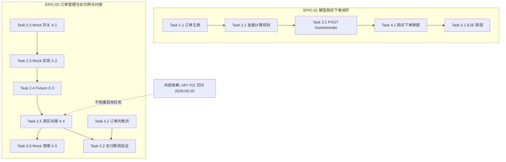

# 研发执行计划:模型市场购买与订单管理(V1.0)

> ✅ **[标准样本 — 结构可直接参照]**
>
> 本文件是 `dev-execution-planner` 当前规范的**标准格式样本**,完整演示:「**EPIC × Sprint × Task**」三层模型、AI 执行指令四件套(① 主命令 + ② 设计/PRD/原型锚点 + ③ 依赖 + ④ 验收锚点)、9 列任务总表、第三方对接「情况 0」Task X.1~X.5 五件套(THIRD_PARTY_MOCK 受控豁免)、SQL 路径透传(Module D)、金额字段类型守恒、待澄清问题清单、REQ ↔ EPIC 双向索引。
>
> 生成新计划时可直接参照本样本的章节骨架与 Task 格式。**业务场景、人员与上游文档路径均为虚构示例**,实际生成时替换为真实项目内容并核验路径可达。
> 各强制规则的权威定义见 `../SKILL.md`(任务拆解/任务模板/上游引用规则/边界情况)与 `quality-review-checklist.md`(14 维度检查);本样本是示范而非穷举,任务量大的真实项目还应为每个 Phase 末尾安排独立验证 Task、按需启用多文件拆分(`00_`/`01_`/.../`99_` 序号规范)。

> 生成时间:2026-06-11
> 技术栈:Spring Boot 2.7 + MyBatis-Plus + MySQL 8.0(后端)/ Vue 3 + Element Plus + Pinia + axios(前端)
>
> **上游输入来源(溯源必填,所有 Task 引用均基于此处声明的根目录)**:
> - **研发 PRD 来源**: `docs/requirements/V1.0/研发需求/模型市场.md`
> - **原型来源**: `docs/prototype/V1.0/code/`
> - **详细设计来源**: `docs/design/detail/V1.0/`(多文件:`01_接口设计.md` / `02_数据库设计.md` / `03_业务规则与状态机.md` / `04_外部依赖与集成.md` / `19_测试方案.md`)
> - **产品需求文档来源**: 无
> - **高保真设计来源**: 无

---

## 一、可用指令清单(按优先级)

> 生成本计划前已按 5 层优先级扫描项目资源(`{{AIDP_HOME}}/`、`AIDP*.md`、`.claude/`、`~/.claude/`、`package.json scripts`、`Makefile`、`pom.xml`、README)。**若项目存在 L1/L2 资源,Task 必须优先采用**;本虚构项目扫描结果如下。

### L1 — AIDP 命令与范式(项目专属,最高优先级)
- 无(`{{AIDP_HOME}}/`、`AIDP*.md` 均未发现)

### L2 — 项目 .claude/ 资源(项目团队约定)
- 无(项目 `.claude/` 下无 commands/skills/agents)

### L3 — 系统 Claude Code 资源(全局)
- `/dev-logic-architect` — 来源:`~/{{AIDP_HOME}}/skills/dev-logic-architect/`
- `/code-verification-loop` — 来源:`~/{{AIDP_HOME}}/skills/code-verification-loop/`

### L4 — 通用工具命令
- `mvn -q compiler:compile`(本样例按 `stack-java-spring.md` 二节的**默认写法**取值——直调 goal、不走 lifecycle;⛔ **不要照抄成 `mvn compile`**,更**永远不要写 `mvn clean compile`**——`clean` 会删 `target/` 触发全量重建;换项目前先读那一节的三条实测事实,尤其「execution 级 `<configuration>` 不生效」那条) / `mvn test` / `mvn mybatis-plus:generate` / `vue-tsc --noEmit`(前端开发期类型检查) / `pnpm test:e2e`

### L5 — Shell 脚本(兜底)
- `bash scripts/run-newman.sh`(接口回归集合)

---

## 二、⚠️ 一致性问题

| 序号 | 冲突点 | 裁决 | 处理 |
| :-: | :- | :- | :- |
| 1 | 原型 `order-list.html` 订单列表展示「下单时间」列,PRD §五-3 定义为「创建时间」 | 样式/文案冲突,**以 PRD 为准** | Task 4.2 按 PRD 实现,建议产品同步修正原型 |
| 2 | PRD §五-2 提到金额展示两位小数,设计 §A-3.2 金额字段为 `BIGINT`(分) | 技术实现**以详细设计为准**,展示**以 PRD 为准** | 存储/传输用整数分,UI 层除以 100 展示(见 Task 4.1 / 4.2) |

---

## 三、接口可用性核验报告(摘要)

> 对应 `../SKILL.md` >「执行流程」第一步半之二(细则见 `./flow-execution.md`)。详细设计标注「✅ 沿用已有」的接口已穿透 Service 实现层验证:
> 执行 `python3 <SKILL_DIR>/scripts/check_service_impl_stub.py <代码根目录>` → 退出码 0(无占位实现)。

| 接口 | 设计标注 | Service 实现层核验结论 | 执行计划处理 |
| :- | :-: | :- | :- |
| `GET /market/model/detail/{id}` | ✅ 沿用已有 | `ModelMarketServiceImpl.detail()` 真实业务实现 | Task 4.1 直接对接,Phase 3 不拆后端 Task |
| `GET /market/order/list` | ✅ 沿用已有 | `MarketOrderServiceImpl.list()` 真实业务实现 | Task 4.2 直接对接,Phase 3 不拆后端 Task |

- 无 🔧 占位实现、无 ❌ @Deprecated 接口;支付网关属 🛰️ 外部系统接口未交付,走「情况 0」五件套(见 EPIC-02)。

---

## 四、Sprint 排期总览

> Sprint 为时间盒;一个 Sprint 可含多个 EPIC,一个 EPIC 也可跨 Sprint。**Day 轴仅作汇总信息,严禁按 Day 切散 Task。**

| Sprint | 周期 | 包含 EPIC | 预估 | 出口准则 |
| :-: | :- | :- | :-: | :- |
| Sprint-001 | 2026-06-15 ~ 2026-06-24 | EPIC-01 全部;EPIC-02 的 Mock 链路(Task 2.2~2.4)与订单列表页(Task 4.2) | 8 工作日 | 购买下单链路 E2E 通过;支付 Mock 链路可演示 |
| Sprint-002 | 2026-06-25 ~ 2026-06-30 | EPIC-02 的真实对接与清理(Task 2.5、2.6、5.2) | 4 工作日 | 支付网关联调通过;`THIRD_PARTY_MOCK` 零残留 |

> **工作日口径说明(EPIC 预估 vs Sprint 预估):** EPIC 预估按"业务闭环整体工作量"计(EPIC-01=5d、EPIC-02=7d,合计 12d);Sprint 预估按"该时间盒内实际排入的 Task 工作量"计(Sprint-001=8d、Sprint-002=4d,合计 12d)。因 EPIC-02 跨两个 Sprint(Mock 链路在 Sprint-001、真实对接在 Sprint-002),故两种口径的单行数字不等但总量守恒(5+7 = 8+4 = 12)。

## Sprint 并行分组

| 并行组 | Sprint 链（有序，组内串行） | 涉及代码域（glob） | 与其它组的文件重叠 |
|---|---|---|---|
| G1 | Sprint-001 | `code/backend/*/order/**`; `code/frontend/*/order/**` | 无 |
| G2 | Sprint-002 | `code/backend/*/payment/**`; `code/frontend/*/payment/**` | 无 |

> 本表由文件级冲突矩阵投影而来。G1 与 G2 无硬依赖且 glob 无交集,可组间并行;每组内 Sprint 链仍按顺序执行。样本业务路径为虚构,生成时必须替换为项目实际 glob。

---

## 五、Phase 级上游引用(L2)

> EPIC 是纵向组织方式,Phase 是横向技术标签(每个 Task 头部同时挂「所属 EPIC」与「Phase」)。本表集中声明各 Phase 的上游参考(L2 引用块)。

| Phase | 详细设计 | PRD | 原型 |
| :- | :- | :- | :- |
| Phase 1 数据层 | `docs/design/detail/V1.0/02_数据库设计.md` §A-3 | §六、数据字段规格 | 不参考 |
| Phase 2 业务层 | `docs/design/detail/V1.0/03_业务规则与状态机.md` §B-1/§B-5 + `04_外部依赖与集成.md` §B-7 | §五-2 / §五-4 业务规则 | 不参考 |
| Phase 3 接口层 | `docs/design/detail/V1.0/01_接口设计.md` §B-2 | §五、页面交互明细 | 触发按钮锚点 |
| Phase 4 前端层 | `docs/design/detail/V1.0/01_接口设计.md` §B-2 | §五、页面交互明细 | `docs/prototype/V1.0/code/` 对应页面 |
| Phase 5 测试 | `docs/design/detail/V1.0/19_测试方案.md` §C | §九、验收测试点 | 涉 UI 验收的页面 |

**Phase 末尾验证锚点**(本样本任务量小,各 Phase 末尾验证由该 Phase 最后一个 Task 验收标准中的自动化指令承担;任务量大时应为每 Phase 拆独立验证 Task):

| Phase | 末尾验证指令 | 承载 Task |
| :-: | :- | :-: |
| 1 | `mvn -q compiler:compile` + `check_ddl_consistency.py` | Task 1.1 |
| 2 | `mvn test -Dtest=MarketOrderServiceTest,PayGatewayClientTest` | Task 2.6 |
| 3 | `bash scripts/run-newman.sh` | Task 3.1 |
| 4 | `python3 <SKILL_DIR>/scripts/scan_mock_data.py src/ --third-party-mode` | Task 4.2 |
| 5 | `/code-verification-loop` 全量回归 | Task 5.1 / 5.2 |

---

## 六、任务总表(9 列)

> 列顺序固定:`Task | 描述 | REQ 关联 | 设计锚点 | 原型锚点 | 责任人 | 估时 | AI 执行指令 | 验收标准`。
> 每行三类锚点(设计 + REQ/PRD + 原型)必须同时命中且为 markdown 相对链接。纯后端 Task 的原型锚点标注其服务的**触发页锚点**(完全无 UI 关联的运维型任务方可标 N/A,本表无此类任务);AI 执行指令列填主命令,四件套完整版见对应 Task 小节。

| Task | 描述 | REQ 关联 | 设计锚点 | 原型锚点 | 责任人 | 估时 | AI 执行指令 | 验收标准 |
| :- | :- | :- | :- | :- | :- | :- | :- | :- |
| Task 1.1 | 创建 biz_market_order 订单主表 | [REQ-102](../docs/requirements/V1.0/研发需求/模型市场.md#REQ-102) | [§A-3.2 订单表](../docs/design/detail/V1.0/02_数据库设计.md#A-3-2) | [#submit-order-btn 触发页](../docs/prototype/V1.0/code/model-detail.html#submit-order-btn) | 张三 | 6h | `/dev-logic-architect`(四件套见 [Task 1.1](#task-11)) | [§C-1.1 订单表核验](../docs/design/detail/V1.0/19_测试方案.md#C-1-1) |
| Task 2.1 | OrderService 下单金额计算规则 | [REQ-102](../docs/requirements/V1.0/研发需求/模型市场.md#REQ-102) | [§B-1 FR-012](../docs/design/detail/V1.0/03_业务规则与状态机.md#B-1-FR-012) | [#submit-order-btn 触发页](../docs/prototype/V1.0/code/model-detail.html#submit-order-btn) | 张三 | 6h | `/dev-logic-architect`(四件套见 [Task 2.1](#task-21)) | [§C-2.2 金额计算用例](../docs/design/detail/V1.0/19_测试方案.md#C-2-2) |
| Task 3.1 | POST /market/order 创建订单接口 | [REQ-102](../docs/requirements/V1.0/研发需求/模型市场.md#REQ-102) | [§B-2.3 创建订单接口](../docs/design/detail/V1.0/01_接口设计.md#B-2-3) | [#submit-order-btn](../docs/prototype/V1.0/code/model-detail.html#submit-order-btn) | 张三 | 6h | `/dev-logic-architect`(四件套见 [Task 3.1](#task-31)) | [§C-3.1 创建订单用例](../docs/design/detail/V1.0/19_测试方案.md#C-3-1) |
| Task 4.1 | 购买下单弹窗 | [REQ-101](../docs/requirements/V1.0/研发需求/模型市场.md#REQ-101) | [§B-2.3 创建订单接口](../docs/design/detail/V1.0/01_接口设计.md#B-2-3) | [#pay-dialog](../docs/prototype/V1.0/code/model-detail.html#pay-dialog) | 李四 | 8h | `/dev-logic-architect`(四件套见 [Task 4.1](#task-41)) | [§C-4.1 下单弹窗用例](../docs/design/detail/V1.0/19_测试方案.md#C-4-1) |
| Task 5.1 | 购买下单链路 E2E 联调 | [REQ-101](../docs/requirements/V1.0/研发需求/模型市场.md#REQ-101) | [§C-5.1 E2E 场景](../docs/design/detail/V1.0/19_测试方案.md#C-5-1) | [#pay-dialog](../docs/prototype/V1.0/code/model-detail.html#pay-dialog) | 李四 | 4h | `/code-verification-loop`(四件套见 [Task 5.1](#task-51)) | [§C-5.1 E2E 场景](../docs/design/detail/V1.0/19_测试方案.md#C-5-1) |
| Task 2.2 | 支付网关 Mock 开关配置 | [REQ-104](../docs/requirements/V1.0/研发需求/模型市场.md#REQ-104) | [§B-7.1 支付网关集成](../docs/design/detail/V1.0/04_外部依赖与集成.md#B-7-1) | [#pay-confirm-btn 触发页](../docs/prototype/V1.0/code/order-list.html#pay-confirm-btn) | 王五 | 2h | `/dev-logic-architect`(四件套见 [Task 2.2](#task-22)) | [§C-2.5 Mock 开关用例](../docs/design/detail/V1.0/19_测试方案.md#C-2-5) |
| Task 2.3 | 支付网关 Mock 实现(运行时分支) | [REQ-104](../docs/requirements/V1.0/研发需求/模型市场.md#REQ-104) | [§B-7.1 支付网关集成](../docs/design/detail/V1.0/04_外部依赖与集成.md#B-7-1) | [#pay-confirm-btn 触发页](../docs/prototype/V1.0/code/order-list.html#pay-confirm-btn) | 王五 | 4h | `/dev-logic-architect`(四件套见 [Task 2.3](#task-23)) | [§C-2.6 Mock 分支用例](../docs/design/detail/V1.0/19_测试方案.md#C-2-6) |
| Task 2.4 | 支付网关 Mock 数据 Fixture | [REQ-104](../docs/requirements/V1.0/研发需求/模型市场.md#REQ-104) | [§B-7.2 支付单报文](../docs/design/detail/V1.0/04_外部依赖与集成.md#B-7-2) | [#pay-confirm-btn 触发页](../docs/prototype/V1.0/code/order-list.html#pay-confirm-btn) | 王五 | 2h | `/dev-logic-architect`(四件套见 [Task 2.4](#task-24)) | [§C-2.6 Mock 分支用例](../docs/design/detail/V1.0/19_测试方案.md#C-2-6) |
| Task 2.5 | 支付网关真实接口对接 — 创建支付单 | [REQ-104](../docs/requirements/V1.0/研发需求/模型市场.md#REQ-104) | [§B-7.2 支付单报文](../docs/design/detail/V1.0/04_外部依赖与集成.md#B-7-2) | [#pay-confirm-btn 触发页](../docs/prototype/V1.0/code/order-list.html#pay-confirm-btn) | 王五 | 6h | `/dev-logic-architect`(四件套见 [Task 2.5](#task-25)) | [§C-2.7 真实对接用例](../docs/design/detail/V1.0/19_测试方案.md#C-2-7) |
| Task 2.6 | 支付网关 Mock 清理验证 | [REQ-104](../docs/requirements/V1.0/研发需求/模型市场.md#REQ-104) | [§B-7.1 支付网关集成](../docs/design/detail/V1.0/04_外部依赖与集成.md#B-7-1) | [#pay-confirm-btn 触发页](../docs/prototype/V1.0/code/order-list.html#pay-confirm-btn) | 王五 | 2h | `scan_mock_data.py`(四件套见 [Task 2.6](#task-26)) | [§C-2.8 Mock 清理用例](../docs/design/detail/V1.0/19_测试方案.md#C-2-8) |
| Task 4.2 | 订单列表页 | [REQ-103](../docs/requirements/V1.0/研发需求/模型市场.md#REQ-103) | [§B-2.5 订单列表接口](../docs/design/detail/V1.0/01_接口设计.md#B-2-5) | [#order-table](../docs/prototype/V1.0/code/order-list.html#order-table) | 李四 | 8h | `/dev-logic-architect`(四件套见 [Task 4.2](#task-42)) | [§C-4.3 订单列表用例](../docs/design/detail/V1.0/19_测试方案.md#C-4-3) |
| Task 5.2 | 支付网关联调验证 — 创建支付单 | [REQ-104](../docs/requirements/V1.0/研发需求/模型市场.md#REQ-104) | [§C-5.3 支付联调场景](../docs/design/detail/V1.0/19_测试方案.md#C-5-3) | [#pay-confirm-btn](../docs/prototype/V1.0/code/order-list.html#pay-confirm-btn) | 王五 | 4h | `/code-verification-loop`(四件套见 [Task 5.2](#task-52)) | [§C-5.3 支付联调场景](../docs/design/detail/V1.0/19_测试方案.md#C-5-3) |

---

## 七、第三方接口对接清单

> 对应 `./flow-phase-split.md` >「第三方系统对接任务拆解规则」。每个第三方接口独立成 Task、逐接口跟踪状态;状态由各 Task 执行时同步更新(本清单是双方协作"看板")。本迭代仅对接 1 个第三方接口;多接口时逐接口加行、逐接口独立拆 Task,严禁合并。

| 接口序号 | 对接系统 | 方向 | 接口名称 | 我方 Task | 第三方对接人 | 第三方预计就绪 | 我方开发状态 | 联调状态 |
| :-: | :- | :- | :- | :-: | :-: | :-: | :-: | :-: |
| API-T01 | 智汇支付网关 | 我方调用对方 | 创建支付单 | Task 2.5 | 赵六(zhao6@example.com) | 2026-06-25 | ⏳ 待开始 | ⏳ 待联调 |

**状态说明:** ⏳ 待开始 / 🔄 开发中 / ✅ 完成 / ⛔ 阻塞;联调状态:⏳ 待联调 / 🔄 联调中 / ✅ 通过 / ⚠️ 部分通过 / ⛔ 阻塞

---

## EPIC-01: 模型购买下单闭环

> **业务目标:** 用户在模型详情页发起购买,生成市场订单并落库,完成一次可感知的"选品 → 下单"业务闭环
> **REQ 编号:** [REQ-101](../docs/requirements/V1.0/研发需求/模型市场.md#REQ-101)、[REQ-102](../docs/requirements/V1.0/研发需求/模型市场.md#REQ-102)(归属对照详见 附录 E 三级索引表)
> **优先级:** P0
> **排期:** Sprint-001,预估 5 工作日(Day 轴仅作汇总,任务不按 Day 切散)

### 后端任务

### Task 1.1: 创建 biz_market_order 订单主表

> **优先级**: P0 | **依赖**: 无 | **Phase**: 1-数据层 | **所属 EPIC**: EPIC-01
> **设计来源:** [§A-3.2 biz_market_order 表(L120-L178)](../docs/design/detail/V1.0/02_数据库设计.md#A-3-2)
> **PRD 来源:** [§六-2 订单字段规格(L300-L340)](../docs/requirements/V1.0/研发需求/模型市场.md#六-2-订单字段规格)
> **原型来源:** 无(纯后端;关联触发页见任务总表)
> **高保真来源:** 无

**目标**:创建模型市场订单上下文的数据库表与数据层代码。

**严格依据**:字段、类型、长度、NOT NULL、DEFAULT、索引一律以设计 §A-3.2 为准,本 Task 不复述设计内容;发现歧义暂停并反馈。

**AI 执行指令**(将整个代码块复制到 Claude Code 等 AI 工具中执行):

```
/dev-logic-architect

请完成 Task 1.1: 创建 biz_market_order 订单主表。

设计来源: docs/design/detail/V1.0/02_数据库设计.md > §A-3.2 biz_market_order 表(L120-L178)
PRD 来源: docs/requirements/V1.0/研发需求/模型市场.md > 六-2 订单字段规格(L300-L340)
依赖: 无
数据库: MySQL 8.0

要求:
1. 先读取设计 §A-3.2,载入完整字段、索引、约束定义;
2. 生成 DDL + Entity + Mapper,字段名/类型/长度/NOT NULL/DEFAULT/索引严格以设计为准,不得偏离;
3. 金额字段 order_amount 在设计中为 BIGINT(按"分"存储),Entity 对应 Long 并加 @JsonSerialize(using = ToStringSerializer.class),严禁 BigDecimal(金额字段类型守恒);
4. DDL 输出到 sql/v1.0.0/01_模型市场订单表DDL.sql,回滚脚本输出到 sql/v1.0.0/99_模型市场订单表回滚.sql(Module D:版本子目录 + NN_中文命名,99_ 固定回滚);
5. 完成后对照设计 §A-3.2 逐字段、逐索引核对一致性。

约束:
- 严禁自行推断设计未覆盖的字段或索引,遇歧义暂停反馈;
- 仅设计明确标注 NOT NULL 的字段加 NOT NULL,且必须有 DEFAULT 或应用层赋值保障(字段宽容原则)。

验收: docs/design/detail/V1.0/19_测试方案.md §C-1.1 订单表结构核验用例
```

> **指令来源**: L3 系统 Skill `/dev-logic-architect`
> **降级方案**: L4 `mvn mybatis-plus:generate`(若 Skill 不可用)/ L5 手动编写 DDL

**产出物**:
- `sql/v1.0.0/01_模型市场订单表DDL.sql`
- `sql/v1.0.0/99_模型市场订单表回滚.sql`
- `src/main/java/com/example/market/entity/MarketOrder.java`
- `src/main/java/com/example/market/mapper/MarketOrderMapper.java`

**验收标准**:
- [ ] DDL 字段清单、类型、约束、索引与设计 §A-3.2(L120-L178)完全一致(技术要素不在此列出,以设计为准)
- [ ] 金额字段为 `BIGINT`(分),Entity 类型为 `Long`(金额字段类型守恒)
- [ ] 执行 `python3 <SKILL_DIR>/scripts/check_ddl_consistency.py sql/v1.0.0/01_模型市场订单表DDL.sql docs/design/detail/V1.0/02_数据库设计.md --table biz_market_order` 通过
- [ ] `mvn -q compiler:compile` 通过(Phase 1 末尾验证)

### Task 2.1: OrderService 下单金额计算规则

> **优先级**: P0 | **依赖**: Task 1.1 | **Phase**: 2-业务层 | **所属 EPIC**: EPIC-01
> **设计来源:** [§B-1 FR-012 下单金额计算(L80-L132)](../docs/design/detail/V1.0/03_业务规则与状态机.md#B-1-FR-012)
> **PRD 来源:** [§五-2 购买规则(L180-L228)](../docs/requirements/V1.0/研发需求/模型市场.md#五-2-购买规则)
> **原型来源:** 无(纯后端;关联触发页见任务总表)
> **高保真来源:** 无

**目标**:实现下单金额计算(单价 × 数量,Long 分单位)与商品上架状态校验业务规则。本 Task 涉及订单取消口径的暂行裁决,详见 附录 D:待澄清问题清单 > D-103。

**严格依据**:计算规则、舍入口径、校验顺序一律以设计 §B-1 FR-012 为准,本 Task 不复述;发现歧义暂停并反馈。

**AI 执行指令**(将整个代码块复制到 Claude Code 等 AI 工具中执行):

```
/dev-logic-architect

请完成 Task 2.1: OrderService 下单金额计算规则。

设计来源: docs/design/detail/V1.0/03_业务规则与状态机.md > §B-1 FR-012(L80-L132)
PRD 来源: docs/requirements/V1.0/研发需求/模型市场.md > 五-2 购买规则(L180-L228)
依赖: Task 1.1(前序产出: MarketOrder Entity 与 MarketOrderMapper)
待澄清: 订单取消口径按 D-103 暂行方案"仅置状态不退款"实现(详见本计划 附录 D)

要求:
1. 先读取设计 §B-1 FR-012,载入金额计算公式、校验规则与异常码;
2. 实现 MarketOrderService.calcAmount() 与 createOrder() 业务规则,金额全程 Long(分),严禁 double/BigDecimal 中转;
3. 单元测试覆盖:正常计算、商品已下架、数量越界三类用例;
4. 完成后对照设计 §B-1 FR-012 逐条规则核对。

约束:
- 严禁自行推断设计未覆盖的业务规则,遇歧义暂停反馈。

验收: docs/design/detail/V1.0/19_测试方案.md §C-2.2 金额计算用例
```

> **指令来源**: L3 系统 Skill `/dev-logic-architect`
> **降级方案**: L4 手写 Service + JUnit(若 Skill 不可用)

**产出物**:
- `src/main/java/com/example/market/service/MarketOrderService.java`
- `src/main/java/com/example/market/service/impl/MarketOrderServiceImpl.java`
- `src/test/java/com/example/market/service/MarketOrderServiceTest.java`

**验收标准**:
- [ ] 计算规则与设计 §B-1 FR-012(L80-L132)完全一致,金额链路全程 `Long`(分)
- [ ] 执行 `mvn test -Dtest=MarketOrderServiceTest` 通过
- [ ] D-103 暂行口径已按 附录 D 落地并在代码注释标注

### Task 3.1: POST /market/order 创建订单接口

> **优先级**: P0 | **依赖**: Task 2.1 | **Phase**: 3-接口层 | **所属 EPIC**: EPIC-01
> **设计来源:** [§B-2.3 POST /market/order(L210-L268)](../docs/design/detail/V1.0/01_接口设计.md#B-2-3)
> **PRD 来源:** [§五-2 购买规则(L180-L228)](../docs/requirements/V1.0/研发需求/模型市场.md#五-2-购买规则)
> **原型来源:** [#submit-order-btn](../docs/prototype/V1.0/code/model-detail.html#submit-order-btn)(模型详情页"立即购买"按钮)
> **高保真来源:** 无

**目标**:实现创建订单接口,完成参数校验、金额计算调用与落库。

**严格依据**:URL、Method、请求/响应字段、错误码一律以设计 §B-2.3 为准,本 Task 不复述;发现歧义暂停并反馈。

**AI 执行指令**(将整个代码块复制到 Claude Code 等 AI 工具中执行):

```
/dev-logic-architect

请完成 Task 3.1: POST /market/order 创建订单接口。

设计来源: docs/design/detail/V1.0/01_接口设计.md > §B-2.3 POST /market/order(L210-L268)
PRD 来源: docs/requirements/V1.0/研发需求/模型市场.md > 五-2 购买规则(L180-L228)
原型来源: docs/prototype/V1.0/code/model-detail.html #submit-order-btn
依赖: Task 2.1(前序产出: MarketOrderService.createOrder())

要求:
1. 先读取设计 §B-2.3,载入接口契约(URL/参数/响应/错误码);
2. 实现 Controller + DTO,字段命名与类型严格以设计为准,不得自行调整;
3. 响应 DTO 中金额字段类型 Long + @JsonSerialize(ToStringSerializer.class),前端按 string 接收(金额字段类型守恒);
4. 幂等方案按设计 §B-2.3 的幂等令牌定义实现;
5. 完成后对照设计 §B-2.3 逐字段核对请求/响应结构。

约束:
- 严禁偏离设计契约;遇设计与 PRD 冲突暂停反馈(技术类以设计为准)。

验收: docs/design/detail/V1.0/19_测试方案.md §C-3.1 创建订单用例
```

> **指令来源**: L3 系统 Skill `/dev-logic-architect`
> **降级方案**: L4 手写 Controller + Apifox 调试(若 Skill 不可用)

**产出物**:
- `src/main/java/com/example/market/controller/MarketOrderController.java`
- `src/main/java/com/example/market/dto/OrderCreateRequest.java` / `OrderCreateResponse.java`

**验收标准**:
- [ ] 接口路径、参数、响应结构、错误码与设计 §B-2.3(L210-L268)完全一致
- [ ] 响应金额字段序列化为字符串(`Long` + ToStringSerializer)
- [ ] 执行 `bash scripts/run-newman.sh` 接口集合通过(Phase 3 末尾验证)

### 前端任务

### Task 4.1: 购买下单弹窗

> **优先级**: P0 | **依赖**: Task 3.1 | **Phase**: 4-前端层 | **所属 EPIC**: EPIC-01
> **设计来源:** [§B-2.3 POST /market/order(L210-L268)](../docs/design/detail/V1.0/01_接口设计.md#B-2-3)
> **PRD 来源:** [§五-2 购买规则(L180-L228)](../docs/requirements/V1.0/研发需求/模型市场.md#五-2-购买规则)
> **原型来源:** [#pay-dialog](../docs/prototype/V1.0/code/model-detail.html#pay-dialog)(路由 /market/model/:id)
> **高保真来源:** 无

**目标**:在模型详情页实现购买下单弹窗,先清除本模块 mock 再对接真实接口。

**严格依据**:弹窗字段/文案/校验提示以 PRD §五-2 为准;接口契约以设计 §B-2.3 为准。本 Task 不复述字段与参数。

**AI 执行指令**(将整个代码块复制到 Claude Code 等 AI 工具中执行):

```
/dev-logic-architect

请完成 Task 4.1: 购买下单弹窗。

设计来源: docs/design/detail/V1.0/01_接口设计.md > §B-2.3 POST /market/order(L210-L268)
PRD 来源: docs/requirements/V1.0/研发需求/模型市场.md > 五-2 购买规则(L180-L228)
原型来源: docs/prototype/V1.0/code/model-detail.html #pay-dialog  路由: /market/model/:id
依赖: Task 3.1(后端接口 POST /market/order)
技术栈: Vue 3 + Element Plus + Pinia + axios(沿用项目脚手架)

要求:
1. 【清除 mock】扫描本弹窗涉及的 mock 数据/静态假数据并删除,禁止 mock 兜底;
2. 读取 PRD 五-2 载入弹窗字段、校验与文案;读取设计 §B-2.3 载入接口契约;
3. 创建 OrderPayDialog.vue,布局参照原型 #pay-dialog;
4. 金额字段以 string 类型接收(后端 Long 序列化为字符串,避免 JS 2^53 溢出),UI 层除以 100 按"元"展示两位小数;
5. 对接 POST /market/order:URL、参数名、响应解析严格以设计 §B-2.3 为准;
6. 完成后对照 PRD 五-2 与设计 §B-2.3 逐项核对。

约束:
- 禁止复用原型 HTML;禁止用 mock 兜底真实接口失败;遇不明确处暂停反馈。

验收: docs/design/detail/V1.0/19_测试方案.md §C-4.1 下单弹窗用例
```

> **指令来源**: L3 系统 Skill `/dev-logic-architect`
> **降级方案**: L4 `pnpm create vite` + 手动编写(若 Skill 不可用)

**产出物**:
- `src/views/market/components/OrderPayDialog.vue`
- `src/api/marketOrder.ts`(新增真实接口调用,类型定义金额为 `string`)

**验收标准**:
- [ ] 已清除本模块 mock/静态假数据(执行 `python3 <SKILL_DIR>/scripts/scan_mock_data.py src/views/market src/api/marketOrder.ts` 通过)
- [ ] 弹窗字段/文案/校验与 PRD §五-2(L180-L228)完全一致(含一致性问题 2 的金额展示裁决)
- [ ] 接口调用与设计 §B-2.3(L210-L268)完全一致,金额按 `string` 接收
- [ ] 联调后端真实接口通过

### 测试任务

### Task 5.1: 购买下单链路 E2E 联调

> **优先级**: P0 | **依赖**: Task 4.1 | **Phase**: 5-测试 | **所属 EPIC**: EPIC-01
> **设计来源:** [§C-5.1 购买下单 E2E 场景(L60-L108)](../docs/design/detail/V1.0/19_测试方案.md#C-5-1)
> **PRD 来源:** [§九-1 验收测试点(L520-L560)](../docs/requirements/V1.0/研发需求/模型市场.md#九-1-验收测试点)
> **原型来源:** [#pay-dialog](../docs/prototype/V1.0/code/model-detail.html#pay-dialog)
> **高保真来源:** 无

**目标**:购买下单全链路端到端联调与回归验证,并执行全局 mock 残留扫描。

**严格依据**:E2E 场景与断言以测试方案 §C-5.1 为准,验收口径以 PRD §九-1 为准。

**AI 执行指令**(将整个代码块复制到 Claude Code 等 AI 工具中执行):

```
/code-verification-loop

请完成 Task 5.1: 购买下单链路 E2E 联调。

设计来源: docs/design/detail/V1.0/19_测试方案.md > §C-5.1 购买下单 E2E 场景(L60-L108)
PRD 来源: docs/requirements/V1.0/研发需求/模型市场.md > 九-1 验收测试点(L520-L560)
原型来源: docs/prototype/V1.0/code/model-detail.html #pay-dialog
依赖: Task 4.1(前序产出: OrderPayDialog.vue 已对接真实接口)

要求:
1. 按 §C-5.1 场景执行: 模型详情页 → 立即购买 → 下单弹窗 → 创建订单 → 订单落库核验;
2. 验收维度: 功能完整性 / mock 清除 / 真实接口对接 / 代码质量;
3. 运行全局 mock 残留扫描(普通 mock 零容忍);
4. 输出验收报告,不通过项回流修复后复跑。

验收: docs/design/detail/V1.0/19_测试方案.md §C-5.1 全部断言通过
```

> **指令来源**: L3 系统 Skill `/code-verification-loop`
> **降级方案**: L4 `pnpm test:e2e`(Playwright)+ 人工核验(若 Skill 不可用)

**产出物**:
- E2E 验收报告(`docs/dev-plan/模型市场/验收报告-EPIC-01.md`)

**验收标准**:
- [ ] §C-5.1(L60-L108)全部 E2E 断言通过
- [ ] 执行 `python3 <SKILL_DIR>/scripts/scan_mock_data.py src/` 无普通 mock 残留
- [ ] PRD §九-1 对应验收测试点逐项通过

---

## EPIC-02: 订单管理与支付网关对接

> **业务目标:** 用户可查看订单列表并对待支付订单发起支付;支付能力经由第三方"智汇支付网关",接口未交付期间以受控 Mock 支撑演示
> **REQ 编号:** [REQ-103](../docs/requirements/V1.0/研发需求/模型市场.md#REQ-103)、[REQ-104](../docs/requirements/V1.0/研发需求/模型市场.md#REQ-104)(归属对照详见 附录 E 三级索引表)
> **优先级:** P0
> **排期:** Sprint-001 ~ Sprint-002,预估 7 工作日(Day 轴仅作汇总,任务不按 Day 切散)
> **第三方对接说明:** 智汇支付网关「创建支付单」接口(API-T01)预计 2026-06-25 交付。按 `./flow-edge-cases.md` >「情况 0:第三方平台接口未交付」强制拆 Task X.1~X.5 五件套(本 EPIC 为 Task 2.2~2.6),Mock 采用**运行时配置开关**(严禁 `@Profile("dev")` 等构建期守卫),带 `THIRD_PARTY_MOCK` 7 行标注。该接口供后端服务端调用,故落后端 mock(P1);仅前端调用的第三方接口应优先前端 mock(P0)。

### 后端任务(第三方对接五件套 Task X.1~X.5)

### Task 2.2: 支付网关 Mock 开关配置

> **优先级**: P0 | **依赖**: 无 | **Phase**: 2-业务层 | **所属 EPIC**: EPIC-02 | **五件套**: X.1
> **设计来源:** [§B-7.1 支付网关集成方案(L40-L78)](../docs/design/detail/V1.0/04_外部依赖与集成.md#B-7-1)
> **PRD 来源:** [§五-4 支付交互(L420-L460)](../docs/requirements/V1.0/研发需求/模型市场.md#五-4-支付交互)
> **原型来源:** 无(纯后端;关联触发页见任务总表)
> **高保真来源:** 无
> **对接清单编号:** API-T01 | **第三方对接人:** 赵六

**目标**:为支付网关 Mock 建立运行时环境变量开关与连接配置占位。网关测试环境连接信息缺失,以占位符登记,详见 附录 D:待澄清问题清单 > P-001。

**严格依据**:配置键名、默认值策略以设计 §B-7.1 为准;严禁编造真实网关地址。

**AI 执行指令**(将整个代码块复制到 Claude Code 等 AI 工具中执行):

```
/dev-logic-architect

请完成 Task 2.2: 支付网关 Mock 开关配置。

设计来源: docs/design/detail/V1.0/04_外部依赖与集成.md > §B-7.1 支付网关集成方案(L40-L78)
PRD 来源: docs/requirements/V1.0/研发需求/模型市场.md > 五-4 支付交互(L420-L460)
依赖: 无
对接清单编号: API-T01

要求:
1. application.yml 添加 third-party.mock.enabled: ${THIRD_PARTY_MOCK_ENABLED:false};application-dev.yml 覆盖为 true;
2. .env.example 登记网关连接占位: PAY_GATEWAY_BASE_URL={待用户填写: PAY_GATEWAY_BASE_URL}、PAY_GATEWAY_APP_KEY={待用户填写: PAY_GATEWAY_APP_KEY}(对应 附录 D P-001,用户提供后全局替换,严禁编造真实地址);
3. 确认 .gitignore 含 .env;
4. 开关必须运行时可控: 打包后通过环境变量即可启停 mock,严禁 @Profile("dev") 等构建期守卫。

验收: docs/design/detail/V1.0/19_测试方案.md §C-2.5 Mock 开关用例
```

> **指令来源**: L3 系统 Skill `/dev-logic-architect`
> **降级方案**: L5 手工编辑 yml + `.env.example`(若 Skill 不可用)

**产出物**:
- `src/main/resources/application.yml` / `application-dev.yml`(更新)
- `.env.example`(更新,占位符与 P-001 双向对应)

**验收标准**:
- [ ] 配置键名与设计 §B-7.1(L40-L78)一致,默认值 dev=true / prod=false
- [ ] 开关为运行时环境变量注入(非构建期守卫);占位符与 附录 D P-001 双向对应
- [ ] 执行 `python3 <SKILL_DIR>/scripts/check_env_config.py .` 通过

### Task 2.3: 支付网关 Mock 实现(运行时分支)

> **优先级**: P0 | **依赖**: Task 2.2 | **Phase**: 2-业务层 | **所属 EPIC**: EPIC-02 | **五件套**: X.2
> **设计来源:** [§B-7.1 支付网关集成方案(L40-L78)](../docs/design/detail/V1.0/04_外部依赖与集成.md#B-7-1)
> **PRD 来源:** [§五-4 支付交互(L420-L460)](../docs/requirements/V1.0/研发需求/模型市场.md#五-4-支付交互)
> **原型来源:** 无(纯后端;关联触发页见任务总表)
> **高保真来源:** 无
> **对接清单编号:** API-T01

**目标**:实现支付网关客户端封装与运行时 Mock 分支(`@Value` 注入 + if 分支),带 `THIRD_PARTY_MOCK` 标注。

**严格依据**:超时、重试、降级策略以设计 §B-7.1 为准;Mock 实现方式以 `./flow-edge-cases.md` >「情况 0」强制约束为准。

**AI 执行指令**(将整个代码块复制到 Claude Code 等 AI 工具中执行):

```
/dev-logic-architect

请完成 Task 2.3: 支付网关 Mock 实现(运行时分支)。

设计来源: docs/design/detail/V1.0/04_外部依赖与集成.md > §B-7.1 支付网关集成方案(L40-L78)
PRD 来源: docs/requirements/V1.0/研发需求/模型市场.md > 五-4 支付交互(L420-L460)
依赖: Task 2.2(前序产出: third-party.mock.enabled 运行时开关)

要求:
1. 创建 PayGatewayClient.createPayOrder() 封装(URL/认证/请求构造/响应解析/超时/重试/降级以设计 §B-7.1 为准);
2. 在 PayServiceImpl 中以 @Value("${third-party.mock.enabled}") 注入开关,运行时 if (mockEnabled) 分支返回 Mock 数据(由 Task 2.4 的 Fixture 提供);
3. Mock 分支处添加 THIRD_PARTY_MOCK 标注块,7 行齐全(THIRD_PARTY_MOCK + vendor: 智汇支付网关 + api: POST /pay/create + since: 2026-06-15 + expected_ready: 2026-06-25 + owner: BE-王五 + REMOVE_WHEN: 真实接口可调通后立即删除本 if 分支与 Fixture);
4. 严禁 mock 出现在 catch/fallback 路径;严禁 mock 与真实凭证/base URL 并存;
5. 单元测试覆盖开关启用/禁用两种场景与重试/降级逻辑。

验收: docs/design/detail/V1.0/19_测试方案.md §C-2.6 Mock 分支用例
```

> **指令来源**: L3 系统 Skill `/dev-logic-architect`
> **降级方案**: L4 手写 Client + JUnit(若 Skill 不可用)

**产出物**:
- `src/main/java/com/example/market/client/PayGatewayClient.java`
- `src/main/java/com/example/market/service/impl/PayServiceImpl.java`
- `src/test/java/com/example/market/client/PayGatewayClientTest.java`

**验收标准**:
- [ ] Mock 为运行时 `@Value` + if 分支(非 `@Profile` 构建期守卫),部署后改环境变量即可启停
- [ ] `THIRD_PARTY_MOCK` 标注块 7 行齐全(协议字段缺一即 Critical)
- [ ] 超时/重试/降级与设计 §B-7.1(L40-L78)一致;执行 `mvn test -Dtest=PayGatewayClientTest` 通过

### Task 2.4: 支付网关 Mock 数据 Fixture

> **优先级**: P0 | **依赖**: Task 2.3 | **Phase**: 2-业务层 | **所属 EPIC**: EPIC-02 | **五件套**: X.3
> **设计来源:** [§B-7.2 创建支付单报文定义(L80-L126)](../docs/design/detail/V1.0/04_外部依赖与集成.md#B-7-2)
> **PRD 来源:** [§五-4 支付交互(L420-L460)](../docs/requirements/V1.0/研发需求/模型市场.md#五-4-支付交互)
> **原型来源:** 无(纯后端;关联触发页见任务总表)
> **高保真来源:** 无
> **对接清单编号:** API-T01

**目标**:Mock 数据独立成类,不散落业务代码,便于 Task 2.6 精准清理。

**严格依据**:Mock 报文结构以设计 §B-7.2 报文定义为准,金额字段同样为整数分(Long)。

**AI 执行指令**(将整个代码块复制到 Claude Code 等 AI 工具中执行):

```
/dev-logic-architect

请完成 Task 2.4: 支付网关 Mock 数据 Fixture。

设计来源: docs/design/detail/V1.0/04_外部依赖与集成.md > §B-7.2 创建支付单报文定义(L80-L126)
PRD 来源: docs/requirements/V1.0/研发需求/模型市场.md > 五-4 支付交互(L420-L460)
依赖: Task 2.3(前序产出: PayServiceImpl 的 mockEnabled 分支)

要求:
1. 创建独立 Mock 数据类 com.example.market.mocks.PayCreateResponseMock(独立文件,易于定位与清理);
2. Mock 报文字段结构与设计 §B-7.2 完全一致,金额字段 Long(分);
3. 类头沿用 Task 2.3 的 THIRD_PARTY_MOCK 7 行标注协议;
4. 严禁在业务组件内内联 Mock 数据。

验收: docs/design/detail/V1.0/19_测试方案.md §C-2.6 Mock 分支用例
```

> **指令来源**: L3 系统 Skill `/dev-logic-architect`
> **降级方案**: L5 手写 Fixture 类(若 Skill 不可用)

**产出物**:
- `src/main/java/com/example/market/mocks/PayCreateResponseMock.java`

**验收标准**:
- [ ] Fixture 独立存放于 `mocks/` 包,报文字段与设计 §B-7.2(L80-L126)一致
- [ ] 类头 `THIRD_PARTY_MOCK` 标注块 7 行齐全
- [ ] 执行 `python3 <SKILL_DIR>/scripts/scan_mock_data.py src/main/java --third-party-mode` 协议核验通过(允许受控豁免存在)

### Task 2.5: 支付网关真实接口对接 — 创建支付单

> **优先级**: P0 | **依赖**: Task 2.4 + 第三方接口交付(外部依赖,不阻塞其他任务) | **Phase**: 2-业务层 | **所属 EPIC**: EPIC-02 | **五件套**: X.4
> **设计来源:** [§B-7.2 创建支付单报文定义(L80-L126)](../docs/design/detail/V1.0/04_外部依赖与集成.md#B-7-2)
> **PRD 来源:** [§五-4 支付交互(L420-L460)](../docs/requirements/V1.0/研发需求/模型市场.md#五-4-支付交互)
> **原型来源:** 无(纯后端;关联触发页见任务总表)
> **高保真来源:** 无
> **对接清单编号:** API-T01 | **第三方预计就绪:** 2026-06-25 | **触发条件:** 赵六确认沙箱环境可用

**目标**:切换创建支付单为真实调用,完成与智汇支付网关的对接验证。

**严格依据**:报文、签名、错误码映射以设计 §B-7.2 为准;真实凭证由用户提供(附录 D P-001),严禁编造。

**AI 执行指令**(将整个代码块复制到 Claude Code 等 AI 工具中执行):

```
/dev-logic-architect

请完成 Task 2.5: 支付网关真实接口对接 — 创建支付单。

设计来源: docs/design/detail/V1.0/04_外部依赖与集成.md > §B-7.2 创建支付单报文定义(L80-L126)
PRD 来源: docs/requirements/V1.0/研发需求/模型市场.md > 五-4 支付交互(L420-L460)
依赖: Task 2.4;前置条件: API-T01 已交付,P-001 连接信息已由用户提供并替换占位符

要求:
1. 用真实 base URL 与凭证(来自 .env,P-001 已闭环)配置 PayGatewayClient;
2. 关闭 mock 开关(THIRD_PARTY_MOCK_ENABLED=false)走真实调用,报文与签名严格按设计 §B-7.2;
3. 沙箱验证: 正常创建支付单 / 签名错误 / 业务错误码三类场景;
4. 同步更新「第三方接口对接清单」API-T01 状态(开发状态 → ✅ 完成);
5. 真实调用验证通过后立即触发 Task 2.6 清理,严禁 mock 与真实调用并存。

验收: docs/design/detail/V1.0/19_测试方案.md §C-2.7 真实对接用例
```

> **指令来源**: L3 系统 Skill `/dev-logic-architect`
> **降级方案**: L4 `curl` 沙箱手测 + 日志核验(若 Skill 不可用)

**产出物**:
- `src/main/java/com/example/market/client/PayGatewayClient.java`(更新为真实调用)
- `.env`(本机真实凭证,不入库)

**验收标准**:
- [ ] 真实接口沙箱调用通过,报文与设计 §B-7.2(L80-L126)一致
- [ ] 对接清单 API-T01 开发状态已更新
- [ ] 代码中无 mock 与真实凭证/base URL 并存(违者 Critical)

### Task 2.6: 支付网关 Mock 清理验证

> **优先级**: P0 | **依赖**: Task 2.5 | **Phase**: 2-业务层(执行时点在最终验收前) | **所属 EPIC**: EPIC-02 | **五件套**: X.5
> **设计来源:** [§B-7.1 支付网关集成方案(L40-L78)](../docs/design/detail/V1.0/04_外部依赖与集成.md#B-7-1)
> **PRD 来源:** [§五-4 支付交互(L420-L460)](../docs/requirements/V1.0/研发需求/模型市场.md#五-4-支付交互)
> **原型来源:** 无(纯后端;关联触发页见任务总表)
> **高保真来源:** 无
> **对接清单编号:** API-T01

**目标**:清理支付网关临时 mock(分支/Fixture/开关),核验零残留。本 Task 显式列入计划,确保不被遗忘。

**严格依据**:清理范围 = Task 2.2 的开关 + Task 2.3 的 if 分支与标注块 + Task 2.4 的 Fixture 类。

**AI 执行指令**(将整个代码块复制到 Claude Code 等 AI 工具中执行):

```
/dev-logic-architect

请完成 Task 2.6: 支付网关 Mock 清理验证。

设计来源: docs/design/detail/V1.0/04_外部依赖与集成.md > §B-7.1 支付网关集成方案(L40-L78)
PRD 来源: docs/requirements/V1.0/研发需求/模型市场.md > 五-4 支付交互(L420-L460)
依赖: Task 2.5(真实接口对接已通过)

要求:
1. 删除 PayServiceImpl 中的 if (mockEnabled) 分支与 THIRD_PARTY_MOCK 标注块(Task 2.3 产物);
2. 删除 PayCreateResponseMock.java(Task 2.4 产物);
3. 移除 third-party.mock.enabled 配置项与环境变量声明(Task 2.2 产物);
4. 运行 python3 <SKILL_DIR>/scripts/scan_mock_data.py src/ --third-party-mode 确认零残留;
5. 回归: mvn test 全量通过,真实链路不受影响;同步更新对接清单 API-T01 联调状态。

验收: docs/design/detail/V1.0/19_测试方案.md §C-2.8 Mock 清理用例
```

> **指令来源**: L3 系统 Skill `/dev-logic-architect`(清理)+ 本 SKILL 脚本 `scan_mock_data.py`(核验)
> **降级方案**: L5 `grep -rn "THIRD_PARTY_MOCK" src/` 人工核验(若脚本不可用)

**产出物**:
- 清理后的 `PayServiceImpl.java` / 配置文件(`PayCreateResponseMock.java` 已不存在)

**验收标准**:
- [ ] 代码中无 `THIRD_PARTY_MOCK` 标注块残留;Fixture 文件已不存在;开关配置已移除
- [ ] 执行 `python3 <SKILL_DIR>/scripts/scan_mock_data.py src/ --third-party-mode` 输出"无残留"(Phase 2 末尾验证)
- [ ] `mvn test -Dtest=MarketOrderServiceTest,PayGatewayClientTest` 通过

### 前端任务

### Task 4.2: 订单列表页

> **优先级**: P0 | **依赖**: 无(对接「✅ 沿用已有」接口,核验结论见 三、接口可用性核验报告) | **Phase**: 4-前端层 | **所属 EPIC**: EPIC-02
> **设计来源:** [§B-2.5 GET /market/order/list(L320-L372)](../docs/design/detail/V1.0/01_接口设计.md#B-2-5)
> **PRD 来源:** [§五-3 订单列表页(L260-L318)](../docs/requirements/V1.0/研发需求/模型市场.md#五-3-订单列表页)
> **原型来源:** [#order-table](../docs/prototype/V1.0/code/order-list.html#order-table)(路由 /market/order/list)
> **高保真来源:** 无

**目标**:实现订单列表页(分页、筛选、金额展示、发起支付入口),先清除本页面 mock 再对接沿用接口。

**严格依据**:列定义/筛选项/文案以 PRD §五-3 为准(含一致性问题 1 的「创建时间」裁决);接口契约以设计 §B-2.5 为准。本 Task 不复述列与参数。

**AI 执行指令**(将整个代码块复制到 Claude Code 等 AI 工具中执行):

```
/dev-logic-architect

请完成 Task 4.2: 订单列表页。

设计来源: docs/design/detail/V1.0/01_接口设计.md > §B-2.5 GET /market/order/list(L320-L372)
PRD 来源: docs/requirements/V1.0/研发需求/模型市场.md > 五-3 订单列表页(L260-L318)
原型来源: docs/prototype/V1.0/code/order-list.html #order-table  路由: /market/order/list
依赖: 无(接口为「✅ 沿用已有」,Service 实现层已核验为真实实现)
技术栈: Vue 3 + Element Plus + Pinia + axios

要求:
1. 【清除 mock】扫描本页面 mock 数据/静态假数据并删除,禁止 mock 兜底;
2. 创建 OrderList.vue,路由 /market/order/list,布局参照原型;列/筛选项严格以 PRD 五-3 为准(时间列名为"创建时间",见一致性问题 1);
3. 对接 GET /market/order/list:参数名、分页结构、返回字段解析严格以设计 §B-2.5 为准,筛选走 query 参数,禁止前端本地过滤;
4. 金额列以 string 接收、UI 层除以 100 按"元"展示两位小数(金额字段类型守恒);
5. "去支付"按钮(#pay-confirm-btn)触发支付流程,Mock 期可演示(运行时开关由后端控制);
6. 完成后对照 PRD 五-3 与设计 §B-2.5 逐项核对。

约束:
- 禁止复用原型 HTML;遇 PRD/设计不明确处暂停反馈。

验收: docs/design/detail/V1.0/19_测试方案.md §C-4.3 订单列表用例
```

> **指令来源**: L3 系统 Skill `/dev-logic-architect`
> **降级方案**: L4 `pnpm create vite` + 手动编写(若 Skill 不可用)

**产出物**:
- `src/views/market/OrderList.vue`
- `src/api/marketOrder.ts`(更新,金额类型 `string`)
- `src/router/routes.ts`(更新,新增路由 `/market/order/list`)

**验收标准**:
- [ ] 已清除本页面 mock/静态假数据(执行 `python3 <SKILL_DIR>/scripts/scan_mock_data.py src/views/market` 通过,普通 mock 零容忍;本页对接「✅ 沿用已有」真实接口,非第三方未交付场景,故不加 `--third-party-mode`)
- [ ] 列定义/筛选项与 PRD §五-3(L260-L318)完全一致(时间列名为"创建时间")
- [ ] 接口调用与设计 §B-2.5(L320-L372)完全一致;金额按 `string` 接收并正确展示
- [ ] 联调后端真实接口通过,列表数据来自后端

### 测试任务

### Task 5.2: 支付网关联调验证 — 创建支付单

> **优先级**: P0 | **依赖**: Task 2.5(本接口封装 + 第三方已就绪)、Task 4.2 | **Phase**: 5-测试 | **所属 EPIC**: EPIC-02
> **设计来源:** [§C-5.3 支付联调场景(L150-L196)](../docs/design/detail/V1.0/19_测试方案.md#C-5-3)
> **PRD 来源:** [§九-2 支付验收测试点(L562-L598)](../docs/requirements/V1.0/研发需求/模型市场.md#九-2-支付验收测试点)
> **原型来源:** [#pay-confirm-btn](../docs/prototype/V1.0/code/order-list.html#pay-confirm-btn)
> **高保真来源:** 无
> **对接清单编号:** API-T01 | **触发条件:** 赵六确认接口已部署沙箱环境

**目标**:按接口粒度完成创建支付单的联调验证(正向/异常/降级),并回写对接清单。

**严格依据**:联调场景与断言以测试方案 §C-5.3 为准。联调按接口粒度独立验证,多接口时逐接口拆 Task,不合并。

**AI 执行指令**(将整个代码块复制到 Claude Code 等 AI 工具中执行):

```
/code-verification-loop

请完成 Task 5.2: 支付网关联调验证 — 创建支付单。

设计来源: docs/design/detail/V1.0/19_测试方案.md > §C-5.3 支付联调场景(L150-L196)
PRD 来源: docs/requirements/V1.0/研发需求/模型市场.md > 九-2 支付验收测试点(L562-L598)
原型来源: docs/prototype/V1.0/code/order-list.html #pay-confirm-btn
依赖: Task 2.5(真实对接完成)、Task 4.2(订单列表页"去支付"入口)

要求:
1. 与赵六确认沙箱地址、凭证、测试数据;
2. 正向联调: 订单列表 → 去支付 → 创建支付单成功;
3. 异常联调: 签名失败 / 业务错误码 / 网关超时触发降级(按设计 §B-7.1 降级策略核验);
4. 核验 Mock 已清理(Task 2.6 产物零残留);
5. 联调结果回写「第三方接口对接清单」(✅ 通过 或 ⛔ 阻塞 + 原因 + 第三方修复预期)。

验收: docs/design/detail/V1.0/19_测试方案.md §C-5.3 全部断言通过
```

> **指令来源**: L3 系统 Skill `/code-verification-loop`
> **降级方案**: L4 Apifox CLI 集合 + 人工核验(若 Skill 不可用)

**产出物**:
- 联调验证报告(`docs/dev-plan/模型市场/联调报告-API-T01.md`)
- 「第三方接口对接清单」联调状态更新

**验收标准**:
- [ ] §C-5.3(L150-L196)正向/异常/降级断言全部通过(或标注 ⛔ 阻塞 + 原因)
- [ ] 执行 `python3 <SKILL_DIR>/scripts/scan_mock_data.py src/ --third-party-mode` 输出"无残留"
- [ ] 对接清单 API-T01 联调状态已更新

---

## 附录 A:任务依赖关系图



## 附录 B:API 端点汇总

| Method | Path | 说明 | Task | 负责人 |
| :- | :- | :- | :-: | :-: |
| POST | /market/order | 创建订单 | Task 3.1 | 张三 |
| GET | /market/order/list | 订单列表(✅ 沿用已有,Service 实现层已核验) | —(Task 4.2 对接) | — |
| GET | /market/model/detail/{id} | 模型详情(✅ 沿用已有,Service 实现层已核验) | —(Task 4.1 所在页) | — |
| POST | {PAY_GATEWAY_BASE_URL}/pay/create | 第三方:创建支付单(API-T01) | Task 2.5 | 王五 |

## 附录 C:Mock 数据清除汇总

| 页面/模块 | Mock 位置 | 清除动作 | 对接的真实接口 | Task |
| :- | :- | :- | :- | :-: |
| 购买下单弹窗 | `src/api/marketOrder.ts` 旧静态假数据 | 普通 mock 零容忍,开发首步删除 | POST /market/order | Task 4.1 |
| 订单列表页 | `src/views/market` 旧硬编码列表 | 普通 mock 零容忍,开发首步删除 | GET /market/order/list | Task 4.2 |
| 支付网关(后端) | `PayServiceImpl` if 分支 + `PayCreateResponseMock` | `THIRD_PARTY_MOCK` 受控豁免,真实对接后由 Task 2.6 清理 | POST {PAY_GATEWAY_BASE_URL}/pay/create | Task 2.6 |

## 附录 D:待澄清问题清单

> 对应 SKILL.md「不中断原则」:全部待澄清项集中于此,Task 正文双向引用;Agent 暂行方案必须具体可执行。

| 序号 | 主题 | 影响范围 | 待澄清问题描述 | 🔧 Agent 暂行方案 | 优先级 | 来源 | 用户确认状态 |
| :-: | :- | :- | :- | :- | :-: | :-: | :-: |
| P-001 | 支付网关测试环境连接信息缺失 | Task 2.2 / Task 2.5;`.env.example` | 智汇支付网关沙箱 base URL 与 AppKey 未提供 | 以 `{待用户填写: PAY_GATEWAY_BASE_URL}`、`{待用户填写: PAY_GATEWAY_APP_KEY}` 占位符登记于 `.env.example`,用户提供后全局替换;严禁编造真实地址 | P0 | 计划新增 | ⏳ 待确认 |
| D-103 | 订单取消是否触发退款 | Task 2.1 / Task 3.1;`MarketOrderServiceImpl` | 设计 Module E 遗留:取消"待支付"订单是否产生退款流水 | 沿用设计 D-103 暂行口径:本迭代取消仅将订单置为"已取消"状态,不产生退款流水;退款流程留待支付回调迭代 | P1 | 设计沿用 | ⏳ 待确认 |

## 附录 E:REQ ↔ EPIC ↔ Sprint 三级索引表

| REQ 编号 | EPIC 编号 | Sprint | 状态 |
| :-: | :-: | :-: | :-: |
| [REQ-101](../docs/requirements/V1.0/研发需求/模型市场.md#REQ-101) | EPIC-01 | Sprint-001 | 已排期 |
| [REQ-102](../docs/requirements/V1.0/研发需求/模型市场.md#REQ-102) | EPIC-01 | Sprint-001 | 已排期 |
| [REQ-103](../docs/requirements/V1.0/研发需求/模型市场.md#REQ-103) | EPIC-02 | Sprint-001 | 已排期 |
| [REQ-104](../docs/requirements/V1.0/研发需求/模型市场.md#REQ-104) | EPIC-02 | Sprint-002 | 已排期 |

## 附录 F:样本自检(冒烟脚本)

> `<SKILL_DIR>` = 本 SKILL 安装目录。以下脚本可直接对本样本文件执行:

```bash
# 任务粒度 + EPIC 完整性 + AI 锚点 + 9 列任务表(QR 维度 3 + 14) → 预期退出码 0
python3 <SKILL_DIR>/scripts/check_task_granularity.py <SKILL_DIR>/references/iteration-plan-sample.md

# SQL 路径透传(Module D,QR 维度 9 子项) → 预期退出码 0
python3 <SKILL_DIR>/scripts/check_sql_path_handoff.py <SKILL_DIR>/references/iteration-plan-sample.md

# 第三方对接进度分析 → 输出进度报告(1 个接口,⏳ 待开始)
python3 <SKILL_DIR>/scripts/analyze_third_party_progress.py <SKILL_DIR>/references/iteration-plan-sample.md
```

- `check_doc_split.py` 不适用:本样本为单文件输出(未触发拆分阈值);多文件模式下应对执行计划目录执行。
- `check_ddl_consistency.py` / `check_env_config.py` / `scan_mock_data.py` / `check_service_impl_stub.py` / `check_third_party_dep_reverse.py` / `scan_aidp.py` 需真实代码仓与设计文档,样本环境不适用(真实项目必跑,见各 Task 验收标准)。
