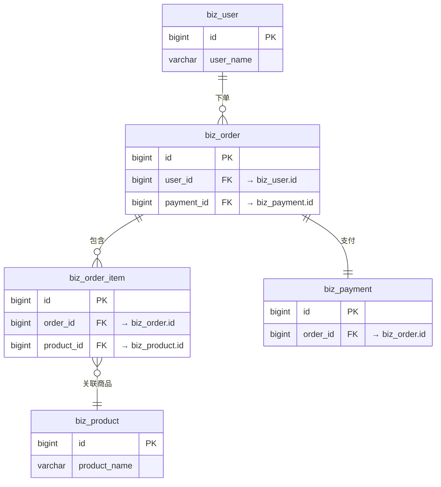

# 执行流程细则(Phase 0 ~ Phase 3)

> 本文件是 `SKILL.md`「执行流程」的细则全文,按需 Read。
> **SKILL.md 骨架保留了每个 Phase 的强制结论**(尤其 Phase 1「技术边界确认」的三条硬约束——那是核心原则 4「用户主权」的落地闸门);本文件展开的是每个 Phase 的具体做法、交互脚本、产出清单。

## 执行流程

### Phase 0: 原型终端分析（自动执行）

读取 PRD 和原型文件后，**自动分析原型的终端类型**，判断依据：

| 特征 | 判定为 |
|------|--------|
| 原型为 HTML/JSX/Vue/React 等 Web 组件，含 PC 布局（侧边栏、导航栏、表格） | **Web 端** |
| 原型含移动端特征（底部 TabBar、手机尺寸布局、触摸手势、APP 导航栈） | **移动端** |
| 原型为微信小程序结构（.wxml/.wxss 或 uni-app pages.json） | **小程序** |
| 混合存在 | **多端** |

分析结果用于 Step 1 动态调整选项。**不要从原型推断技术栈（如看到 Vue 不等于选 Vue），只判断终端类型。**

---

### Phase 1: 技术边界确认（必须在生成设计前完成）

全程分 **6 步**，每步最多 **3 次选择**，每次选择只涉及**一个维度**。

---

#### 技术选型选项表

> 📎 **必读：** Agent 执行 Phase 1 的 Step 1-6 前，必须读取 `references/tech-stack-options.md` 文件。该文件包含开发范畴、客户端技术栈、后端技术栈、数据中间件、认证文档架构、服务配置等全部选项表，以及"确认汇总"和"交互轮次总结"模板。不读取该文件无法向用户展示可选的技术栈组合。

读取流程：
1. 使用 Read 工具加载 `references/tech-stack-options.md`
2. 按 Step 1 → Step 6 顺序，逐步向用户展示选项并收集选择
3. 全部收集完成后，按"确认汇总"模板汇总所有选择，请用户最终确认

---

#### ⚠️ 技术边界确认硬化（防跳过 + 防推断 + 完成门）

以下为 Phase 1 铁律，执行 Agent **不得图省事跳步或从框架/原型推断**（对应核心原则 4「用户主权」）。曾出现"只让用户选了主体语言+框架，就自动补全 ORM/连接池/序列化/实时通信/数据库整套栈"的降级执行，本节即为防线：

1. **禁止推断/静默补全** — 严禁从已选语言/框架/原型推断或默认补全任何**未经用户确认**的栈维度。凡要写进详细设计的每一项技术（ORM、连接池、序列化、后端 WebSocket/SSE 服务端、HTTP 客户端、数据库、缓存、MQ 等），用户没在某一步显式选过的，**必须先作为 ⭐ 推荐项弹出让用户确认/改选，不得静默采用**。
2. **打包项透明化** — Step 3「后端核心组合」选定打包选项（如 `Kotlin + Ktor`）后，必须把其隐含子决策（ORM / 构建工具）显式回显给用户确认或改选；并对打包项未覆盖、但本设计确需的配套维度（**连接池、序列化、后端 WS/SSE 服务端**）补充独立询问——**不得因"选了打包项"就当作后端栈全定**（细则见 `tech-stack-options.md` Step 3「⚠️ 打包项透明化」说明）。
3. **数据库必确认** — Step 4 选择 1 数据库**始终执行、由用户确认**，不得跳过，或从框架默认推断（如 Ktor→PostgreSQL、Spring Boot→MySQL）。
4. **完成门（唯一闸门）** — 在全部适用 Step 1~6 逐维度收集完 **且**「确认汇总」经用户最终 accept 之前，**禁止**输出"技术栈确定 / 技术栈已定"之类结论、**禁止**进入 Phase 2 生成设计。若已进入 Phase 2/3 却发现 Phase 1 未走完确认汇总，按「⚠️ 不臆造兜底原则 > 何时应当中断」强制中断、回到 Phase 1。

> **验收自检口径：** 新项目跑 `/version → /sprint-design`，Phase 1 应逐维度询问（含 ORM / 连接池 / 序列化 / 通信 / 数据库），每项用户可见可改，最后有「确认汇总」让用户拍板，才生成设计；**绝不出现"只选语言+框架 → 自动补全全栈"**。

---

### Phase 2: PRD 深度分析

用户确认技术边界后，执行以下分析：

1. **逐条提取功规点** — 从 PRD 中提取每一个功能需求点，编号列出，**标注 PRD 文件路径和章节定位(精确到章节编号+页码或行号范围)**
2. **原型交互流转梳理** — 从 HTML 原型中提取页面结构、交互流程、表单字段、按钮行为，**标注原型文件路径和页面路由**
3. **高保真设计对照**(如有) — 从高保真设计稿中提取视觉规格、组件样式、响应式断点，**标注高保真设计文件路径和页面名称**
4. **建立映射表** — 将功规点与原型页面/组件/高保真设计建立对应关系，确保无遗漏
5. **🛡️ 外部集成需求扫描(强制)** — 在 PRD 中扫描以下关键词识别**所有需要发起外部 HTTP 请求的场景**,作为 B.7 外部依赖与集成章节和 Phase 1 Step 3 选择 3 HTTP 客户端选型的输入依据:
   - **关键词**: 第三方 / 对接 / 集成 / 调用 / 推送 / 回调 / 同步 / 上报 / 拉取 / 接入 / SDK / API Key / OAuth / 短信 / 邮件 / 支付 / 退款 / 物流 / 推送 / 地图 / OSS / 银行 / 海关 / 电子签章 / 实名认证 / 发票 / 鉴权
   - **跨服务关键词(微服务场景)**: 调用 / 远程接口 / RPC / 服务间 / 跨服务 / 聚合
   - **每个集成场景必须输出清单条目**:
     ```
     | 序号 | 第三方/服务名称 | 调用方向 | 同步/异步 | 是否走服务注册发现 | 关联功规点 | PRD 来源 |
     |-----|---------------|---------|----------|-------------------|-----------|---------|
     | I-001 | 阿里云短信 | 我方→第三方 | 同步 | 否(直连域名) | FR-007 | PRD 五-3 注册流程(L210) |
     | I-002 | user-service | 我方→内部微服务 | 同步 | 是(Nacos `user-service`) | FR-012 | PRD 五-7 用户详情(L450) |
     ```
   - **若 PRD 未涉及任何外部集成**(纯 CRUD 系统),记录"无外部集成需求,HTTP 客户端选型仅作为基础设施预设",Phase 1 Step 3 选择 3 仍需让用户选,但 B.7 章节可标注"无外部依赖,本期不涉及"
6. **🛡️ 建立「原型内容基线」为详细设计的覆盖依据(Critical·三级覆盖)** — 详细设计从原型转写时最易漏清点元素与交互,导致设计本身就不全、下游前端比原型大量缺失。本步把原型可见元素 + 交互态 + 操作逻辑逐项清点为「覆盖基线」,详细设计必须逐项覆盖:
   - **基线来源(有则消费·无则回退)**: 若上游已产出 `docs/design/{version}/原型内容基线.md`(逐页 → 可见区块/卡片/表格列/表单字段/筛选排序/按钮次级操作/交互态/跳转 → 处置列)**则强制消费为覆盖依据**;无则**回退直接从原型 `code/` 现场逐页提取**同等清单。路径为示例,自适应项目实际结构。同时若存在原型 `DESIGN-MANIFEST.json` / `DESIGN-HANDOFF.md`(含 `screens`/`appModules`/`requiredStates`/`tokens`/`flows`),**主动读取**其 `requiredStates`(交互态)与 `flows`(操作逻辑)作为状态级/操作逻辑级覆盖的输入;无则从原型 code/ 现场归纳。**基线/manifest 均为上游产物,本 SKILL 只消费不自产,不硬依赖其存在。**
   - **对齐原型 = 视觉 + 内容 + 操作逻辑 三层**(详细设计侧重后两层,视觉层交由前端还原,但内容/操作逻辑层必须在设计中落全):① **内容层** = 原型 code/ 可见的区块/卡片/表格列/表单字段/筛选排序/按钮次级操作/空态加载错误成功等交互态/跳转,一个不许静默漏;② **操作逻辑层** = 校验规则与时机、字段联动、条件显隐/禁用、增删改-保存-取消/批量流、二次确认、默认值/初始态、多步步序、错误处理、权限态差异——禁止擅自简化/改流程(AIDP 约定4扩展「三层对齐」)。
   - **基线里每个处置="实现"的项,必须覆盖到三级**:
     - **字段级**(表格列/表单字段)→ 落到 B.1 功规点实现映射 + B.2 接口出入参 + A.3 数据字段(承接并扩展下文 B.2「需求字段(语义)⟷我方接口字段」比对门);
     - **状态级**(交互态 `requiredStates`:empty/loading/error/success/disabled 等)→ 落到 B.5 状态机模型 与 B.3 异常处理/接口错误码;
     - **操作逻辑级**(`flows`:校验规则与时机/字段联动/条件显隐禁用/增删改保存取消流/二次确认/默认值/多步步序/错误处理)→ 落到 B.2 接口契约、时序描述、B.5 状态机、业务规则里。
   - **规划期铁律(不臆造·不静默简化)**: 基线里**未显式标注「裁剪 / 延期 / 改为 X」的元素与操作逻辑,默认必须照原型在详细设计里落全,不得缺席或被简化**;漏写=违规。任何裁剪/延期/改逻辑须沿用约定4三件套——**留痕 + 产品确认 + 触发约定22级联**(在 Module E 登记 D-NNN 并双向引用,禁止设计 Agent 自行删减)。
   - **约定28边界**: "用项目已有组件实现"只约束组件**实现选型层**,**不豁免**上述内容层/操作逻辑层的三层对齐——复用组件≠可以少一列、少一个交互态、少一条校验规则(AIDP 约定28)。

**映射表格式：**

```
| 功规点编号 | 功规点名称 | PRD 来源 | 原型来源 | 高保真设计(如有) |
|-----------|-----------|---------|---------|----------------|
| FR-001 | 用户列表分页查询 | `<PRD路径>` > `五-1 页面交互明细` | `<原型路径>/user-list.html` 路由: `/user/list` | `<高保真路径>/用户列表.fig` |
| FR-002 | 新增用户 | `<PRD路径>` > `五-4 新增用户弹窗` | `<原型路径>/user-list.html#add-dialog` 路由: `/user/list`（弹窗） | `<高保真路径>/新增用户弹窗.fig` |
```

**引用规范(强制)：**

| 引用类型 | 格式要求 | 示例 |
|---------|---------|------|
| 研发 PRD 引用 | `<文件路径>` > `<章节编号及名称>` | `docs/prd/功能规格说明书.md` > `五-1 用户列表页` |
| 原型文件引用 | `<文件路径>` + 页面路由 | `docs/ui/code/user-list.html` 路由: `/user/list` |
| 高保真设计引用 | `<文件路径>` + 页面名称 | `docs/design/高保真/用户列表.fig` |
| 产品需求文档引用(如有) | `<文件路径>` > `<章节>` | `docs/product/需求说明.docx` > `3.2 用户列表` |

**B.1 功规点实现映射中的引用要求：**
- **承接 Phase 2 步骤 6「原型内容基线」三级覆盖**:B.1 映射须逐页覆盖基线里处置="实现"的可见元素(区块/卡片/表格列/表单字段/筛选排序/按钮次级操作/交互态/跳转)与操作逻辑,未标裁剪/延期/改逻辑的元素不得在 B.1 缺席或被简化;字段级落 B.2/A.3、状态级落 B.5/B.3、操作逻辑级落 B.2/时序/B.5/业务规则。
- 每个功规点**必须**标注 `PRD 来源`(研发 PRD 的章节 + 页码/行号范围)和 `原型来源`(原型文件路径+路由,多页共文件时加锚点/屏位)
- 有高保真设计时**必须**标注 `高保真来源`(文件路径 + 页面名称)
- 引用必须精确到章节编号(如 `五-1`),不接受模糊引用(如"参考 PRD")
- **数据库表设计(A.3)**每张表 DDL 上方必须标注 `PRD 来源: <PRD路径> > <字段规格章节>`,列明该表字段的 PRD 依据
- **API 契约(B.2)**每个接口必须标注 `PRD 来源: <PRD路径> > <页面交互章节>` + `原型来源: <原型路径>#<触发按钮/表单锚点>`,列明该接口被哪个页面交互调用
- **字典/枚举(A.4)**每个字典/枚举必须标注 `PRD 来源: <PRD路径> > 七 字典枚举表 > <枚举名>`,禁止自创字典
- **状态机(B.5)**每个状态机必须标注 `PRD 来源: <PRD路径> > 三 业务流程 或 七 字典枚举`

将分析结果以表格形式呈现给用户，确认是否有补充或修正，然后进入 Phase 3。

### Phase 3: 生成详细设计方案

根据确认的 Scope 动态调整输出模块。输出为结构化 Markdown 文档。

**生成 A.2 基础框架配置时内联校验(写入前自检):**
- 若 Phase 1 Step 3 选择 3 已选定 HTTP 客户端方案,A.2 必须包含「HTTP 客户端落地」子章节,提供 (a) Bean/Client 初始化示例 (b) 完整的 `application.yml` / `config.yaml` / `.env` / `appsettings.json` 配置块(随后端语言对应)(c) 服务发现集成声明(若集成 Nacos/Eureka/Consul/etcd,标注服务名+命名空间+分组)
- 配置块中所有第三方 base URL / IP / 端口 / 凭证必须用 `${ENV_VAR}` 占位符,严禁硬编码;敏感凭证(API Key / Secret / 私钥)在示例 yaml/json 中**只能**出现 `${XXX_KEY}` 形态,严禁明文
- 与 B.7 外部依赖集成清单交叉核对:每个 B.7 集成项引用的配置 Key 必须能在 A.2 配置块中找到对应定义,不允许 B.7 引用 `third-party.alipay.base-url` 但 A.2 配置块中无该 Key
- 与 D.3 第三方依赖列表交叉核对:A.2 落地示例使用的依赖(如 OpenFeign / Nacos Discovery / 熔断组件)必须在 D.3 后端依赖表中列出
- **日志持久化与分环境保留策略(后端强制):** A.2 日志规范须声明后端服务日志**持久化落盘 + 滚动归档**,并按环境设默认保留期与容量上限(dev/test=30 天/1GB、prod=1 年/5GB),经 logback `maxHistory`+`totalSizeCap`(或 log4j2 等价策略)落地、分 spring profile 区分、超限自动清理最旧日志;数值为默认可覆盖。详见 `references/output-module-examples.md` A.2「日志规范」
- **跨域(CORS)等入口安全配置默认放开(团队约定):** A.2 须声明后端 CORS 默认**全放开、不做 origin 限制**(Spring `allowedOriginPatterns("*")`+`allowedMethods/Headers("*")`+放行 `OPTIONS`;带 Cookie 用 `allowedOriginPatterns` 而非 `allowedOrigins("*")` 以兼容 `allowCredentials(true)`)。理由:部署经 nginx 反代统一入口、跨域在网关层处理。默认放开;有等保/安全合规需求时优先在 nginx 收紧,后端限制须用户显式要求并标注。详见 `references/output-module-examples.md` A.2「跨域(CORS)…默认放开」
- 详见核心原则 16「HTTP 客户端配置驱动铁律」+ `references/quality-review-checklist.md` 检查项 8

**生成 B.2 接口契约时内联校验(写入前自检,对应核心原则 23「错误契约铁律」):**
- **每个接口必须有「错误契约」小节**,固定 5 列 `| 错误码 | HTTP Status | 触发条件 | 面向用户的中文提示 | 失败/降级行为 |`,逐行填实、不留空(模板见 `assets/api-template.md`);旧版「错误码 | HTTP Status | 说明」三列表已作废
- **三态判然区分**:小节内写明本接口的**空结果**长什么样(`code=0` + `data.list=[]` = 合法成功),**严禁**用 `200 + 空 data` / `{success:true, data:[]}` 表达失败
- **调上游的接口必须有"上游不可达"行**,文案固定「{上游中文名}服务无法连接,请稍后再试」;服务名用**业务中文名**,严禁内部代号 / IP / URL;确需降级须就地写明**降级理由 + 范围 + 用户可感知性**
- **安全类判断(鉴权/权限/归属/签名)声明 fail-closed**:取不到 / 解析失败 / 查询异常 → 拒绝或报错,严禁 fail-open
- **引用上游契约处标注**「以上游契约为准,上游变更即需跟进」+ 契约来源与采集时间
- **错误码全部取自 A.4「GlobalErrorCode 全局错误码」枚举**(核心原则 23.5):接口只选用、不自编码;确需新码先加进全局枚举再引用;该枚举同受核心原则 10/检查项 11 约束(强制生成 `ErrorCodeEnum` 枚举类 + 代码契约 8 项)

**生成 B.3 并发控制时内联校验(写入前自检,对应核心原则 24「并发加锁选型优先级铁律」):**
- **按 P0 → P1 → P2 落档并写明理由**:P0 进程内锁(语言自带,首选,各栈写法见 `references/stack-<栈>.md`)→ P1 Redis 分布式锁 → P2 数据库级锁
- **升到 P1 必须写明 P0 为何不够**(多实例/多副本部署、跨进程或跨服务竞争),且**必须带自动过期**:原子加锁(`SET NX PX` / Redisson `RLock`,严禁先 `SETNX` 再 `EXPIRE` 两步)+ TTL/leaseTime + 长任务续期 + 释放校验持有者 + 获取失败行为(错误码取自全局枚举)
- **P2 数据库级锁默认不可用**(`SELECT ... FOR UPDATE`/`LOCK TABLES`/`GET_LOCK`/悲观锁/行锁/表锁),**必须先向用户说明并取得确认**才可写进设计,确认痕迹落在正文标注 / 专章 / Module E D-NNN 三者之一
- ⚠️ **乐观锁(version + CAS)、唯一索引幂等不是锁**,不计入档位、不需确认门、仍推荐——勿误判

**生成 A.3 数据表时内联校验(写入前自检):**
- 每个金额/价格/费用字段 → 类型必须为 BIGINT + COMMENT 含"单位:..."(核心原则 11);已有项目沿用现有约定并标注理由;是否 NOT NULL 由业务语义决定(非强制)
- 每个枚举/状态字段 → COMMENT 引用 A.4 枚举类(核心原则 10)
- 若设置了 NOT NULL → 必须同时声明初始化方式 DEFAULT/触发器/应用层(核心原则 8);无充分理由时默认允许 NULL
- **索引列必须 NOT NULL(核心原则 8 强制例外)** → 任何被普通索引/唯一索引/联合索引/主键引用的列**必须** NOT NULL + DEFAULT;联合索引涉及的**全部**列均强制 NOT NULL,业务语义"可空"的列用哨兵值(`''`/`0`/`-1`/`'N/A'`)代替 NULL,字段 COMMENT 标注"索引列,空值用 X 表示"
- **每个自由输入文本字段 → 长度 ≥ 前端限制 3×**(核心原则 13);COMMENT 必须显式写"前端限制 N 字符,DB 冗余 3×";豁免字段(强格式/系统生成/枚举 code/历史沿用/TEXT)在 COMMENT 标注豁免理由
- 若存在历史 SQL → 新表命名/公共字段/主键/索引/字符集必须沿用历史风格(核心原则 12)
- **给既有表新增列(核心原则 32)** → 凡出现 `ALTER TABLE ... ADD`,A.3 必须同时产出 6 列「新增列举证表」(`列名 | 类型 | 业务含义 | 谁读它(具体到界面/判据/接口出参) | 不加会怎样 | 与既有近似列的区别`),每个新增列各一行。⛔ **第 4 列写不出具体读取方、或第 5 列答「没什么影响」的列一律不得进入 DDL**——**建表的判据是「谁会读它」,不是「上游有什么」**;举证指向外部仓库时须附**该仓库文件路径 + 映射函数名**。另须做**重复性对账**(对同库已有列做名称/含义近似检索:重复则复用、不重复则**把区别写进列注释**),且**每个 `ADD COLUMN` 必须有配对列注释**(MySQL 内联 `COMMENT` 或达梦/Oracle 的 `COMMENT ON COLUMN`)。细则与模板见 `references/output-module-examples.md` >「4b. 给既有表新增列」
- **业务实体表审计字段填充(核心原则 22)** → 有增删改的业务主表带审计四件套(`create_by`/`create_time`/`update_by`/`update_time`)+ 逻辑删除标记;A.3/A.2 显式写明**填充机制 + 操作人来源**(优先 MetaObjectHandler / JPA Auditing 从当前登录态取操作人),**严禁写死 `"system"`** 作通用默认;逻辑删除的 `UPDATE` 必须同步 `update_by`/`update_time`(注意绕过 ORM 自动填充的坑);字典/枚举/中间/日志表豁免审计人字段须在 COMMENT/表说明标注理由

**生成 A.3 数据表时必须附带 Mermaid ER 关系图:**

A.3 章节在所有表 DDL 之后(或多文件模式下每个数据域子文档末尾),**必须**生成一张 Mermaid `erDiagram` 图,展示表与表之间的关联关系(1:1 / 1:N / M:N)和关键外键字段的对应关系。

**规则:**
- **图中标注关系,DDL 中不加外键约束** — ER 图仅用于文档可视化,帮助开发者理解表间关联;实际 DDL **严禁**添加 `FOREIGN KEY` / `REFERENCES` 约束(外键约束在高并发场景下影响写入性能、增加死锁风险、阻碍分库分表,关联完整性由应用层保证)
- **关联字段必须标注** — 图中用 `FK` 标记标注哪个字段关联到哪张表的哪个字段(如 `biz_order.user_id --> biz_user.id`)
- **关系基数必须标注** — 使用 Mermaid 标准基数语法(`||--o{` 一对多、`||--||` 一对一、`}o--o{` 多对多)
- **多文件模式** — 每个数据域子文档(如 `02_用户域数据表.md`)末尾放该域内部的 ER 图;跨域全局 ER 图放在数据库设计主文档(如 `03_数据库设计.md`,仅展示域间关联,不重复域内细节;专职索引 `00_索引.md` 只做导航不含 ER 图)
- **图中表名/字段名** — 必须与 DDL 中的实际表名/字段名完全一致(含前缀/大小写)

**示例:**



**DDL 中对应写法(无 FOREIGN KEY 约束,仅 COMMENT 标注关联):**

```sql
CREATE TABLE biz_order (
  id BIGINT AUTO_INCREMENT PRIMARY KEY COMMENT '主键',
  user_id BIGINT NOT NULL COMMENT '下单用户 ID(关联 biz_user.id)',
  payment_id BIGINT NULL COMMENT '支付单 ID(关联 biz_payment.id)',
  -- 无 FOREIGN KEY 约束,关联完整性由应用层保证
  ...
) ENGINE=InnoDB DEFAULT CHARSET=utf8mb4;
```

---

