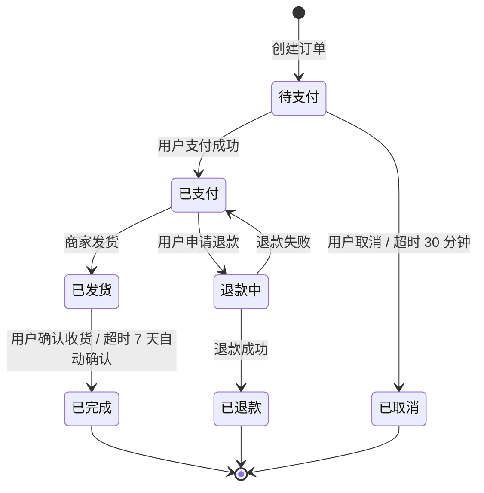

# Output Module Examples（输出模块详细示例）

> 本文件隶属于 `dev-logic-architect` SKILL，供 SKILL.md 生成详细设计文档时参考。
> 上级文档：`../SKILL.md`
>
> **使用说明：** Agent 生成详细设计文档时应参考本文件的格式和深度，确保输出内容的完整性和规范性。本文件包含 Module A（技术架构与约束）、Module B（研发路径图）、Module C（测试全链路方案）、Module D（版本归档）、Module E（待澄清问题清单）的完整章节定义和示例。
>
> **`<SKILL_DIR>` 占位符(全文统一)：** 本文件所有 `python3 <SKILL_DIR>/scripts/xxx.py` 命令中的 `<SKILL_DIR>` = 本 SKILL 的实际安装目录（本项目 = `.aidp/skills/dev-logic-architect`），执行前须替换为真实路径。

---

## 输出模块定义

### Module A: 技术架构与约束 (Architectural Blueprint)

#### A.1 系统架构图

使用文本描述系统分层架构，包含：
- **逻辑分层**：展示层 → 应用层 → 领域层 → 基础设施层（根据选定架构规范调整）
- **物理部署**：服务部署拓扑、负载均衡、数据库主从等
- **模块划分**：按业务域拆分的模块边界

#### A.2 基础框架配置

**Web 前端（如适用）：**
- 项目结构（目录规划）
- 状态管理方案与 Store 划分
- 组件库选型与自定义组件规划
- 路由规划（页面路由表）
  - 路由 base 配置为 `/{前端服务名称}/`（如 Vue Router 的 `createWebHistory('/{前端服务名称}/')`）
  - 完整访问地址：`http://{ip}:{port}/{前端服务名称}/{页面路由}`
- 请求层封装（拦截器、错误处理）
  - API 请求 baseURL 配置为 `/{后端服务名称}`

**移动端（如适用）：**
- 项目结构（目录规划）
- 导航架构（Tab / Stack / Drawer）
- 状态管理方案
- 网络请求封装
  - API 请求 baseURL 配置为 `http://{ip}:{port}/{后端服务名称}`
- 平台适配方案

**后端（如适用）：**
- 项目结构（包/模块规划）
  - 若为微服务/多模块，按 Step 6 确认的模块划分组织项目结构
  - **Spring Boot / Java 项目必须采用"分层优先"的包组织方式**，详见下方规范
- 依赖注入配置
- ORM 配置与数据源管理
- 中间件配置（缓存、消息队列、认证）
- **跨域（CORS）等入口安全访问配置默认放开（团队约定）：** 后端 CORS 默认**全部放开、不做限制**——允许所有来源 / 方法 / 请求头、放行预检 `OPTIONS`（Spring 全局 `CorsConfiguration`：`allowedOriginPatterns("*")` + `allowedMethods("*")` + `allowedHeaders("*")`；**需带 Cookie 时用 `allowedOriginPatterns("*")` 而非 `allowedOrigins("*")`**，以兼容 `allowCredentials(true)`——浏览器规范不允许 `Access-Control-Allow-Origin: *` 与 credentials 并存；其他框架用等价全局 CORS 配置）。**理由：** 最终部署几乎都经 **nginx 反向代理统一入口**访问，跨域在 nginx 层处理或天然同源，后端再做 origin 白名单只会增加联调 / 部署摩擦。**同类**：不在后端做 Referer / Host 白名单等入口级限制。此为**默认**；若项目有等保 / 安全合规要求需收紧 origin 白名单，**优先在 nginx / 网关层收敛**，或由用户显式要求后端限制并在 A.2 标注理由。
- 异常处理体系
- 日志规范
  - **后端服务必须有日志且持久化（强制）：** 后端服务**必须**输出运行日志并**持久化落盘**（不得仅输出到控制台 / stdout 或仅留内存），经日志框架（`logback-spring.xml` / `log4j2.xml` / `logging.file`）写入文件并配滚动归档（按时间 + 大小滚动）。
  - **分环境保留期与容量上限（默认值，可由用户覆盖）：**

    | 环境 | 默认保留期 | 单服务总日志空间上限 |
    | :- | :- | :- |
    | 研发 / 测试（dev/test） | 30 天 | 1 GB |
    | 生产（prod） | 1 年（365 天） | 5 GB |

    - 落地到滚动策略：logback `SizeAndTimeBasedRollingPolicy` 的 `maxHistory`（dev/test=30、prod=365）+ `totalSizeCap`（dev/test=1GB、prod=5GB）+ `cleanHistoryOnStart`；log4j2 用 `DefaultRolloverStrategy max` + `Delete` 按 age / 累计大小清理。**分环境用 spring profile（`logback-spring.xml` 的 `<springProfile>`）或多套配置区分，勿写死单一环境值。**
    - 超过保留期或总容量上限时**自动清理最旧日志（滚动删除）**，防止磁盘写满。以上数值为默认，项目有合规 / 审计留存要求（如金融需更长留存）时用户可覆盖，覆盖须在 A.2 标注理由。
- 服务访问配置
  - context-path 配置为 `/{后端服务名称}`（如 Spring Boot 的 `server.servlet.context-path=/{后端服务名称}`）
  - 接口路径不使用 `/api/v1` 等版本号前缀
  - 完整访问地址：`http://{ip}:{port}/{后端服务名称}/{接口路径}`
- **动态配置刷新（使用配置中心时必须）**
  - 若项目使用 Spring Cloud Config、Nacos、Apollo 等配置中心，读取配置中心动态配置的 Bean **必须**支持动态刷新，确保配置变更后无需重启即可生效
  - `@Value("${...}")` 注入方式：Bean 类上**必须**添加 `@RefreshScope` 注解
  - `@ConfigurationProperties` 注入方式：Spring Cloud 2020+(Boot 2.4+)自动支持刷新（通过 `ConfigurationPropertiesRebinder`，无需额外注解）；旧版本需在类上添加 `@RefreshScope`
  - 不适用：固定不变的本地配置（如数据源连接池大小、端口号等启动时确定的配置）
  - 设计文档 A.2 中需标注哪些配置项属于"动态可刷新"，哪些属于"启动时固定"
- **HTTP 客户端落地（必须）**
  - 详见下方"HTTP 客户端落地规范"章节
  - 用户在 Phase 1 Step 3 选择 3（HTTP 客户端）选定的方案，**必须**在 A.2 中给出 Bean 初始化示例 + 配置文件块
  - **严禁**在代码中硬编码 base URL / IP / 端口 / 凭证；敏感凭证使用 `${ENV_VAR}` 占位符引用环境变量

---

##### HTTP 客户端落地规范（强制章节，对应 `tech-stack-options.md` Step 3 选择 3）

> **强制要求：** Phase 1 Step 3 选择 3 选定的 HTTP 客户端方案，Agent 必须在 A.2 章节生成以下三块内容：
> 1. **Bean/Client 初始化示例**（语言对应）
> 2. **配置文件示例**（`application.yml` / `config.yaml` / `.env` / `appsettings.json`，根据语言对应）
> 3. **服务发现集成声明**（若与 Nacos/Eureka/Consul/etcd 集成）
>
> **核心铁律：** 严禁在代码中硬编码 base URL / IP / 端口 / 凭证；所有可变参数必须走配置文件；敏感凭证用 `${ENV_VAR}` 引用环境变量。

**示例 1: Java（Spring Boot 3.x + OpenFeign，默认推荐）**

`pom.xml` 关键依赖：

```xml
<dependency>
    <groupId>org.springframework.cloud</groupId>
    <artifactId>spring-cloud-starter-openfeign</artifactId>
</dependency>
<!-- 若集成 Nacos 服务发现 -->
<dependency>
    <groupId>com.alibaba.cloud</groupId>
    <artifactId>spring-cloud-starter-alibaba-nacos-discovery</artifactId>
</dependency>
```

启动类：

```java
@SpringBootApplication
@EnableFeignClients(basePackages = "com.{project}.feign")
public class Application {
    public static void main(String[] args) {
        SpringApplication.run(Application.class, args);
    }
}
```

**模式 A: 通过 Nacos 服务发现调用其他微服务**

```java
@FeignClient(name = "user-service", path = "/api")
public interface UserServiceClient {
    @GetMapping("/user/{id}")
    UserDTO getUser(@PathVariable("id") Long id);
}
```

**模式 B: 通过配置文件指定 IP/端口调用第三方服务（无服务发现）**

```java
@FeignClient(name = "alipayClient", url = "${third-party.alipay.base-url}")
public interface AlipayClient {
    @PostMapping("/alipay/trade/refund")
    RefundResponse refund(@RequestBody RefundRequest request);
}
```

`application.yml` 配置块：

```yaml
spring:
  application:
    name: order-service
  cloud:
    nacos:
      discovery:
        server-addr: ${NACOS_ADDR:127.0.0.1:8848}
        namespace: ${NACOS_NAMESPACE:public}
        group: DEFAULT_GROUP

# OpenFeign 全局配置
feign:
  client:
    config:
      default:
        connect-timeout: 3000   # 连接超时(ms)
        read-timeout: 10000     # 读取超时(ms)
        logger-level: basic
  circuitbreaker:
    enabled: true               # 集成 Sentinel/Resilience4j 熔断

# 第三方服务地址(走配置,严禁硬编码)
third-party:
  alipay:
    base-url: ${ALIPAY_BASE_URL:https://openapi-sandbox.alipay.com}
    app-id: ${ALIPAY_APP_ID}
    private-key: ${ALIPAY_PRIVATE_KEY}     # 严禁硬编码,从 KMS/环境变量读取
    public-key: ${ALIPAY_PUBLIC_KEY}
    timeout-ms: 5000
    retry-times: 3
```

**示例 2: Python（FastAPI + httpx，默认推荐）**

`pyproject.toml` / `requirements.txt`：

```
httpx>=0.27.0
pydantic-settings>=2.0.0
```

`app/clients/alipay_client.py`：

```python
import httpx
from app.config import settings

def build_alipay_client() -> httpx.AsyncClient:
    return httpx.AsyncClient(
        base_url=settings.alipay_base_url,
        timeout=httpx.Timeout(
            connect=3.0,
            read=settings.alipay_timeout_seconds,
        ),
        headers={"User-Agent": f"{settings.app_name}/1.0"},
    )
```

`app/config.py`（读取 `.env`）：

```python
from pydantic_settings import BaseSettings, SettingsConfigDict

class Settings(BaseSettings):
    model_config = SettingsConfigDict(env_file=".env")

    app_name: str = "order-service"
    alipay_base_url: str
    alipay_app_id: str
    alipay_private_key: str
    alipay_timeout_seconds: float = 5.0
    alipay_retry_times: int = 3

settings = Settings()
```

`.env`（严禁提交到 git，实际部署从 KMS/CI Secret 注入）：

```dotenv
ALIPAY_BASE_URL=https://openapi-sandbox.alipay.com
ALIPAY_APP_ID=2026000000000000
ALIPAY_PRIVATE_KEY=${ALIPAY_PRIVATE_KEY}
ALIPAY_TIMEOUT_SECONDS=5
ALIPAY_RETRY_TIMES=3
```

**示例 3: Node.js（NestJS + axios，默认推荐）**

`src/clients/alipay.module.ts`：

```typescript
import { Module } from '@nestjs/common';
import { HttpModule } from '@nestjs/axios';
import { ConfigModule, ConfigService } from '@nestjs/config';

@Module({
  imports: [
    HttpModule.registerAsync({
      imports: [ConfigModule],
      inject: [ConfigService],
      useFactory: (config: ConfigService) => ({
        baseURL: config.get<string>('THIRD_PARTY_ALIPAY_BASE_URL'),
        timeout: config.get<number>('THIRD_PARTY_ALIPAY_TIMEOUT_MS', 5000),
        headers: { 'User-Agent': `${config.get('APP_NAME')}/1.0` },
      }),
    }),
  ],
})
export class AlipayClientModule {}
```

`.env`：

```dotenv
APP_NAME=order-service
THIRD_PARTY_ALIPAY_BASE_URL=https://openapi-sandbox.alipay.com
THIRD_PARTY_ALIPAY_APP_ID=2026000000000000
THIRD_PARTY_ALIPAY_PRIVATE_KEY=${ALIPAY_PRIVATE_KEY}
THIRD_PARTY_ALIPAY_TIMEOUT_MS=5000
```

**示例 4: Go（Gin + net/http，默认推荐）**

`internal/client/alipay.go`：

```go
type AlipayClient struct {
    httpClient *http.Client
    baseURL    string
}

func NewAlipayClient(cfg *config.Config) *AlipayClient {
    return &AlipayClient{
        httpClient: &http.Client{
            Timeout: time.Duration(cfg.Alipay.TimeoutMs) * time.Millisecond,
        },
        baseURL: cfg.Alipay.BaseURL,
    }
}
```

`config.yaml`：

```yaml
alipay:
  base_url: ${ALIPAY_BASE_URL:https://openapi-sandbox.alipay.com}
  app_id: ${ALIPAY_APP_ID}
  private_key_path: ${ALIPAY_PRIVATE_KEY_PATH:/etc/secrets/alipay.pem}
  timeout_ms: 5000
  retry_times: 3
```

**示例 5: .NET（ASP.NET Core + HttpClient + IHttpClientFactory，默认推荐）**

`Program.cs`：

```csharp
builder.Services.AddHttpClient("AlipayClient", client =>
{
    client.BaseAddress = new Uri(builder.Configuration["ThirdParty:Alipay:BaseUrl"]!);
    client.Timeout = TimeSpan.FromMilliseconds(
        builder.Configuration.GetValue<int>("ThirdParty:Alipay:TimeoutMs", 5000));
});
```

`appsettings.json`：

```json
{
  "ThirdParty": {
    "Alipay": {
      "BaseUrl": "${ALIPAY_BASE_URL}",
      "AppId": "${ALIPAY_APP_ID}",
      "PrivateKey": "${ALIPAY_PRIVATE_KEY}",
      "TimeoutMs": 5000,
      "RetryTimes": 3
    }
  }
}
```

**配置规范（所有语言通用）：**

| 配置项 | 必须放配置文件 | 说明 |
|-------|:-:|------|
| 第三方 base URL | ✅ | 不同环境（dev/test/prod）走不同配置 |
| 第三方 IP / 端口 | ✅ | 严禁硬编码 |
| API Key / Secret / 私钥 | ✅ | 用 `${ENV_VAR}` 占位符，从 KMS/环境变量读取 |
| 连接超时 / 读超时 | ✅ | 业务调优时无需改代码 |
| 重试次数 / 退避策略 | ✅ | 业务调优时无需改代码 |
| 熔断阈值 | ✅ | 业务调优时无需改代码 |
| 服务发现地址（Nacos/Eureka 等） | ✅ | 走 `${ENV_VAR}` |
| 是否启用 mock / 降级开关 | ✅ | feature flag 由配置控制 |

**严禁事项：**

- ❌ `client.BaseAddress = new Uri("http://192.0.2.100:8080")` — 硬编码 IP
- ❌ `httpx.AsyncClient(base_url="https://api.example.com")` — 硬编码 URL
- ❌ `@FeignClient(url = "http://localhost:8080")` — 硬编码 localhost
- ❌ 把 API Key 写在代码或 `application.yml` 明文
- ❌ 把 `.env` 提交到 git（用 `.env.example` 模板代替）

---

##### 第三方接口临时 Mock 实现规范（强制章节，对应 SKILL.md 核心原则 14「第三方接口临时 Mock 运行时可控原则」）

> **强制要求：** 第三方接口临时 mock **必须是部署后运行时可控的**（任意环境通过环境变量启用/关闭），严禁使用构建期守卫导致 mock 代码在打包后被裁掉或部署后失效。
>
> **核心铁律：**
> - ✅ **正确做法**：运行时环境变量开关 + if 分支判断，打包后逻辑仍保留，部署时修改环境变量即可切换
> - ❌ **错误做法**：构建期守卫（`import.meta.env.DEV` / `@Profile("dev")`），打包后被 tree-shake 裁掉或 prod profile 不加载

**实现位置选型优先级：**
1. **P0 前端 mock（首选）**：适用于第三方接口仅供前端调用（OAuth 登录、地图 SDK、支付收银台）
2. **P1 后端 mock（次选）**：适用于第三方接口供后端服务端调用（服务端鉴权、银行代扣、报关推送）
3. **P2 中间件 mock（最后）**：适用于前后端都需调用且接口复杂、需团队共享 mock 服务

---

###### 前端 Mock 实现示例（P0 优先）

**场景：** 第三方接口仅供前端调用（如支付宝收银台跳转、OAuth 登录回调）

**✅ 正确实现（运行时可控）：**

**Step 1: 环境变量配置**

`.env.development`:
```env
# 第三方接口 Mock 开关（开发期默认启用）
VITE_THIRD_PARTY_MOCK_ENABLED=true
```

`.env.production`:
```env
# 生产环境默认禁用，UAT/Demo 环境可在部署时设置为 true
VITE_THIRD_PARTY_MOCK_ENABLED=false
```

**Step 2: Mock 数据 Fixture（独立文件）**

`src/mocks/fixtures/alipayRefund.json`:
```json
{
  "code": "10000",
  "msg": "Success",
  "trade_no": "2024010122001234567890",
  "out_trade_no": "ORDER20240101001",
  "refund_fee": "99.00"
}
```

**Step 3: 拦截器实现（运行时判断）**

`src/utils/request.ts`:
```typescript
import axios from 'axios';
import alipayRefundMock from '@/mocks/fixtures/alipayRefund.json';

const request = axios.create({
  baseURL: import.meta.env.VITE_API_BASE_URL,
  timeout: 10000
});

// THIRD_PARTY_MOCK: 支付宝退款接口临时 mock
// vendor: 支付宝
// api: POST /alipay/trade/refund
// since: 2026-05-15
// expected_ready: 2026-07-01
// owner: 张三
// REMOVE_WHEN: 真实接口可调通后立即删除本拦截逻辑，禁止保留为兜底
request.interceptors.request.use((config) => {
  // 运行时判断：环境变量开关控制
  const mockEnabled = import.meta.env.VITE_THIRD_PARTY_MOCK_ENABLED === 'true';
  
  if (mockEnabled && config.url?.includes('/alipay/trade/refund')) {
    console.warn('[DEV] 使用 Mock 数据拦截: /alipay/trade/refund');
    
    // 返回 mock 响应（模拟异步延迟）
    return Promise.reject({
      config,
      response: {
        data: alipayRefundMock,
        status: 200,
        statusText: 'OK (Mocked)'
      },
      isMockResponse: true
    });
  }
  
  return config;
});

request.interceptors.response.use(
  (response) => response,
  (error) => {
    // 处理 mock 拦截的伪错误
    if (error.isMockResponse) {
      return Promise.resolve(error.response);
    }
    return Promise.reject(error);
  }
);

export default request;
```

**关键点：**
- ✅ `import.meta.env.VITE_THIRD_PARTY_MOCK_ENABLED` 是运行时判断，打包后保留在代码中
- ✅ 部署到 UAT/Demo 环境时，修改 `.env.production` 或注入环境变量 `VITE_THIRD_PARTY_MOCK_ENABLED=true` 即可启用 mock
- ✅ 真实接口对接完成后，删除拦截逻辑和 fixture 文件

**❌ 错误写法（构建期裁掉）：**

```typescript
// ❌ 使用 import.meta.env.DEV 构建期守卫
if (import.meta.env.DEV && config.url?.includes('/alipay/trade/refund')) {
  // 这段代码在 production 构建时会被 Vite tree-shake 完全删除
  // 部署到 UAT 环境后无法启用 mock
}
```

---

###### 后端 Mock 实现示例（P1 次选）

**场景：** 第三方接口供后端服务端调用（如银行代扣、报关推送）

**✅ 正确实现（运行时可控）：**

**Step 1: 配置文件**

`application.yml`:
```yaml
# 第三方接口 Mock 开关（运行时可控）
third-party:
  mock:
    enabled: ${THIRD_PARTY_MOCK_ENABLED:false}  # 从环境变量读取，默认 false
  alipay:
    base-url: ${ALIPAY_BASE_URL:https://openapi-sandbox.alipay.com}
    app-id: ${ALIPAY_APP_ID}
    private-key: ${ALIPAY_PRIVATE_KEY}
```

`application-dev.yml`:
```yaml
# 开发环境默认启用 mock
third-party:
  mock:
    enabled: true
```

**Step 2: Mock 数据 Fixture（独立类）**

`com.project.mocks.AlipayRefundMockData.java`:
```java
package com.project.mocks;

/**
 * THIRD_PARTY_MOCK: 支付宝退款接口临时 mock 数据
 * vendor: 支付宝
 * api: POST /alipay/trade/refund
 * since: 2026-05-15
 * expected_ready: 2026-07-01
 * owner: 张三
 * REMOVE_WHEN: 真实接口可调通后立即删除本类，禁止保留为兜底
 */
public class AlipayRefundMockData {
    public static String getMockResponse(String outTradeNo) {
        return String.format("""
            {
              "code": "10000",
              "msg": "Success",
              "trade_no": "2024010122001234567890",
              "out_trade_no": "%s",
              "refund_fee": "99.00"
            }
            """, outTradeNo);
    }
}
```

**Step 3: 服务类实现（运行时判断）**

`com.project.service.impl.AlipayServiceImpl.java`:
```java
package com.project.service.impl;

import com.project.mocks.AlipayRefundMockData;
import org.springframework.beans.factory.annotation.Value;
import org.springframework.stereotype.Service;

@Service
public class AlipayServiceImpl implements AlipayService {
    
    @Value("${third-party.mock.enabled}")
    private boolean mockEnabled;  // 运行时注入配置
    
    @Autowired
    private AlipayClient alipayClient;
    
    @Override
    public RefundResponse refund(RefundRequest request) {
        // 运行时判断：配置开关控制
        if (mockEnabled) {
            log.warn("[DEV] 使用 Mock 数据: Alipay Refund API");
            String mockJson = AlipayRefundMockData.getMockResponse(request.getOutTradeNo());
            return JSON.parseObject(mockJson, RefundResponse.class);
        }
        
        // 真实调用
        return alipayClient.refund(request);
    }
}
```

**关键点：**
- ✅ `@Value("${third-party.mock.enabled}")` 运行时从配置注入，部署后修改环境变量 `THIRD_PARTY_MOCK_ENABLED=true` 即可启用
- ✅ 不依赖 `@Profile("dev")`，任意环境都可通过配置切换 mock
- ✅ 真实接口对接完成后，删除 `if (mockEnabled)` 分支和 `AlipayRefundMockData` 类

**❌ 错误写法（构建期裁掉）：**

```java
// ❌ 使用 @Profile("dev") 导致 prod profile 部署时类不加载
@Profile("dev")
@Service
public class AlipayServiceMockImpl implements AlipayService {
    // 这个类在 prod profile 部署时不会注册到 Spring 容器
    // UAT 环境用 prod profile 时无法启用 mock
}
```

---

**清理验证脚本（真实对接后执行；以下为交付到目标项目的脚本模板,非本 SKILL 自带脚本）：**

目标项目 `scripts/check_third_party_mock_residue.sh`:
```bash
#!/bin/bash
# 检查第三方接口 Mock 残留

echo "扫描第三方接口 Mock 残留..."

# 1. 检查 THIRD_PARTY_MOCK 标注块
if grep -r "THIRD_PARTY_MOCK:" src/ --include="*.ts" --include="*.tsx" --include="*.java"; then
  echo "❌ 发现 THIRD_PARTY_MOCK 标注块残留"
  exit 1
fi

# 2. 检查 Mock Fixture 文件
if find src/mocks/fixtures -name "*.json" 2>/dev/null | grep -q .; then
  echo "❌ 发现 Mock Fixture 文件残留"
  exit 1
fi

# 3. 检查环境变量开关配置
if grep -q "THIRD_PARTY_MOCK_ENABLED=true" .env.* 2>/dev/null; then
  echo "❌ 发现 Mock 开关仍为 true"
  exit 1
fi

echo "✅ 无第三方接口 Mock 残留"
```

---

##### 缓存方案落地规范（条件章节，仅当用户在 Phase 1 Step 4 选择 2 主动选择 Redis/Caffeine/多级缓存时输出）

> ⚠️ **强制约束(对应 SKILL.md 核心原则 17):** 本子章节**仅当用户明确确认使用缓存后才能生成**。若用户在 Phase 1 选择"D 不需要缓存"或未明确同意,**严禁**输出本章节。一旦输出,以下 6 项必须齐全(检查项 23 / 自动化脚本 `check_cache_user_confirmed.py` 强制核验)。

**章节标题模板:**

```markdown
### A.2.x 缓存方案(用户已确认 YYYY-MM-DD)

> **确认依据:** Phase 1 Step 4 选择 2,用户选择 [A Redis / B Redis Cluster / C Caffeine / E 多级缓存] (`<原始对话/会议纪要引用>`)

#### 1. 缓存中间件选型与版本

| 项目 | 配置 |
|------|------|
| 中间件 | Redis 7.x(单节点 / Cluster 模式) |
| 客户端库 | Lettuce(Spring Boot 默认) / Redisson(高级特性) |
| 部署架构 | 主从 + 哨兵 / Cluster 6 节点 |
| 序列化 | Jackson JSON(便于跨语言) / Kryo(高性能 Java 内部) |
| 连接池 | min: 5, max: 50, timeout: 3s |

#### 2. Key 命名规范

**统一前缀格式:** `{project}:{module}:{biz_id}:{sub_key}`

| 业务场景 | Key 模板 | 示例 |
|---------|---------|------|
| 用户详情 | `{project}:user:detail:{user_id}` | `order-service:user:detail:1001` |
| 字典数据 | `{project}:dict:{dict_type}` | `order-service:dict:order_status` |
| 列表分页 | `{project}:{biz}:list:{page}:{size}` | `order-service:order:list:1:20` |
| Token | `{project}:auth:token:{user_id}` | `order-service:auth:token:1001` |

#### 3. TTL 策略表

| 数据类型 | TTL | 失效策略 | 理由 |
|---------|-----|---------|------|
| 字典/枚举数据 | 24h | 主动失效 + 兜底 TTL | 数据极少变更,长 TTL 减少 DB 压力 |
| 用户会话 | 30min | 滑动过期 | 活跃用户自动续期 |
| 列表首页 | 60s | TTL 自然过期 | 数据变更频繁,短 TTL 容忍轻度延迟 |
| 用户详情 | 10min | 主动失效(更新接口触发) | 个人信息更新频率低 |

#### 4. 一致性保障策略

- **模式选型:** Cache-Aside(读时缓存,写时主动 evict)
- **双写一致性:** 数据更新接口 → DB 更新成功 → 主动 `cache.evict(key)` → 下次读取重建
- **延迟双删:** 高并发场景下,更新前先 `evict` → 更新 DB → 延迟 500ms 再 `evict` 一次
- **分布式锁防并发重建:** Redisson 互斥锁,key: `{project}:lock:cache_rebuild:{biz_id}`,`leaseTime=10s` **自动过期**(看门狗续期),释放走 Lua 校验持有者;抢锁失败方退避重试 50ms×3。⚠️ 按**核心原则 24**:分布式锁属 P1 档,必须带自动过期;此处用 P1 而非 P0 进程内锁,理由 = 缓存重建在**多实例**间竞争,单机锁挡不住其它副本重复重建

#### 5. 防护机制

| 风险 | 防护措施 |
|------|---------|
| 缓存穿透(查询不存在数据) | 空值缓存 5min + 布隆过滤器(海量数据时) |
| 缓存击穿(热点 Key 过期瞬间打挂 DB) | 互斥锁(Redisson `tryLock(waitTime, **leaseTime**, unit)` 抢锁重建,**必须带 leaseTime 自动过期**、释放校验持有者,见核心原则 24 P1 档)+ 永不过期(逻辑过期标记) |
| 缓存雪崩(大量 Key 同时过期) | TTL 加随机偏移 ±10% / 多级缓存(Caffeine + Redis) |

#### 6. 监控指标与告警

| 指标 | 告警阈值 | 监控方式 |
|------|---------|---------|
| 缓存命中率 | < 80% 告警 | Prometheus + Redis Exporter |
| 平均响应耗时 | > 100ms 告警 | Spring Boot Actuator |
| 内存使用率 | > 80% 告警 | Redis INFO memory |
| Key 过期速率 | 异常飙升告警 | Redis INFO stats(expired_keys) |
| 慢查询(>10ms) | 出现即告警 | Redis SLOWLOG |
```

**配置文件示例(`application.yml`):**

```yaml
spring:
  data:
    redis:
      host: ${REDIS_HOST}
      port: ${REDIS_PORT:6379}
      password: ${REDIS_PASSWORD}
      database: ${REDIS_DB:0}
      timeout: 3000
      lettuce:
        pool:
          min-idle: 5
          max-active: 50
          max-wait: 3000

  cache:
    type: redis
    redis:
      time-to-live: 600000  # 默认 10 分钟,业务接口可在 @Cacheable(value=...) 单独覆盖
      cache-null-values: true  # 空值也缓存防穿透(共用上面 TTL,需更短可对具体 cache 单独设)

# 业务自定义缓存策略(覆盖默认 TTL)
app:
  cache:
    user-detail-ttl: 600s
    dict-ttl: 86400s
    list-page-ttl: 60s
    rebuild-lock-ttl: 30s
```

**与 B.X 接口设计的对齐:**

每个使用缓存的接口在 B.X 章节标注 `[缓存: Redis, TTL=60s, Key: {project}:user:list:{page}]`,Key 命名/TTL 必须与本章节一致。

**与 D.3 依赖列表的对齐:**

D.3 后端依赖必须包含:

| 依赖 | 版本 | 用途 |
|------|------|------|
| spring-boot-starter-data-redis | 3.x | Redis 客户端集成 |
| spring-boot-starter-cache | 3.x | Spring Cache 抽象层 |
| redisson-spring-boot-starter | 3.x | 分布式锁/防击穿 |

**严禁事项:**

- ❌ 用户未明确同意使用缓存就生成本章节(违反核心原则 17,被检查项 23 拦截)
- ❌ 6 个子项缺失(选型/Key 规范/TTL/一致性/防护/监控)
- ❌ ORM 隐式缓存(MyBatis `<cache/>` / Hibernate L2)未在本章节显式声明
- ❌ B.X 接口缓存标注与本章节 Key 命名不一致
- ❌ D.3 缺缓存中间件依赖

---

##### Spring Boot / Java 项目包组织规范(强制)

**核心原则:分层优先,功能次之(Layer-First, Feature-Second)**

Spring Boot 项目必须采用"**先按技术分层、再按业务功能**"的包组织方式,**禁止**在每个功能模块包下重复创建 controller/service/mapper 等子包。

**✅ 正确的包结构(分层优先):**

```
com.{company}.{project}
├── controller/              # 控制器层(所有 Controller 集中)
│   ├── UserController.java
│   ├── OrderController.java
│   └── ProductController.java
├── service/                 # 服务层接口
│   ├── UserService.java
│   ├── OrderService.java
│   ├── ProductService.java
│   └── impl/                # 服务层实现
│       ├── UserServiceImpl.java
│       ├── OrderServiceImpl.java
│       └── ProductServiceImpl.java
├── mapper/                  # 数据访问层(MyBatis Mapper 接口)
│   ├── UserMapper.java
│   ├── OrderMapper.java
│   └── ProductMapper.java
├── entity/                  # 数据库实体类(DO / PO)
│   ├── User.java
│   ├── Order.java
│   └── Product.java
├── dto/                     # 数据传输对象(请求入参)
│   ├── UserCreateDTO.java
│   ├── UserUpdateDTO.java
│   ├── OrderCreateDTO.java
│   └── ProductQueryDTO.java
├── vo/                      # 视图对象(返回出参)
│   ├── UserVO.java
│   ├── OrderVO.java
│   └── ProductVO.java
├── config/                  # 配置类
│   ├── WebMvcConfig.java
│   ├── MybatisPlusConfig.java
│   └── SecurityConfig.java
├── common/                  # 公共模块
│   ├── Result.java
│   ├── PageResult.java
│   └── exception/
│       ├── BusinessException.java
│       └── GlobalExceptionHandler.java
├── util/                    # 工具类
└── constant/                # 常量定义
    └── enums/               # 枚举类
```

**❌ 错误的包结构(功能优先,禁止使用):**

```
com.{company}.{project}
├── user/                    # ❌ 功能模块包下重复分层
│   ├── controller/
│   │   └── UserController.java
│   ├── service/
│   │   └── UserService.java
│   ├── mapper/
│   │   └── UserMapper.java
│   ├── entity/
│   │   └── User.java
│   ├── dto/
│   │   └── UserCreateDTO.java
│   └── vo/
│       └── UserVO.java
├── order/                   # ❌ 每个模块都重复同样的子包
│   ├── controller/
│   ├── service/
│   └── ...
└── product/
    └── ...
```

**分层优先的理由:**

1. **符合 Spring Boot 官方约定** — 官方示例、主流开源框架(如 ruoyi、若依-vue3、jeecg-boot)均采用分层优先
2. **职责清晰,便于扫描** — 同类组件集中存放,一眼看全所有 Controller、所有 Service
3. **便于统一配置** — MyBatis `mapper-locations`、Spring `@ComponentScan` 等配置路径简洁统一
4. **工具友好** — IDE 的结构树、代码生成器(MyBatis-Plus Generator、EasyCode)默认按分层生成
5. **避免跨模块引用混乱** — 分层优先时,跨业务调用只需 `import com.xxx.service.UserService`,不需要关心 User 属于哪个业务模块
6. **简化命名冲突** — 功能优先模式下,`com.xxx.user.entity.User` 和 `com.xxx.order.entity.Order` 分散在多处,IDE 自动导入容易出错

**功能模块划分方式(在分层优先前提下):**

- **单体应用(中小项目)** — 所有业务共用一套分层包,通过**类名前缀**区分业务(如 `UserController`、`OrderController`)
- **多模块应用(Maven 多 module)** — 按业务拆分为多个 module,**每个 module 内部仍采用分层优先**
  ```
  project-root/
  ├── user-module/
  │   └── src/main/java/com/xxx/user/
  │       ├── controller/
  │       ├── service/
  │       ├── mapper/
  │       ├── entity/
  │       ├── dto/
  │       └── vo/
  ├── order-module/
  │   └── src/main/java/com/xxx/order/
  │       ├── controller/
  │       ├── service/
  │       └── ...
  └── common-module/
      └── src/main/java/com/xxx/common/
  ```
- **微服务(Spring Cloud)** — 每个微服务是独立的 Spring Boot 应用,**应用内仍采用分层优先**

**DDD 架构例外说明:**

若 Step 5 选择了 **DDD 领域驱动设计**,可采用"**限界上下文优先,分层次之**"的方式:

```
com.{company}.{project}
├── user/                    # 限界上下文(Bounded Context)
│   ├── interfaces/          # 接口层(Controller、DTO、VO)
│   │   ├── controller/
│   │   ├── dto/
│   │   └── vo/
│   ├── application/         # 应用层(ApplicationService)
│   ├── domain/              # 领域层(Entity、ValueObject、DomainService)
│   └── infrastructure/      # 基础设施层(Mapper、Repository 实现)
│       ├── mapper/
│       └── persistence/
├── order/
│   └── ...
└── shared/                  # 共享内核
```

**判断规则:**
- **分层架构(Step 5 选择 A/B)** → 采用**分层优先**的包组织方式
- **DDD 领域驱动设计(Step 5 选择 C/D)** → 采用**限界上下文优先**的包组织方式
- **六边形/Clean Architecture(Step 5 选择 E/F)** → 采用**分层优先**,但层次名称调整(如 `adapter/`、`usecase/`、`domain/`)

---

##### 其他语言/框架的包组织参考

| 语言/框架 | 推荐组织方式 |
|----------|-------------|
| **Go + Gin** | 分层优先:`handler/`、`service/`、`repository/`、`model/`、`dto/` |
| **Python + FastAPI** | 分层优先:`routers/`、`services/`、`repositories/`、`models/`、`schemas/` |
| **Node.js + NestJS** | **模块优先**(NestJS 官方推荐):每个业务模块为独立 module,内部分层 |
| **.NET Core** | 分层优先:`Controllers/`、`Services/`、`Repositories/`、`Entities/`、`DTOs/` |

> 注:NestJS 是例外,其官方脚手架就是模块优先组织,每个 module 内包含 controller/service/dto,遵循框架约定即可。

#### A.3 数据定义

**数据库 Schema（后端）：**

设计每张表时，必须遵循以下规范：

**1. NOT NULL 约束使用原则（字段宽容原则）**

**核心理念：PRD 的"必填"≠数据库的 NOT NULL**

- **PRD 必填字段**：指用户界面层面的校验要求，应在**代码层**（Controller/Service）校验，数据库仍允许 NULL
- **数据库 NOT NULL**：仅用于数据完整性约束，即"没有这个值，记录在数据库层面就无意义"的场景

**为什么要区分？**
- 数据库 NOT NULL 是硬约束，会阻断所有绕过前端的路径（数据导入、API 直接调用、系统迁移、历史数据修复）
- 代码层校验更灵活，可以根据不同场景（新增/编辑/导入）调整规则
- 保持数据库宽容，让代码负责业务规则，降低系统脆弱性

---

默认所有字段允许 NULL，**仅在以下情况下**才设置 NOT NULL：

| 必须 NOT NULL 的场景 | 示例字段 | 理由 | 与 PRD 必填的区别 |
|---------------------|---------|------|------------------|
| 主键 | `id` | 唯一标识，数据库强制要求 | — |
| **任何索引列(Critical)** | `user_id`（普通索引）、`order_no`（唯一索引）、`(user_id, status)`（联合索引,涉及全部列均强制） | MySQL `NULL != NULL` → 唯一索引允许重复 NULL 行;联合索引任一列 NULL 时索引退化;跨数据库迁移行为分歧。**联合索引涉及的所有列均强制 NOT NULL,业务可空的列用哨兵值('' / 0 / -1) 代替** | 详见核心原则 8 强制例外 + 维度 21 |
| 唯一约束字段 | `username`（登录凭证） | 唯一索引零容忍 NULL | PRD 必填 + 数据库唯一性要求，两者重合 |
| 强关联字段(无此值记录无意义) | `order.user_id`（订单必须属于用户） | 业务强依赖,即使无索引也应 NOT NULL | PRD 可能标注"必填"，但这里是数据完整性要求 |
| 审计字段 | `created_time`、`updated_time`、`deleted` | 系统必须记录的元数据 | 与 PRD 无关，系统级要求 |
| 枚举/状态字段 | `status`（0-禁用 1-启用）、`type`（1-个人 2-企业） | 用明确值代替 NULL，避免三值逻辑（`WHERE status = 1` vs `WHERE status IS NULL OR status = 1`） | PRD 可能标注"必填"，但这里是为了避免 NULL 带来的查询复杂度 |

**其他字段默认允许 NULL**，包括但不限于：
- 非必填的业务字段（`nickname`、`avatar`、`birthday`、`remark`），且未建索引
- 可选的联系方式（`phone`、`email`），且未建索引(若已建索引,即使是普通索引也必须 NOT NULL,用 `''` 代替 NULL)
- ❌ ~~弱关联外键 `department_id`,用户可能未分配部门~~ → 若该字段被任何索引引用,必须 NOT NULL DEFAULT 0,COMMENT 标注"索引列,空值用 0 表示未分配"(详见维度 21)
- 操作人字段（`created_by`、`updated_by`，系统自动操作时可为空），且未建索引
- **PRD 标注"必填"但不属于上述场景的字段** — 在代码层校验即可，数据库不加 NOT NULL

**2. NOT NULL 字段的初始化策略（强制要求）**

每个 NOT NULL 字段**必须明确初始化方式**，三选一：

| 初始化方式 | 适用场景 | DDL 示例 | 说明 |
|-----------|---------|---------|------|
| **DEFAULT 值** | 有合理默认值的字段 | `status TINYINT NOT NULL DEFAULT 1` | 数据库自动填充，应用层无需关心 |
| **数据库触发器/函数** | 时间戳、自增序列 | `created_time DATETIME NOT NULL DEFAULT CURRENT_TIMESTAMP` | 数据库层面自动生成 |
| **应用层强制赋值** | 无默认值但业务必填，**且该列不被任何索引引用** | `remark VARCHAR(64) NOT NULL COMMENT '备注（应用层必填）'` | 在注释中标注"应用层必填"，Controller 层校验 `@NotBlank`。⚠️ **被索引引用的列不适用本条**——检查项 21 要求索引列 NOT NULL **且**带 DEFAULT 哨兵值，此时改用上一行「空值哨兵」（`DEFAULT ''` / `DEFAULT 0`）。此处曾举 `username`（恰是索引列）为例，导致照规则写的设计被检查项 21 判死 |

**禁止出现：** NOT NULL 字段既无 DEFAULT，注释也未说明初始化方式。这会导致开发时插入空值报错。

---

**案例：PRD 必填字段的正确处理方式**

假设 PRD 要求用户注册时"真实姓名"为必填项：

```
❌ 错误做法：直接设为 NOT NULL
CREATE TABLE `user` (
  `real_name` VARCHAR(150) NOT NULL COMMENT '真实姓名(前端限制 50 字符,DB 冗余 3×,PRD 必填)',
  ...
);
问题：数据导入、第三方同步、历史数据迁移时可能没有真实姓名，导致插入失败

✅ 正确做法：数据库允许 NULL，代码层校验
CREATE TABLE `user` (
  `real_name` VARCHAR(150) DEFAULT NULL COMMENT '真实姓名(前端限制 50 字符,DB 冗余 3×,前端注册时必填,代码层校验)',
  ...
);

// Controller 层校验
@PostMapping("/register")
public Result register(@Valid @RequestBody UserRegisterDTO dto) {
    // @NotBlank 注解确保 real_name 非空
}

// DTO 定义
public class UserRegisterDTO {
    @NotBlank(message = "真实姓名不能为空")
    private String realName;
}
```

这样设计的好处：
- 前端注册流程仍然强制要求填写真实姓名
- 数据导入、系统迁移时可以先插入不完整数据，后续补全
- 代码可以根据不同场景（注册/导入/编辑）灵活调整校验规则
- 数据库保持宽容，不会因为一个字段缺失就阻断整个操作

---

**3. 可空字段的代码容错要求**

对于允许 NULL 的字段，代码层面必须做容错处理：

- **Java 示例：** 使用 `Optional` 或空值检查
  ```java
  // ❌ 错误：直接使用可能为 null 的字段
  String phone = user.getPhone().trim();
  
  // ✅ 正确：先判空
  String phone = user.getPhone() != null ? user.getPhone().trim() : "";
  ```

- **前端示例：** 使用可选链或默认值
  ```javascript
  // ❌ 错误：直接访问可能为 null 的字段
  const avatar = user.avatar.url;
  
  // ✅ 正确：可选链 + 默认值
  const avatar = user.avatar?.url || '/default-avatar.png';
  ```

**4. DDL 输出格式**

每张表的 DDL 必须包含：
- 完整的 CREATE TABLE 语句
- 每个字段的注释（COMMENT）
- 索引定义（PRIMARY KEY、UNIQUE、INDEX）
- ❌ **严禁** `FOREIGN KEY` / `REFERENCES` 约束（关联完整性由应用层保证；外键约束影响高并发写入性能、增加死锁风险、阻碍分库分表）
- 关联字段（如 `user_id`、`order_id`）仅在 COMMENT 中标注关联目标（如 `COMMENT '下单用户 ID(关联 biz_user.id)'`），**不**写 FK 约束
- 表注释（COMMENT）
- **NOT NULL 字段的初始化说明**（在字段注释或表后单独说明）

**示例：**

```sql
CREATE TABLE `sys_user` (
  `id` BIGINT NOT NULL AUTO_INCREMENT COMMENT '主键ID',
  `username` VARCHAR(64) NOT NULL DEFAULT '' COMMENT '用户名(登录账号,前端限制 20 字符,DB 冗余 3×,应用层必填)',
  `nickname` VARCHAR(150) NULL DEFAULT NULL COMMENT '昵称(前端限制 50 字符,DB 冗余 3×)',
  `email` VARCHAR(128) NULL DEFAULT NULL COMMENT '邮箱(强格式,精确长度,后续可加唯一约束)',
  `phone` VARCHAR(20) NULL DEFAULT NULL COMMENT '手机号(强格式,精确长度)',
  `avatar` VARCHAR(512) NULL DEFAULT NULL COMMENT '头像 URL(强格式,精确长度)',
  `gender` TINYINT NULL DEFAULT NULL COMMENT '性别:0-未知 1-男 2-女(参考 A.4 GenderEnum)',
  `birthday` DATE NULL DEFAULT NULL COMMENT '生日(可选)',
  `department_id` BIGINT NOT NULL DEFAULT 0 COMMENT '部门ID(关联 sys_department.id,索引列,0=未分配)',
  `status` TINYINT NOT NULL DEFAULT 1 COMMENT '状态:0-禁用 1-启用(参考 A.4 UserStatusEnum)',
  `remark` VARCHAR(600) NULL DEFAULT NULL COMMENT '备注(前端限制 200 字符,DB 冗余 3×)',
  `created_by` BIGINT NULL DEFAULT NULL COMMENT '创建人ID(系统操作时可为空)',
  `created_time` DATETIME NOT NULL DEFAULT CURRENT_TIMESTAMP COMMENT '创建时间',
  `updated_by` BIGINT NULL DEFAULT NULL COMMENT '更新人ID(系统操作时可为空)',
  `updated_time` DATETIME NOT NULL DEFAULT CURRENT_TIMESTAMP ON UPDATE CURRENT_TIMESTAMP COMMENT '更新时间',
  `deleted` TINYINT NOT NULL DEFAULT 0 COMMENT '逻辑删除:0-未删除 1-已删除',
  PRIMARY KEY (`id`),
  UNIQUE INDEX `uk_username` (`username`),
  INDEX `idx_department_id` (`department_id`),
  INDEX `idx_status` (`status`),
  INDEX `idx_created_time` (`created_time`)
) ENGINE=InnoDB DEFAULT CHARSET=utf8mb4 COLLATE=utf8mb4_unicode_ci COMMENT='用户表';

-- NOT NULL 字段初始化说明：
-- id: 自增主键，数据库自动生成
-- username: 应用层必填，Controller 层 @NotBlank 校验
-- status: DEFAULT 1（默认启用）
-- department_id: DEFAULT 0（索引列强制 NOT NULL,0=未分配部门,详见维度 21）
-- created_time: DEFAULT CURRENT_TIMESTAMP（数据库自动填充）
-- updated_time: DEFAULT CURRENT_TIMESTAMP ON UPDATE CURRENT_TIMESTAMP（数据库自动更新）
-- deleted: DEFAULT 0（默认未删除）
```

**⏱️ 审计字段填充与逻辑删除(核心原则 22 + 维度 30):**

上表 `created_by`/`updated_by` 存**操作人 ID(BIGINT)**,值必须由**框架自动填充、从当前登录态取得**,严禁写死字符串 `"system"`。设计须在 A.2 持久层或本表说明中显式声明填充机制 + 操作人来源:

```java
// ✅ 正例:MyBatis-Plus 自动填充,操作人从登录态取
@Component
public class AuditMetaObjectHandler implements MetaObjectHandler {
    @Override
    public void insertFill(MetaObject m) {
        Long uid = CurrentUser.id();               // 从 SecurityContext / SSO / 登录态 ThreadLocal 取当前登录用户
        this.strictInsertFill(m, "createdBy",   Long.class,          uid);
        this.strictInsertFill(m, "createdTime", LocalDateTime.class, LocalDateTime.now());
        this.strictInsertFill(m, "updatedBy",   Long.class,          uid);
        this.strictInsertFill(m, "updatedTime", LocalDateTime.class, LocalDateTime.now());
    }
    @Override
    public void updateFill(MetaObject m) {
        this.strictUpdateFill(m, "updatedBy",   Long.class,          CurrentUser.id());
        this.strictUpdateFill(m, "updatedTime", LocalDateTime.class, LocalDateTime.now());
    }
}
```

```java
// ❌ 反例:创建人/修改人写死字符串,所有数据的操作人都是 "system",无法溯源(下游实测踩坑)
entity.setCreatedBy("system");
entity.setUpdatedBy("system");
```

**逻辑删除必须同步修改人(高频坑):** 逻辑删除是一次 `UPDATE ... SET deleted=1`,**必须同时** `SET updated_by=当前操作人, updated_time=now()`。但逻辑删除常走 `@TableLogic` 默认删除 / 自定义 Mapper `UPDATE`,会**绕过** `updateFill` 自动填充 → 需在删除逻辑里显式补写:

```java
// ✅ 正例:逻辑删除显式补写审计字段(不依赖被绕过的自动填充)
UserEntity u = new UserEntity();
u.setId(id);
u.setDeleted(1);
u.setUpdatedBy(CurrentUser.id());
u.setUpdatedTime(LocalDateTime.now());
userMapper.updateById(u);          // 或 UpdateWrapper 同时 set deleted / updated_by / updated_time
```

> **提示:** 若审计人字段确需 DB 层 `DEFAULT`,只能用于**无登录态**的定时任务 / 数据初始化场景,取固定系统账号 **ID**(非字符串 `"system"`),且须在 COMMENT / 表说明标注该场景。

**4b. 给既有表新增列（强制产出「新增列举证表」·Critical·对应核心原则 32 / 检查项 39）**

> **背景（实际项目中的事故）：** 需求写「某列表改为查本应用自己的库表，缺字段可以加上」，
> 执行体照着上游那个 21 字段的 VO 形状一次性加了 10 列。复核后逐条验证——本应用源码的映射函数
> 只映射 13 个字段，新加的 10 列里 **8 列零消费**；其中一列是证件号码（留存一份用不上的敏感个人
> 信息 = 凭空增加的合规负担）；另有一列与既有列是同一个事实的两份副本；10 列**全部无注释**。
> 最终收敛为 2 列，**80% 的列是纯粹的浪费**。
>
> ⚠️ **根因不是判断失误，是缺门。**「缺字段可以加上」在没有硬门时被解读成「把上游 VO 的字段补齐」，
> 这是极其自然、且几乎必然发生的误读——上游 VO 就摆在眼前，而「谁会读它」要主动去下游仓库翻源码。
> **阻力最小的路径是错的那条。**

**★ 判据一句话：建表的判据是「谁会读它」，不是「上游有什么」。**

凡本次设计**给既有表新增列**（`ALTER TABLE ... ADD`），A.3 必须产出一张 **6 列「新增列举证表」**，
每个新增列**各一行**，逐格填实：

- ⛔ **第 4 列「谁读它」写不出具体读取方 → 该列不得进入 DDL。**「以后可能要用」「上游有这个字段」
  「保持与上游一致」「先存着」「备用」「预留」**一律不算**。
- ⛔ **第 5 列「不加会怎样」答「没什么影响」→ 同样不得进入 DDL。**
- ★ **举证指向外部仓库的消费者时，必须附「该仓库的文件路径 + 映射函数名」**，不接受「我认为它会用」。
  上面那次事故里，**只要真的去读一眼那个映射函数，10 列会当场变成 2 列**。
- 第 6 列承载**重复性对账**（见下）；确认过没有近似列的写「无近似列」，**允许写「无」、不允许留空**
  ——留空无法区分「确认过没有」与「根本没考虑」（与核心原则 27 的「脱敏字段清单」同款取舍）。

**重复性对账（Critical）：** 新增列进入 DDL 前，对**同库全部已有列**（项目的数据库基线文档 +
本版 DDL）做一次**名称近似 + 含义近似**检索，命中则强制二选一：

| 判定 | 处置 |
| :- | :- |
| **重复** | 不加，复用既有列 |
| **不重复** | **必须在列注释里写明与那个近似列的区别** —— 只写在设计文档里不算 |

> ⚠️ 事故里 `ADMIN_USER_ID` vs 既有 `SUPER_ADMIN_USER_ID` 正是后者：两者**确实不同**
> （当前管理员 vs 首任创建人快照），但差别当时没写进任何注释，所以复核方的怀疑完全合理——
> **下一个人、以及下一次的 AI，必然重新怀疑一遍。**

**DDL 侧配套（Critical）：** 每个 `ADD COLUMN` 必须有**配对的列注释**，内容 = 业务含义 + 取值域
（枚举必须列全）+ 与近似列的区别（若上面命中）。两种方言形态都算配对：

```sql
-- MySQL:内联 COMMENT
ALTER TABLE biz_order
  ADD COLUMN IF NOT EXISTS user_id BIGINT NOT NULL DEFAULT 0 COMMENT '用户ID,关联 biz_user.id(索引列,0=未关联)' AFTER id,
  ADD COLUMN IF NOT EXISTS settle_status TINYINT NOT NULL DEFAULT 0 COMMENT '结算状态:0-未结算 1-已结算(参考 A.4 SettleStatusEnum;区别于 status:status 是订单主状态,本列只描述资金结算)';

-- 达梦 / Oracle:ALTER 里不支持内联 COMMENT,必须另起 COMMENT ON COLUMN
-- ALTER TABLE BIZ_ORDER ADD (SETTLE_STATUS TINYINT DEFAULT 0 NOT NULL);
-- COMMENT ON COLUMN BIZ_ORDER.SETTLE_STATUS IS '结算状态:0-未结算 1-已结算(区别于 STATUS:...)';
```

对应的「新增列举证表」（**照此填写即合规**）：

| 列名 | 类型 | 业务含义 | 谁读它(具体到界面/判据/接口出参) | 不加会怎样 | 与既有近似列的区别 |
| :- | :- | :- | :- | :- | :- |
| `user_id` | BIGINT | 下单用户 | 订单列表「下单人」列；订单详情页头部；`GET /order/page` 出参 `userId` | 列表下单人列渲染为空，按用户维度的筛选与统计全部做不了 | 无近似列 |
| `settle_status` | TINYINT | 资金结算状态 | 订单列表「结算」标签列；财务导出第 7 列；`OrderQuery.settleStatus` 筛选判据 | 财务无法区分「订单已完成」与「钱已结清」，对账只能人工翻流水 | 与 `status` 不同：`status` 是订单主状态机（待付款/已发货/已完成），本列只描述资金侧是否结清，两者可任意组合 |

**硬门：**
```bash
python3 <SKILL_DIR>/scripts/check_column_consumer_evidence.py <设计文档目录> --json   # 举证表 6 列 + 逐格填实 + 与 DDL 双向对账
python3 <SKILL_DIR>/scripts/check_ddl_column_comment.py      <设计文档目录> --json   # 每个 ADD COLUMN 有无配对注释
```
⚠️ 两个脚本**都须传目录**：举证表与 DDL、`COMMENT ON COLUMN` 与 `ALTER` 常分册。
⚠️ 注释门**只是必要条件、不充分**——事故里**脚本是对的、执行漏了**（只跑了 ADD 那段循环，
注释语句整段没跑）。「执行后回库实查列注释」那一半由**被测项目侧**的 SQL 执行台账 / 发布基线核查
承担，⛔ 本 SKILL 不承担、也不重写那一半。

**5. ER 关系说明（强制要求 Mermaid 图）**

A.3 章节所有表 DDL 之后**必须**生成一张 Mermaid `erDiagram` 图，描述表之间的关联关系：
- 一对一、一对多、多对多关系（基数标记 `||--o{` / `||--||` / `}o--o{`）
- 关联字段（FK 标记的字段）+ COMMENT 标注关联目标（如 `→ biz_user.id`）
- ❌ **严禁** DDL 中加 `FOREIGN KEY` / `REFERENCES` 约束（仅在 ER 图中可视化关系，关联完整性由应用层保证）
- 多文件模式：每个数据域子文档末尾放该域 ER 图；主文档放跨域全局 ER 图

详见 `references/flow-execution.md` > Phase 3 > "生成 A.3 数据表时必须附带 Mermaid ER 关系图"

**6. 字段设计依据**

每张表需说明：
- 对应 PRD 的哪些功规点
- 关键字段的业务含义
- 为什么某些字段设为 NOT NULL，某些允许 NULL

**📏 文本字段长度冗余规则(核心原则 13 + 维度 5 文本长度子项):**

**所有自由输入文本字段的 DB 长度必须 ≥ 前端输入限制 × 3,COMMENT 显式标注"前端限制 N 字符,DB 冗余 3×"。**

**为什么必须 3×:**
- 用户实际输入常超出前端限制(粘贴/拼音输入法/复制富文本带格式),前端校验失效时 DB 不应再次截断造成数据丢失
- 业务限制可能在产品迭代中放宽(如"昵称从 20 改 50"),DB 提前预留避免 ALTER TABLE 风险
- 应用层多重转义(URL encode、HTML 实体、JSON 字符串转义)会让实际入库长度膨胀至 1.5~3 倍
- 国际化场景中文/全角字符占用倍数差异
- 写入 `Data too long for column` 错误用户体验极差

**自由输入字段长度速查表:**

| 业务字段类型 | 前端限制(字符) | DB 长度建议 | 示例 COMMENT |
| :- | :-: | :-: | :- |
| 短文本(用户名/账号) | 20 | `VARCHAR(64)` 或 `VARCHAR(80)` | `'用户名(前端限制 20 字符,DB 冗余 3×)'` |
| 短文本(昵称/标题) | 50 | `VARCHAR(150)` | `'昵称(前端限制 50 字符,DB 冗余 3×)'` |
| 中等文本(简短描述/标签) | 100 | `VARCHAR(300)` | `'描述(前端限制 100 字符,DB 冗余 3×)'` |
| 中等文本(备注/简介) | 200 | `VARCHAR(600)` | `'备注(前端限制 200 字符,DB 冗余 3×)'` |
| 中等文本(长简介) | 500 | `VARCHAR(1500)` 或 `VARCHAR(2000)` | `'简介(前端限制 500 字符,DB 冗余 3×)'` |
| 长文本(详细介绍) | 2000 | `VARCHAR(8000)` 或 `TEXT`(超 16383 字符必用 TEXT) | `'详情(前端限制 2000 字符,DB 冗余 3×)'` |
| 富文本/超长内容 | 5000+ | `TEXT` / `MEDIUMTEXT` | `'正文(前端限制 5000 字符)'` |

**豁免白名单(无需 3×,但 COMMENT 必须标注豁免理由):**

| 字段类型 | 推荐长度 | 豁免理由(COMMENT) | 示例 |
| :- | :-: | :- | :- |
| 手机号 | `VARCHAR(20)` | 强格式,精确长度 | `phone VARCHAR(20) NULL COMMENT '手机号(强格式,精确长度)'` |
| 身份证 | `VARCHAR(18)` 或 `VARCHAR(32)` | 强格式,精确长度 | `id_card VARCHAR(18) NULL COMMENT '身份证(强格式,精确长度)'` |
| 邮箱 | `VARCHAR(128)` | 强格式,RFC 5321 上限 | `email VARCHAR(128) NULL COMMENT '邮箱(强格式,精确长度)'` |
| 银行卡号 | `VARCHAR(32)` | 强格式,精确长度 | `bank_card VARCHAR(32) NULL COMMENT '银行卡号(强格式,精确长度)'` |
| 邮编 | `VARCHAR(10)` | 强格式,精确长度 | `zip_code VARCHAR(10) NULL COMMENT '邮编(强格式,精确长度)'` |
| IP / MAC | `VARCHAR(45)` / `VARCHAR(17)` | 强格式,精确长度 | `ip VARCHAR(45) NULL COMMENT 'IP 地址(强格式,IPv6 上限 45)'` |
| URL | `VARCHAR(512)`/`VARCHAR(2048)` | 强格式上限 | `avatar VARCHAR(512) NULL COMMENT '头像 URL(强格式,精确长度)'` |
| UUID | `CHAR(36)` | 系统生成,固定长度 | `uuid CHAR(36) NOT NULL COMMENT 'UUID(系统生成,固定长度)'` |
| 订单号 | `VARCHAR(32)` | 系统生成,固定长度 | `order_no VARCHAR(32) NOT NULL COMMENT '订单号(系统生成,固定长度)'` |
| Token / Session | `VARCHAR(128~256)` | 系统生成 | `access_token VARCHAR(256) NOT NULL COMMENT '访问 Token(系统生成)'` |
| 密码哈希 | `VARCHAR(60~255)` | 算法决定长度(BCrypt 60、SHA-256 64) | `password VARCHAR(255) NOT NULL COMMENT '密码哈希(算法决定长度,BCrypt)'` |
| 密钥 / API Key | `VARCHAR(64~256)` | 算法决定长度 | `api_key VARCHAR(64) NOT NULL COMMENT 'API 密钥(系统生成,算法决定长度)'` |
| 签名 / Hash / 校验和 | `VARCHAR(64~512)` | 算法决定长度 | `signature VARCHAR(512) NULL COMMENT '请求签名(算法决定长度,RSA-SHA256)'` |
| 设备 / 序列号 | `VARCHAR(64)` | 系统生成 | `device_no VARCHAR(64) NULL COMMENT '设备号(系统生成,固定长度)'` |
| 扩展属性 JSON | `VARCHAR(500~4000)` 或 `JSON` | 非自由输入,JSON 字符串 | `ext_attr VARCHAR(2000) NULL COMMENT '扩展属性 JSON 字符串(非自由输入)'` |
| 文件路径 / OSS Key | `VARCHAR(256~512)` | 系统生成 | `oss_key VARCHAR(512) NULL COMMENT '对象存储 Key(系统生成)'` |
| 字典/枚举 code | `VARCHAR(N)` 按枚举常量名 +20% | 枚举 code | `status_code VARCHAR(32) NOT NULL COMMENT '状态码(枚举 code,参考 OrderStatusEnum)'` |
| 海关编码/发票号等 | 按规范精确长度 | 强约束业务编号 | `customs_code VARCHAR(13) NULL COMMENT '海关编码(强约束业务编号,固定 13 位)'` |
| TEXT/MEDIUMTEXT/LONGTEXT | 大字段 | 不适用 3× 规则 | `content TEXT NULL COMMENT '正文(前端限制 5000 字符)'` |
| 历史沿用字段 | 沿用历史长度 | 历史沿用 | `legacy_field VARCHAR(N) NULL COMMENT '...(历史沿用,与 t_old.field 保持一致)'` |

**VARCHAR 大长度的边界:**
- MySQL InnoDB 单 VARCHAR 字符上限(utf8mb4)约 `16383`(N×4 ≤ 65535 行字节上限)
- 3× 后超过 `16383` 字符 → 改用 `TEXT` / `MEDIUMTEXT` / `LONGTEXT`
- `TEXT` 不适用 3× 规则,但前端依然应有合理输入限制

**质量检查脚本:** `python3 <SKILL_DIR>/scripts/check_text_field_length.py <设计文档路径>`(支持 `--json`)

**7. 索引设计原则**

**何时建索引：**
- **高频查询** + **高基数（低重复度）** 的字段
- 示例：`username`（唯一）、`order_no`（唯一）、`created_time`（时间戳，重复度低）
- 反例：`gender`（只有 3 个值）、`status`（只有 0/1）— 即使高频查询，重复度太高，索引效果差

**🔴 索引列必须 NOT NULL(Critical,核心原则 8 强制例外 + 维度 21):**

任何被普通索引/唯一索引/联合索引/主键引用的列**必须** `NOT NULL` + `DEFAULT 哨兵值`,无任何例外:

- **单列索引**: 该列必须 NOT NULL + DEFAULT
  - 示例:`user_id BIGINT NOT NULL DEFAULT 0 COMMENT '用户ID(普通索引列,匿名用 0)'`,配 `KEY idx_xxx_user_id (user_id)`
- **联合索引**: 涉及的**所有**列均强制 NOT NULL,即使其中部分列业务语义"可空"也用哨兵值代替
  - 示例:`UNIQUE KEY uk_user_status (user_id, status)` 要求 `user_id` 和 `status` 都 NOT NULL
- **唯一索引**: 涉及列零容忍 NULL,无任何例外
  - 示例:`order_no VARCHAR(32) NOT NULL DEFAULT '' COMMENT '订单号(唯一索引列)'`,配 `UNIQUE KEY uk_order_no (order_no)`

**Why(MySQL 底层语义陷阱):**
- `NULL != NULL`(SQL 标准)→ 唯一索引允许多条 NULL 行,本应唯一却出现重复,引发数据完整性事故
- 联合索引中任一列 NULL → 部分查询计划无法走索引,索引退化为全表扫描
- Oracle/PostgreSQL/SQLite/MySQL 对 NULL 索引行为不一致,跨库迁移时事故高发
- 设计阶段拦截索引列 NULL,避免后期被动修复

**哨兵值约定(类型相符):**

| 数据类型 | 推荐哨兵值 | 业务含义 |
|---------|-----------|---------|
| `BIGINT` / `INT` | `0` 或 `-1` | 匿名/未分配/未关联 |
| `VARCHAR` / `CHAR` | `''`(空串) 或 `'N/A'` | 未填写 |
| `TINYINT`(枚举) | 在枚举中预留 `0` 或 `99` 表示"未设置" | 未指定 |
| `DATETIME` / `DATE` | `'1970-01-01'` 或 `'9999-12-31'` | 起始/未来哨兵 |
| `DECIMAL`(非金额小数,如比率) / `BIGINT`(金额) | `0` | 零值/零金额 |

**枚举/状态字段的特殊处理：**
- `status`、`type` 等枚举字段通常重复度高(不一定建独立索引),但若被联合索引使用(常见),必须 NOT NULL
- 这类字段设为 NOT NULL 的理由综合:① 维度 21 索引列强制要求 ② 避免三值逻辑

**索引设计检查清单：**
- [ ] 每个索引字段满足"高频查询 + 高基数"条件
- [ ] 低重复度字段（如 `gender`、`status`）未滥建独立索引(联合索引中作为辅助列除外)
- [ ] **任何被索引引用的字段都是 NOT NULL + DEFAULT 哨兵值**(强制,无例外)
- [ ] 联合索引涉及的全部列均 NOT NULL
- [ ] 唯一索引列零 NULL
- [ ] 业务语义可空但被强制 NOT NULL 的列,COMMENT 标注"索引列,空值用 X 表示"
- [ ] 时间戳类索引列用 `DEFAULT CURRENT_TIMESTAMP`,自增主键用 `AUTO_INCREMENT`

---

**全局 State（前端/移动端）：**
- Store 结构定义
- 状态流转说明

---

#### A.4 字典与枚举定义（强制章节）

**核心原则：根据 PRD 提取所有字典和枚举,在设计阶段统一定义、统一编码、前后端对齐。**

**A.4.1 提取来源**

从 PRD 中**完整提取**所有需要字典/枚举管理的字段,来源包括但不限于:
- PRD 七、字典枚举表(若存在,直接采纳)
- PRD 中出现的状态字段(如订单状态、用户状态、审核状态)
- PRD 中出现的类型字段(如用户类型、订单类型、消息类型)
- PRD 中出现的下拉选项、单选/多选项、Radio/Tag 选项
- PRD 中出现的角色、权限、级别、分类标签
- PRD 中出现的固定枚举值(如性别、是否、启用/禁用)
- 业务流程中涉及的状态机所有状态(与 B.5 状态机模型对齐)

**A.4.1′ 🛡️ GlobalErrorCode 全局错误码(固定必产条目,Critical,对应核心原则 23.5)**

> 除了从 PRD 提取的业务字典/枚举,A.4 还有**一条固定必产的枚举**:**全局错误码**。它是**全系统错误码的唯一信源**——B.2 每个接口错误契约表用到的每一个错误码都必须能在这里逐条对应上,**严禁接口自编码**。

| 错误码 | label | HTTP Status | 业务含义 | 归属域 |
| :- | :- | :-: | :- | :- |
| 40001 | PARAM_INVALID | 400 | 参数校验失败 | 通用 |
| 40101 | UNAUTHORIZED | 401 | 未登录或登录失效 | 通用 |
| 40301 | FORBIDDEN | 403 | 无该数据的访问权限 | 通用 |
| 40901 | LOCK_ACQUIRE_FAILED | 409 | 操作过于频繁(未抢到锁) | 通用 |
| 50001 | INTERNAL_ERROR | 500 | 服务内部错误 | 通用 |
| 50021 | UPSTREAM_UNREACHABLE | 502 | 上游服务不可达 | 集成域 |
| 50022 | UPSTREAM_PARTIAL | 200 | 上游部分超时,主数据可用(partial=true) | 集成域 |
| 40041 | OPEN_SIGN_INVALID | 401 | 开放接口签名错误 | 对外开放域 |
| 40042 | OPEN_TIMESTAMP_EXPIRED | 401 | 开放接口时间戳过期(与服务器时间差 > 5 分钟) | 对外开放域 |
| 40043 | OPEN_APIKEY_INVALID | 401 | 开放接口 API Key 无效或已禁用 | 对外开放域 |
| 40044 | OPEN_NONCE_REUSED | 401 | 开放接口 Nonce 已使用(重放攻击) | 对外开放域 |
| 42901 | RATE_LIMITED | 429 | 超出限流阈值 | 通用 |

> ⚠️ **对外开放接口同样受本表约束**,错误码统一落在本表 `4004x` 对外开放域段——接口自编一套码时
> 极易出现**同码不同义**(如自编 `40001` 当「签名错误」、而本表 `40001` 是参数校验失败),
> 同一个码在两处表示完全不同的语义，调用方按哪份文档都可能判错。**新增对外错误码一律先加进本表再引用，严禁接口自编码。**

**分段规范(必写)**: `4xxxx` = 客户端类(参数/鉴权/权限/冲突)、`5xxxx` = 服务端与上游类;二级按业务域分段(如 `401xx` 鉴权、`500xx` 通用服务端、`502xx` 集成域),新增错误码按段申请、**全局唯一**。

> - 本条目**与其它枚举同规格**——照填下方「代码契约」8 项(后端 `ErrorCodeEnum`、前端同名常量、code/label 前后端对齐),受检查项 11 约束。**不是特殊表、不另起炉灶。**
> - 多文件拆分模式下它通常单独成篇(如 `07_错误码枚举.md`),核验须跨文件取全集。
> - 接口侧只**选用**,并在错误契约表写清本接口的触发条件 / 用户提示 / 失败降级行为;确需新码**先加进本表**再引用。
> - 机检:`python3 <SKILL_DIR>/scripts/check_error_contract.py <设计文档目录>`(C0 缺枚举 / C8 错误码未登记)。

**A.4.2 字典 vs 枚举的区分**

| 类型 | 适用场景 | 存储方式 | 示例 |
|------|---------|---------|------|
| **枚举(Enum)** | 值固定不变,不需要运营/管理员维护;代码逻辑强依赖 | 代码内 enum 类 + 数据库字段(无 dict 表) | 订单状态(待支付/已支付/已取消)、性别、是否启用 |
| **字典(Dictionary)** | 值可能扩展或调整,需要运营/管理员维护;前端下拉常用 | 数据库字典表(如 `sys_dict_type` + `sys_dict_data`)+ 代码常量映射 | 行业分类、地区、用户标签、广告位类型 |
| **混合(枚举 + 字典)** | 核心枚举(代码强依赖) + 扩展属性(字典维护额外信息) | 代码 enum 定义核心值 + 字典表存储展示文本/排序/扩展属性 | 用户类型(代码定义) + 字典表存中文显示名/图标/排序 |

**判定原则**:
- PRD 明确标注"运营可配置/管理员可维护/字典管理"→ **字典**
- PRD 中值固定且业务逻辑分支强依赖 → **枚举**
- 不确定时优先用**枚举**(简单清晰);后续有维护需求再改为字典

**A.4.3 输出格式**

> **原则来源:** `../SKILL.md` > 核心原则 10「字典/枚举强制枚举类(Critical)」
> **质量检查归属:** `quality-review-checklist.md` > 检查项 11「字典/枚举强制生成枚举类(Critical)」

对每个字典/枚举,**必须**输出以下信息(尤其包含"代码契约"硬性约束)。**所有字典/枚举条目无一例外都必须生成枚举类**,即便只有 2 个候选值(如 `0=禁用 / 1=启用`):

```
### {字典/枚举名称} ({类型: 枚举 | 字典 | 混合})

> **PRD 来源**: `[PRD文件路径]` > [章节编号及名称]
> **应用场景**: [哪些表的哪些字段使用 / 哪些前端组件展示]
> **数据库字段**: [关联的表.字段,如 biz_order.status]

**枚举/字典值定义**:

| 编码(code) | 显示文本(label) | 业务含义(description) | 颜色(color) | 排序 | 是否默认 | 备注 |
|-----------|---------------|---------------------|-----------|------|---------|------|
| 1 | 待支付 | 用户已下单未支付 | 橙色 | 1 | ✅ | 30分钟未支付自动取消 |
| 2 | 已支付 | 支付成功,等待发货 | 蓝色 | 2 | — | — |
| 3 | 已取消 | 用户主动取消或超时取消 | 灰色 | 3 | — | — |
| 4 | 已完成 | 订单流程结束 | 绿色 | 4 | — | — |

> **必备字段说明**:
> - `code`(必填): 与数据库存储一致
> - `label`(必填): 与前端展示一致
> - `description`(必填): 业务含义说明
> - `color`(状态类枚举必填): 前端展示颜色,与字典/状态徽章颜色一致
> - 枚举常量名采用 UPPER_SNAKE_CASE(如 `OrderStatusEnum.PENDING_PAYMENT`)

**代码契约(Critical 强制小节,所有字典/枚举无一例外都必须填写)**:

| 项目 | 要求 |
|------|------|
| 后端枚举类名 | `OrderStatusEnum`(PascalCase + Enum 后缀) |
| 后端文件路径 | `src/main/java/com/{project}/enums/OrderStatusEnum.java`(Java)<br>`internal/enums/order_status.go`(Go)<br>`app/enums/order_status.py`(Python) |
| 前端枚举/常量类名 | `OrderStatus`(PascalCase) |
| 前端文件路径 | 推荐 `src/enums/{enumName}.ts`,文件名风格随项目约定:**统一 camelCase**(`orderStatus.ts`)**或统一 kebab-case**(`order-status.ts`),**严禁同项目混用**;若项目已有 `src/constants/` 体系,可放在 `src/constants/enums/` 下 |
| 前端定义方式 | TypeScript `enum` 或 `as const` 字面量联合类型 |
| 数据库映射方式 | MyBatis `TypeHandler`(`OrderStatusEnumTypeHandler`)<br>JPA `@Convert(converter = OrderStatusConverter.class)`<br>TypeORM `column({ type: "enum" })` |
| Mapper/ORM 引用 | A.3 数据表的枚举字段 COMMENT 必须引用本枚举类名(如 `参考 OrderStatusEnum`) |
| 前后端 code/label 对齐 | code 完全一致;label 完全一致(推荐 OpenAPI/协议文件自动同步,或在 A.4 章节明确唯一来源) |

**前后端对齐方案**:
- 后端枚举类: `OrderStatusEnum`(包路径 `com.xxx.enums.OrderStatusEnum`)
- 数据库字段类型: `TINYINT`(存 code)
- 前端常量定义: `enum OrderStatus { ... }` 或 `export const ORDER_STATUS = { ... } as const`(路径 `src/enums/orderStatus.ts`)
- 字典 API(若为字典类型): `GET /{服务名}/dict/{type}`,返回 `[{code, label, sort, default, color}]`

**关联状态机**(若涉及): 引用 B.5 状态机章节 → "订单状态流转图"

**严禁事项**:
- ❌ 业务代码以"魔法值"(裸字符串/裸数字)直接判断状态(如 `if (status == 1)`、`if (type === "wechat")`)
- ❌ 前后端各自定义同名枚举但取值不同
- ❌ 仅有 2 个候选值就省略枚举类(如 `is_active TINYINT` 直接用 0/1 判断)
```

**A.4.4 字典表 DDL(若使用字典模式)**

若项目无统一字典表,在本章节定义:

```sql
-- 字典类型表
CREATE TABLE sys_dict_type (
    id BIGINT PRIMARY KEY,
    dict_type VARCHAR(64) NOT NULL DEFAULT '' UNIQUE COMMENT '字典类型编码',
    dict_name VARCHAR(128) NOT NULL COMMENT '字典名称',
    description VARCHAR(255) COMMENT '描述',
    -- 审计字段...
);

-- 字典数据表
CREATE TABLE sys_dict_data (
    id BIGINT PRIMARY KEY,
    dict_type VARCHAR(64) NOT NULL DEFAULT '' COMMENT '所属字典类型',
    dict_code VARCHAR(64) NOT NULL DEFAULT '' COMMENT '字典编码',
    dict_label VARCHAR(128) NOT NULL COMMENT '字典文本',
    sort INT DEFAULT 0 COMMENT '排序',
    is_default TINYINT DEFAULT 0 COMMENT '是否默认',
    -- 审计字段...
    UNIQUE KEY uk_type_code (dict_type, dict_code)
);
```

若项目已有字典表,本章节仅说明"复用已有字典表 `xxx`",并列出需要新增的字典数据。

**A.4.5 字典/枚举完整性检查**

| 检查项 | 要求 |
|-------|------|
| PRD 字段全覆盖 | PRD 中所有状态、类型、分类、下拉选项必须在 A.4 列出 |
| 编码稳定 | 字典/枚举编码一旦定义不得修改(避免数据库历史数据失效) |
| 必备字段齐全 | 每个枚举常量包含 `code` / `label` / `description`;状态类枚举追加 `color` |
| 枚举常量命名 | 采用 UPPER_SNAKE_CASE(如 `PENDING_PAYMENT`) |
| 排序明确 | 前端展示顺序在表格中明确(`sort` 字段) |
| 默认值标注 | 每个字典/枚举必须标明哪个是新增数据时的默认值(若适用) |
| **代码契约填写完整(Critical)** | 每个字典/枚举必须填写"代码契约"小节 8 项必填字段:① 后端枚举类名 ② 后端文件路径 ③ 前端枚举类名 ④ 前端文件路径 ⑤ 前端定义方式 ⑥ 数据库映射方式 ⑦ Mapper/ORM 引用 ⑧ 前后端 code/label 对齐;**无一例外**(详见 A.4.3 代码契约表格) |
| **强制生成枚举类(Critical)** | 即使只有 2 个候选值(如启用/停用),也必须生成枚举类;严禁业务代码裸字符串/裸数字判断 |
| 前后端对齐 | 后端枚举类、前端常量、数据库字段三者一致(类名 / code / label) |
| A.3 数据表引用 | A.3 中所有枚举字段(`status`、`type`、`category`)的 COMMENT 必须引用对应枚举类(如 `参考 OrderStatusEnum`) |
| 状态机引用 | 若枚举值参与状态流转,必须在 B.5 状态机模型中引用,且状态机节点名与枚举 `label` 完全一致 |

---

### Module B: 研发路径图 (Implementation Roadmap)

#### B.1 功规点实现映射

对 Phase 2 提取的每个功规点,逐条描述,**必须标注原型来源和 PRD 来源**:

```
### [编号] 功规点名称

> **原型来源:** `[原型文件路径]` 路由: `[页面路由]`
> **PRD 来源:** `[PRD文件路径]` > [章节编号及名称]

**PRD 描述:** (原文摘录)
**实现方案:**
- 前端/移动端:涉及的组件、页面、状态变更、用户交互处理
- 后端:涉及的 Controller → Service → Repository 调用链路
- 数据流:完整的数据流转路径描述

**UI 交互技术实现:**
- 显隐控制:[前端 JS 逻辑判断 / 后端接口返回 visible 字段 / CSS 样式控制]
- 权限控制:[前端路由拦截 + 按钮级 v-if / 后端接口返回 403]
- 表单联动:[前端同步计算 / 后端接口获取]
- 动态渲染:[数据源和渲染时机]

**可空字段容错:** [针对允许 NULL 的字段,说明代码层面的空值处理方式,如:"avatar 为空时显示默认头像 /default-avatar.png"]

**关键逻辑:** (核心业务规则的伪代码或流程图描述)
**边界条件:** (异常场景、权限控制、并发处理等)
**复用映射:** [沿用 X (代码位置 文件:行号) / 部分复用 X (代码位置) / 无可复用,三选一;**对应维度 27 复用识别,不允许留空**,非"无可复用"时必须给出代码位置 + 行号]
```

**示例:**
```
### FR-003 用户列表分页查询

> **PRD 来源:** `<PRD路径>` > `五-1 用户列表页`
> **原型来源:** `<原型路径>/user-list.html` 路由: `/user/list`
> **高保真设计:** `<高保真路径>/用户列表.fig`（如有）

**PRD 描述:** 支持按用户名、手机号、状态筛选,分页展示用户列表...
**实现方案:**
- 前端:创建 UserList.vue,包含搜索栏+表格+分页组件
- 后端:UserController.listUsers() → UserService.queryPage() → UserMapper.selectPage()
- 数据流:前端搜索条件 → GET /user/list?keyword=&status=&page=&size= → 后端分页查询 → 返回分页结果

**UI 交互技术实现:**
- "编辑"按钮置灰:后端接口返回 editable 字段控制(基于当前用户权限)
- 列表字段"手机号"脱敏:后端返回已脱敏的字符串(138****1234),前端不处理
- 权限控制:前端路由 meta.roles = ['ADMIN'] 拦截,按钮级 v-if="hasPermission('user:edit')"

**可空字段容错:**
- avatar 为空时显示默认头像 /default-avatar.png
- phone 为空时列表单元格显示 `-`

**关键逻辑:** 模糊搜索同时匹配用户名和手机号,状态筛选支持多选
**边界条件:** 空列表展示"暂无数据",搜索无结果展示"未找到匹配的用户"
**复用映射:** 无可复用(已全仓扫描 `UserList`/`queryPage`/`selectPage`,无同义实现)
```

#### B.2 API 契约定义

对每个接口定义：

```
### [接口编号] 接口名称

- **Method:** GET/POST/PUT/DELETE
- **Path:** /{后端服务名称}/{接口路径}（不含版本号前缀）
- **完整地址:** http://{ip}:{port}/{后端服务名称}/{接口路径}
- **描述:** 一句话说明用途
- **所属模块:** （微服务/多模块时标注）
- **关联功规点:** [编号]

**Request:**
- Headers: （认证、Content-Type 等）
- Path Params / Query Params / Body（含字段类型、是否必填、校验规则）

**Response:**
- 成功响应（含完整 JSON 结构示例）
- 错误响应（错误码 + 错误信息 + HTTP Status）

**错误契约（Critical 强制小节，核心原则 23；每接口必填）:**

> 三态判然区分：成功 = code=0 + 业务数据；空结果 = code=0 + data.list=[]（合法成功）；失败 = 下表错误码 + 中文提示。
> 上游契约以上游契约为准，上游变更即需跟进；来源 = {对方文档}，采集时间 = {YYYY-MM-DD}。

| 错误码 | HTTP Status | 触发条件 | 面向用户的中文提示 | 失败/降级行为 |
|--------|------------|---------|-------------------|--------------|
| 40001 | 400 | 参数校验失败 | 查询参数不合法，请检查后重试 | 快速失败，不降级 |
| 40301 | 403 | 无该数据的访问权限 | 您无权查看该数据 | fail-closed：拒绝并记审计日志 |
| 50021 | 502 | {上游中文名}不可达（超时/连接失败/5xx） | {上游中文名}服务无法连接，请稍后再试 | 不降级：整单失败上抛，禁返空列表 |
```

**🛡️ B.2.x「错误契约」小节(每接口强制,Critical)**

> **目的:** 下游反复出现"**失败没有被正确表达**"——失败被伪装成成功(200 + "操作成功" + 空数据)、前端吞掉后端 error 渲染成空态、上游不可达时用内部代号报错、安全判据 fail-open。根因在设计期没规定错误行为,于是编码期各写各的、测试期才当 bug 抓。故把它做成**每个接口的强制产出小节**。

- **固定 5 列,逐行填实不留空**:`| 错误码 | HTTP Status | 触发条件 | 面向用户的中文提示 | 失败/降级行为 |`。**旧版「错误码 | HTTP Status | 说明」三列表已作废。**
- **三态判然区分**:小节须写明本接口**空结果**长什么样(`code=0` + `data.list=[]` = **合法成功**);**严禁** `200 + 空 data` / `{success:true, data:[]}` 表达失败;部分失败显式 `partial=true` + 失败明细。
- **上游不可达行必有**(本接口调上游时):文案固定「**{上游中文名}服务无法连接,请稍后再试**」;服务名用**业务中文名**,严禁内部代号/IP/URL(❌ `order-svc 连接失败`)。
- **确需降级须就地写明**降级理由 + 降级范围 + 用户是否可感知(未写明 = 臆造兜底,见核心原则「不臆造兜底」)。
- **安全判据 fail-closed**:鉴权/权限/归属/签名,取不到/解析失败/查询异常 → 拒绝或报错,严禁 fail-open。
- **上游契约权威**:引用上游契约处标注「以上游契约为准,上游变更即需跟进」+ 来源与采集时间。
- **完整模板与填表铁律**见 `../assets/api-template.md`;机检 `python3 <SKILL_DIR>/scripts/check_error_contract.py <设计文档路径>`;核验清单见 `quality-review-checklist.md` 检查项 31。
- **边界**:本小节管"我方接口**怎么表达**失败"(服务端侧);核心原则 16 第 4 子项管"我方**怎么判**下游失败"(客户端侧),见 B.7。二者方向相反、都要有。

**🛡️ B.2.x「需求字段(语义) ⟷ 我方接口字段」比对门(对内接口强制,Critical)**

> **目的:** 接口字段(尤其是列表/详情查询接口的出参)极易出现「接口设计悄悄少承载、多返或丢失了需求语义字段」的静默偏差,联调或验收阶段才暴露。设计阶段必须以**研发需求文档的需求字段清单(语义)**(上游 ux-logic-extractor 产出的「需求字段清单」表 A〔只含业务语义名,无代码级字段名〕+ 「需求字段 → 处置对照表」表 B,作为字段对账**单一信源**)为基准,对每个有需求列表/详情承载的查询接口生成一张逐字段差异比对表。比对门本质 = 「需求语义字段 → 我方接口字段(代码级,我方契约权所定)」的**映射完整性**核验,差异显式标处置并过产品确认门。

- **适用范围:** 凡承载需求列表/详情/卡片可见语义字段的**对内**查询接口(`GET .../list`、`GET .../detail` 等),都必须生成比对表。纯写操作接口(create/update/delete)若其出参也回显需求语义字段,同样适用;无任何需求语义字段承载的纯后端接口可标"无需求语义字段承载,免比对"+ 理由。
- **三维比对(逐字段):** ① **命名(映射)** — 需求语义字段 ↔ 我方接口字段的映射是否完整无丢字段、业务语义是否对得上(我方接口字段名由我方契约权所定,映射须显式说明);② **集合(缺/多)** — 需求语义字段是否都有接口字段承载(无承载=缺)、接口字段是否凭空多出而需求无对应(多);③ **顺序** — 接口出参字段顺序是否与需求展示顺序一致(列表展示列序敏感时强制对齐)。
- **差异必须显式标处置(对齐表 B 枚举):** 每个差异项必须落到 `{保留 / 裁剪 / 前端计算还原 / 请第三方补}` 之一,并写明理由与去向(如"裁剪 → 该语义字段需求仅占位,PRD 无对应业务数据,已在 Module E 登记 D-NNN")。**严禁**差异项无处置、无理由地静默存在。
- **🚫 接口字段直透必须回比需求字段清单(语义):** 采用「接口字段直透 / 直接取接口字段 / 沿用后端现有出参」策略时,**严禁**让接口字段静默覆盖需求设计——必须把直透后的接口字段集合**逐列回比需求字段清单(语义)**,确认每个需求语义字段都被接口字段覆盖、无一遗漏;凡需求语义有而直透出参没有承载的字段,必须在比对表显式列为"缺",并标处置(保留补返 / 前端计算还原 / 请第三方补),不允许"反正接口现在就返这些"一笔带过。
- **差异过产品确认门:** 比对表中任何"裁剪需求可见字段""命名映射漂移""顺序不一致"类差异,必须经**产品确认**(确认后在比对表「确认状态」列标 ✅ 已确认 / 引用确认记录;未确认的登记 Module E 待澄清 D-NNN),不得由设计 Agent 自行决定砍列。

**比对表模板(每个适用接口一张):**

```markdown
**B.2.x 需求字段(语义) ⟷ 接口字段比对表 —— [接口编号/名称]**

> **需求字段清单(语义)来源:** 研发需求文档的需求字段清单(语义)〔表 A 字段语义名称 / 表 B 需求字段→处置〕,只含业务语义名、无代码级字段名
> **接口出参信源:** 已部署后端真实出参 / DTO 定义 / 待实现(三选一,标注信源等级)

| 需求字段(语义) | 需求展示顺序 | 映射的我方接口字段(代码级) | 命名映射一致 | 集合(缺/多/一致) | 顺序一致 | 处置(保留/裁剪/前端计算还原/请第三方补) | 理由/去向 | 确认状态 |
| :- | :-: | :- | :-: | :-: | :-: | :- | :- | :-: |
| 用户名 | 1 | userName | ✅ | 一致 | ✅ | 保留 | 直透后端出参,已回比需求字段清单 | ✅ 已确认 |
| 注册时间 | 2 | (无) | — | 缺 | — | 保留(需后端补返) | 需求列表第2列,后端现出参漏返,标🔧待实现 | ✅ 已确认 |
| 累计消费 | 3 | (无) | — | 缺 | — | 前端计算还原 | 由订单明细前端聚合,后端不单独返 | ✅ 已确认 |
| 风险等级 | 4 | (无) | — | 缺 | — | 请第三方补 | 风控系统数据,B.7 业务诉求清单 D-NNN | ⏳ 待第三方 |
| — | — | internalFlag | — | 多 | — | 裁剪 | 后端内部标记,需求无此语义字段,出参剔除 | ✅ 已确认 |
```

> **差异收口:** 任一标"缺/裁剪/命名映射漂移/顺序不一致"且「确认状态」非 ✅ 的行,必须在 Module E 登记对应 D-NNN 待澄清条目并双向引用;直透策略下需求语义字段零遗漏方可视为通过。

**B.2.y 统计指标口径表(存在任何"给用户看的数字"时强制,对应核心原则 25 / 检查项 34 · 通用规则 约定39-R11+R12):**

> ⚠️ **编号消歧:** 「约定39-RNN」是上下游共用的通用规则号,与本 SKILL 上游溯源的 `R1/R2/R3`(见 B.2 章节头引用块)**不是一套编号**,引用一律写全称。

凡会被展示给用户的数值——页面数字、统计卡片、图表、列表数值列、导出列、接口返回的统计值——**逐个**在本表登记五要素 + 唯一权威口径,**缺任一项即视为设计不完整**:

```markdown
| 指标/字段 | 展示位(全部) | 单位 | 小数精度 | 时间窗 | 统计范围 | 取数粒度 | 权威取数口径 |
| :- | :- | :- | :- | :- | :- | :- | :- |
| 累计消耗积分 | 概览页「累计消耗」卡片 | 积分(整数) | 0 位,不舍入 | 全时段(无时间过滤) | 含已回收;不含逻辑删除记录 | 订单级汇总 | `GET /admin/stat/overview` → `usedPoints` |
| 累计消耗积分 | 用量监控页顶部数字 | 积分(整数) | 0 位,不舍入 | 全时段(无时间过滤) | 含已回收;不含逻辑删除记录 | 订单级汇总 | `GET /admin/stat/overview` → `usedPoints` |
| 日均调用量 | 趋势图 Y 轴 | 次 | 1 位,四舍五入 | 近 30 天(含今日,`[T-29 00:00, T 23:59]`,东八区) | 含失败调用;不含内部压测账号 | 天级聚合 | `GET /admin/stat/trend` → `dailyCount` |

> 用量监控页复用同一接口、不另算(此类说明写表下注,**不要塞进单元格**——同名指标各行的
> 「权威取数口径」必须逐字一致,硬门据此比对)。
>
> ⚠️ **上例「累计消耗积分」占两行,是「多行形态」、合规。** 第 2 列叫「展示位(**全部**)」,
> 判据是**位点的并集穷举**、不是「必须挤进一格」:同一格用 `/` 分隔,或同名指标占多行各写一处
> (此时**其余七列须逐字一致**,否则硬门 M4 判死),两种写法都行。
> **不通过的只有一种:该指标在设计里还有别的展示位(弹窗 / 导出列 / tooltip 文案…),表里一个都没写。**
```

**四条硬性约束:**

1. **五要素逐项落字面**——`同上` / `按业务` / `视情况` / `前端处理` 一律判不通过(不可核对 = 等于没写)。
2. **时间窗须写边界闭开与时区**,或显式写「全时段(无时间过滤)」。
3. **统计范围须写含什么、排除什么**——软删除 / 已回收 / 已失效 / 测试账号这四类最常漏。
4. **同名指标跨页面必须同源**(约定39-R12):多行的「权威取数口径」逐字一致,且指向 B.2 / A.3 里真实存在的接口或 SQL。
   > 口诀:**判据全站唯一化,不在 N 处各写一遍。**

> **确无数值展示物时**须就地写明「本次无数值展示物」,不得整表省略(硬门据此区分"确实没有"与"漏写")。
> 硬门:`python3 <SKILL_DIR>/scripts/check_metric_spec.py <设计文档路径或目录> --json`。

**B.2.z 渲染层归并声明表(存在列表 / 卡片 / 统计数位点时强制,对应核心原则 29 / 检查项 37):**

> ⚠️ **与上面 B.2.y 不同层、⛔ 勿合并**:B.2.y 管「同一指标别在 N 处各算一遍」;
> 本表管「**上游记录数 ≠ 页面条目数**」这一层转换。下游两例失效里**取数口径本身完全正确**,
> 错的是判据挂在上游集合、渲染表达式挂在归并后的集合——**这一层若在设计里没有落点,就会出这类事故**。

凡「多条上游记录汇成若干个页面条目」的位点(列表 / 卡片 / 头部统计数),各占一行:

```markdown
| 列表位点 | 数据来源 | 渲染层是否归并/过滤 | 上游记录数 == 页面条目数? | 该位点的计数与判据表达式 |
| :- | :- | :- | :- | :- |
| 订阅卡片列表 | 订单台账 ∪ 平台预约单 | 按 skuId 归并 | 否 | `dedupBy(skuId)` 覆盖「订单台账」与「平台预约单」两个来源;条目数用 `mergedCards.length` |
| 订阅头部统计数 | 订单台账 ∪ 平台预约单 | 与卡片列表同一归并结果 | 否 | 复用「订单台账」「平台预约单」归并后的 `mergedCards.length`,⛔ 不用上游订阅记录数 |
| 成员明细列表 | 企业成员台账 | 无 | 是 | `memberList.length`(一条记录一行,不并不滤) |
```

**四条硬性约束:**

1. **「数据来源」多来源必须全列**,写成 `A ∪ B`。只写主来源 = 下游失效①原样复现
   (去重判据只覆盖「台账」,而页面是「台账 ∪ 预约单」,**预约单那一整类从未进入去重**,
   表现为"功能没生效"、不报任何错)。
2. **多来源时第 5 列必须逐字点名它覆盖的每一个来源**。⚠️ 这不是啰嗦——来源是中文业务名、
   表达式是代码标识符,两者天然对不上,**只有要求作者把覆盖面写出来,这一条才可核对**(硬门 R4 据此判)。
3. **第 4 列填「否」时,第 5 列不得引用上游侧计数**(`total` / `totalCount` / `count(*)` / `记录数`)
   = 下游失效②原样复现(4 人订阅显示 4、页面只有 1 张卡)。硬门 R5 判 Critical;
   `.length` / `.size()` 因为**不区分上游还是归并后**只判 Important 告警(`mergedCards.length` 是合规写法)。
4. **第 3 列填「无」时第 4 列只能填「是」**——既不归并也不过滤,记录数不可能 ≠ 条目数(硬门 R6)。

> **确无列表 / 卡片 / 统计数位点时**须就地写明「本次无列表/卡片/统计数位点」,不得整表省略。

**B.2.za 权限与可见范围约束落点表(存在任何权限 / 可见范围约束时强制,对应核心原则 33 / 检查项 40):**

> ⚠️ **编号用 `za` 而非顺延**:`B.2.x/y/z` 已被占用且全仓有 6 处引用,
> 追加式编号不会让既有引用位移(同 bash 块「编号刻意用 10b 不顺延」那条纪律)。

> **★ 判据只判「有无」,不判「对不对」。** 权限设计得合不合理要连业务才知道(那是人的活);
> 但「需求写了约束、设计一个字没提」是确定性可判的。
> ⚠️ **为什么非要单独一张表**:这类约束**加在既有字段/页面上、不新增任何实体**,
> 而规划期既有基准全是「元素/字段存不存在」——**加了部门过滤的列表和没加的在原型上长得一模一样**,
> 检查项 3(原型驱动)、29(需求字段)、39(新增列)一条都命不中它。

需求里每条权限 / 可见范围约束各占一行:

```markdown
| 约束原文(引 PRD 位置) | 约束类型 | 约束主体来源 | 落点(可指认) |
| :- | :- | :- | :- |
| 「该列表仅本部门可见」(PRD 3.2 L118) | 数据行过滤 | 登录态 JWT 的 deptId | `OrderService#listByDept` 追加 `WHERE dept_id = :ctxDept` |
| 「只有管理员能导出」(PRD 3.4 L140) | 操作准入 | 会话中的 roleCode | `OrderController#export` 上 `@PreAuthorize("hasRole('ADMIN')")` |
| 「手机号对非本人隐藏」(PRD 4.1 L166) | 字段脱敏 | 登录态 userId | `UserVoAssembler#mask` 出参组装时打码 |
| 「草稿仅创建人可见」(PRD 5.1 L203) | 页面可见性 | 登录态 userId | 前端 `v-if="row.createBy === currentUser.id"` + 后端 `listDraft` 同条件过滤 |
```

**四条硬性约束:**

1. **第 1 列必须「引 PRD 位置 + 原文摘要」两者都有**(同核心原则 30)。只写编号时,
   编号一位移两侧都仍「在范围内」,**任何范围检查都发现不了**。
2. **第 2 列「约束类型」只有四档**:`数据行过滤` / `字段脱敏` / `操作准入` / `页面可见性`。
   ⚠️ 四档按**落点该在哪一层**划分,不是业务分类——数据行过滤→服务层/SQL where、
   字段脱敏→出参组装、操作准入→接口层鉴权、页面可见性→前后端双侧。**填错档 = 落点多半也挂错层**
   (上表最后一行正因为是「页面可见性」,落点才必须**前后端各写一处**)。
3. ⚠️⚠️ **第 3 列「约束主体来源」是最容易被忽略、却最致命的一列**:
   「本部门」的部门 ID 从哪来——登录态 / token / 会话,还是**请求参数**?
   **若取自请求参数,等于「客户端自称是哪个部门就是哪个部门」,过滤代码写得再对也等于没有。**
   确需前端传(如管理员跨部门查询)须就地写明「服务端以登录态为准 / 服务端校验归属」,
   否则硬门 G5 判 Critical。
4. **第 4 列「落点」须可指认**:具体到接口 / 服务方法 / SQL 条件 / 前端组件。
   「由权限框架自动处理」「按业务」「见上」一律不算——**不可核对等于没写**(硬门 G6)。

> ⚠️ **刻意不设第 5 列「取不到主体时的行为」**:那是**核心原则 23.4 的 fail-closed**
> (鉴权/权限/归属/签名取不到 → 拒绝或报错)。同一条纪律只登记一处,
> ⛔ 不在本表再要一遍——同判据两份实现是本仓库最高频漂移源。

> **确无权限 / 可见范围约束时**须就地写明「本次无权限/可见范围类约束」,不得整表省略。

> ⚠️ 上面的示例写在 ```markdown 围栏内(与 B.2.y / B.2.z 一致),而硬门会跳过代码围栏,故**它不是 `check_permission_constraint.py` 的回归样本**——
> 真正被硬门扫到的 canonical 样本是 `quality-review-checklist.md` 检查项 40 正文里那张(围栏外)。
> 改本示例的列名或档位时**那一张要同步改**,否则两张 canonical 会分叉。
> ⚠️ 硬门 `check_render_merge_table.py` **刻意不做缺表判定**(「列表」「卡片」在设计正文里几乎必然出现,
> 扫正文必满屏假红),故 **`skipped=true` 不等于通过**,表该不该有由 QR 子 Agent 按检查项 37 判。
> 硬门:`python3 <SKILL_DIR>/scripts/check_render_merge_table.py <设计文档路径或目录> --json`。
> **跨产物契约**:下游 `dev-manual-testcase`「含数字的页」以本表为基准,**凡第 4 列填「否」的位点逐个**生成「两位点数值自洽」用例
> (上例三行里只有前两行要配用例;第三行「成员明细列表」填「是」,不并不滤,⛔ 别按「逐位点」把它也算进去)。

#### B.3 异常处理与容错机制(强制章节)

**本章节必须针对 PRD 中的异常场景提供具体技术方案,原型通常不展示这些逻辑。**

| 异常场景 | 技术方案 | 适用条件 |
|---------|---------|---------|
| **并发冲突** | **按核心原则 24 优先级落档**:**P0 进程内锁**(语言自带:`synchronized`/`ReentrantLock`/`sync.Mutex`/`threading.Lock`,首选)→ **P1 Redis 分布式锁**(Redisson `RLock` / `SET NX PX`,**必须带 TTL 自动过期 + 释放校验持有者**;仅当多实例/跨进程竞争时升档,须写明理由)→ **P2 数据库级锁**(`SELECT FOR UPDATE`/`LOCK TABLES`/`GET_LOCK`,⚠️ **默认不可用、必须人为确认**)。**乐观锁(version + CAS)/ 唯一索引幂等属无锁并发控制,不计入档位、仍推荐** | 先判竞争范围(单进程内 → P0;跨进程/多实例 → P1);P2 须用户确认,见检查项 32 |
| **幂等性** | 幂等令牌(idempotent_key + Redis `SET key val NX PX <ttl>` 单次原子,**非**两步 setNx+expire)/ 数据库唯一索引 / 业务字段幂等校验(如订单号) | 所有支付/下单/提交类接口必需 |
| **超时重试** | 重试次数(默认 3 次)、退避策略(指数退避:1s→2s→4s)、幂等保证 | 调用外部服务时必需 |
| **熔断降级** | Sentinel/Hystrix 熔断配置、降级方案(快速失败 + 标准错误码 / 排队重试 / 人工介入告警;**禁缓存兜底·默认值等臆造兜底,见核心原则「不臆造兜底」**) | 依赖外部服务的关键路径 |
| **事务边界** | 本地事务(@Transactional)/ 分布式事务(Seata AT/TCC/Saga)/ 最终一致性(MQ + 本地事务表) | 跨库或跨服务写操作 |
| **数据回滚** | 批量操作失败的回滚策略、部分成功的处理方案 | 批量导入、批量删除等场景 |
| **异步失败补偿** | 死信队列、重试队列、人工介入告警 | MQ 消费场景 |
| **第三方业务错误透传** | 调第三方接口时,第三方返回**业务错误**(业务码 + 面向用户、有指导意义的 message,如 `40001 个人积分余额不足`)须**透传前端**、不替换成无信息量的通用文案;仅第三方**系统/基础设施错误**(超时/连接失败/5xx/网关错误/无结构化业务体)才走通用兜底文案。**与「熔断降级」区分**:熔断降级管"第三方不可用"的系统错误,本行管"第三方返回的业务错误"的透传 | 调用第三方接口的功规点 |

**每个功规点如涉及上述场景,必须明确采用的方案。**

**输出示例:**

```markdown
**FR-020 订单提交接口**

| 场景 | 方案 |
|------|------|
| 幂等性 | 客户端生成 idempotent_key(UUID),服务端 Redis `SET key val NX PX 60000` 单次原子去重 |
| 并发冲突 | 库存扣减使用乐观锁(version 字段),冲突时重试 3 次 |
| 超时重试 | 调用支付网关超时 5s,重试 3 次,退避 1s→2s→4s |
| 事务边界 | 订单创建 + 库存扣减 + 积分扣减使用 Seata AT 模式分布式事务 |
| 失败补偿 | 支付回调失败进入死信队列,定时任务每 5 分钟重试,超过 24 小时告警人工介入 |
| 第三方错误透传 | 调支付网关返回业务错误(如"账户余额不足")透传前端原文展示;仅网关超时/5xx 才提示"支付服务暂不可用,请稍后重试" |
```

#### B.4 性能与边界限制(强制章节)

**本章节必须根据 PRD 预期用户量或数据量设计性能方案。**

> ⚠️ **缓存策略须用户确认(核心原则 17 / 检查项 23):** 下表为示例形态。**是否引入缓存、用哪一层、TTL 取值,必须经用户确认后才能写入设计**;用户未确认时本缓存策略表**整体省略**,改在 Module E 待澄清问题清单登记,**严禁默认 bake Redis/Caffeine 方案**。

**缓存策略表(已确认引入缓存时填写):**

| 数据类型 | 缓存层级 | Key 设计 | TTL | 更新策略 |
|---------|---------|---------|-----|---------|
| 热点字典数据 | Redis | `dict:{type}` | 24h | 定时任务 + 手动刷新 |
| 用户会话 | Redis | `session:{userId}` | 30min | 登录写入、登出删除 |
| 列表首页数据 | Redis | `list:home:{page}` | 60s | 新增/编辑后失效 |
| 本地配置 | Caffeine | `config:{key}` | 10min | 启动时加载 |

**索引策略表:**

| 表名 | 索引字段 | 索引类型 | 设计理由 |
|------|---------|---------|---------|
| biz_user | username | UNIQUE | 登录查询,唯一约束 |
| biz_user | department_id | 普通索引 | 按部门筛选高频 |
| biz_order | user_id, status, created_time | 联合索引 | 用户订单列表查询,覆盖最左前缀 |

**容量规划:**

- **预期 QPS**:[根据 PRD 用户量估算]
- **连接池配置**:DB 连接池最小 10 最大 50,Redis 连接池最小 5 最大 20
- **线程池配置**:核心线程 10,最大 50,队列容量 200
- **分表策略**:预计数据量 > 1000 万时按 `user_id % 16` 水平分表
- **历史数据归档**:3 年前数据归档至冷库 `biz_order_archive`

**分页策略:**

- 传统分页:`LIMIT 20 OFFSET N`,适用于 N < 1000
- **深分页优化**:N > 1000 时采用游标分页(基于 created_time + id)或延迟关联
- 大数据量导出:分批查询(每批 1000 条) + 流式写入 Excel/CSV

**列表页数据量级与分页策略子表(每个列表页一行,强制,对应核心原则 26 · 通用规则 约定39-R13):**

上面的「分页策略」是通用要求;本子表把它**收紧为逐页面逐条登记**——通用一句「采用分页」覆盖不到「这一页到底会有多少条」,而正是量级没写清导致下游「用户与组织页加载缓慢」这类缺陷。

| 列表页 | 预期最大数据量级 | 分页策略 | 单页条数 | 大数据量用例要求 |
| :- | :- | :- | :-: | :- |
| 用户与组织 | 单企业 ≤ 5000 员工 | 服务端分页 | 20 | 需要:造 3000+ 员工验列表与删除后刷新耗时 |
| 员工 Key 列表 | 单企业 ≤ 20000 条 | 游标分页(深分页) | 50 | 需要:造 10000+ 条验翻到末页耗时 |
| 计费套餐 | ≤ 30 条(产品侧硬限定) | 全量不分页 | 不适用 | 不需要 |

- **量级须是可核对的数字或数量级**,严禁「较多」「视业务而定」「数据量不大」。
- 选**全量不分页**须量级 ≤ 200 **且**写明理由;无量级依据即不通过。
- 量级达千级以上时,**Module C 必须显式要求大数据量场景用例**(下游 `dev-manual-testcase` 会消费这一列生成「大数据量加载」用例)。
- 量级取不到(PRD 与业务方都没给)→ 登记 Module E `D-NNN` 并给暂行假设值,**不得留空**。

#### B.5 状态机模型(涉及状态流转时强制)

**对每个有状态流转的业务对象,必须生成状态机图和迁移表。**

**状态机图(Mermaid):**



**状态迁移表:**

| 从状态 | 到状态 | 触发条件 | 操作者 | 副作用 |
|-------|-------|---------|-------|-------|
| 待支付 | 已支付 | 支付网关回调成功 | 系统 | 扣减库存、增加积分、发送通知 |
| 待支付 | 已取消 | 用户点击取消 或 30 分钟超时 | 用户/系统 | 释放库存 |
| 已支付 | 退款中 | 用户申请退款且未发货 | 用户 | 冻结商家账户资金 |
| 已发货 | 已完成 | 用户点击确认 或 7 天超时 | 用户/系统 | 释放商家资金、计算佣金 |

**不可迁移约束:**

- 已取消 → 任意状态(终态)
- 已完成 → 任意状态(终态)
- 已发货 → 已取消(必须先退货再退款)

#### B.6 存量数据与兼容性方案(强制章节)

**必须评估设计方案对现有系统的影响。**

| 维度 | 方案 |
|------|------|
| **旧数据迁移** | 新增字段 `level`,历史数据默认值 1,通过 `UPDATE biz_user SET level = 1 WHERE level IS NULL` 批量初始化 |
| **接口版本兼容** | 新接口保留旧版本 `/api/v1/xxx` 3 个月,新版本 `/api/v2/xxx`,Header 中 `X-API-Version` 区分(**此为存量遗留接口兼容期的版本化特例,属核心原则 7 的"用户明确要求版本化"例外;新建内部接口仍不加 `/api/` 前缀**) |
| **DDL 变更影响** | 新增字段必须允许 NULL 或 DEFAULT,删除字段前先下线所有引用代码 |
| **配置项兼容** | 新增配置提供默认值,避免老环境启动失败 |
| **数据清洗** | 历史脏数据通过 `scripts/clean_dirty_data.sql` 清洗,备份后执行 |
| **灰度策略** | 新功能通过 `feature_flag.enable_xxx` 开关控制,分批上线(内部 → 10% → 50% → 100%) |
| **回滚方案** | 数据库回滚脚本 `{SQL脚本目录}/v{版本号}/99_回滚脚本.sql`、代码回滚分支 `release/v1.x`、配置回滚 |

#### B.7 外部依赖与集成方案(涉及第三方系统时强制)

**对 PRD 中提到的每个第三方系统集成,必须明确:**

| 项目 | 说明 |
|------|------|
| **集成目标** | 第三方系统名称、版本、环境(沙箱/生产)、官方文档链接 |
| **交付状态** | ✅ 已交付(可联调) / ⚠️ 已交付·字段不全(接口已存在但入参/出参缺我方所需数据项——逐条列缺失出参/缺失入参转字段补充需求 + D-NNN,严禁因"接口已有"笼统判已满足) / ⏳ 未交付(预计 YYYY-MM-DD) / 🔧 暂行方案(说明原因) |
| **调用链路** | 同步调用 / 异步通知 / 消息订阅 / 文件交换 |
| **协议定义** | HTTP/HTTPS、gRPC、WebSocket、MQ、SFTP |
| **HTTP 客户端** | Phase 1 Step 3 选择 3 选定的方案(如 OpenFeign / httpx / axios / HttpClient + IHttpClientFactory),与 A.2 章节一致;若与默认方案不同,须单独标注理由 |
| **服务发现集成** | 若集成 Nacos/Eureka/Consul/etcd,标注服务名 + 命名空间 + 分组;否则标注"直连(配置文件指定 base URL)" |
| **配置文件来源** | 引用 A.2 配置 Key(如 `third-party.alipay.base-url`),严禁在示例代码中硬编码 IP/URL/凭证 |
| **认证方式** | API Key / OAuth 2.0 / 证书 / 签名算法(HMAC-SHA256) |
| **接口契约** | 请求/响应结构、错误码定义 |
| **超时配置** | 连接超时 3s、响应超时 10s |
| **重试策略** | 失败重试 3 次,退避 1s→2s→4s |
| **失败降级** | 第三方不可用时的降级方案(快速失败 + 标准错误码 / 排队重试 / 人工介入;**禁缓存兜底·臆造默认值,见核心原则「不臆造兜底」**) |
| **数据同步** | 拉取频率、增量同步机制(基于 updated_time)、对账逻辑(每日对账表) |
| **SLA 要求** | 可用性 99.9%、响应时间 P99 < 500ms |
| **安全合规** | 数据脱敏(手机号/身份证)、传输加密(HTTPS/TLS 1.2+)、审计日志(请求/响应/耗时) |

**交付状态说明:**
- **✅ 已交付**:第三方已提供 base URL、凭证、联调环境,可开始对接真实接口
- **⏳ 未交付**:第三方接口尚未交付,标注预计交付日期;开发阶段允许使用带 `THIRD_PARTY_MOCK` 标注的临时 mock 占位(协议详见 SKILL.md 核心原则 15「第三方接口交付状态分类」,实现方式符合核心原则 14「运行时可控」),一旦真实接口可用必须立即删除 mock
- **🔧 暂行方案**:第三方长期无法交付或项目决定暂不对接,说明暂行方案(如人工处理/简化流程/使用替代服务)

**上游调用日志与脱敏声明表(强制产出 · 核心原则 27 / 检查项 35 · 通用规则 约定40):**

> 本节里**每一个**进程外依赖调用(第三方 HTTP API / 微服务 RPC·Feign / 对象存储 / 短信邮件消息网关 /
> 支付鉴权中心)都要在本表占一行;**本地 DB 与本地缓存不计入**。

```markdown
| 上游中文名 | 完整 URL(含环境变量占位) | 请求段必打字段 | 响应段必打字段 | 脱敏字段清单 | 二进制/大对象降级说明 |
| :- | :- | :- | :- | :- | :- |
| 阿里云短信 | `https://${ALIYUN_SMS_HOST}/?Action=SendSms&PhoneNumbers={mobile}` | traceId、method、完整 URL(含 query)、入参 JSON | status、上游业务 Code、出参 JSON、耗时 ms | PhoneNumbers、AccessKeySecret、验证码 | 无(本调用无二进制) |
| 支付宝退款 | `https://${ALIPAY_GATEWAY}/gateway.do?method=alipay.trade.refund` | traceId、method、完整 URL(含 query)、out_trade_no、退款金额 | status、上游业务 code(`sub_code`)、out_request_no、耗时 ms | app_private_key、sign、买家账号 | 无(本调用无二进制;响应体超 2KB 截断并标注原始长度) |
```

> **成功路径必须 INFO**(整节声明一次即可):请求行与响应行**成功时同样打**,并用同一 traceId/调用序号配对。
> ⛔ 只在失败时打日志 = 「只有出事才出声」——既定位不了"对方成功返回了但内容不对",也拿不到耗时基线。
> **「脱敏字段清单」允许写「无」但不允许留空**——留空无法区分"确认过没有敏感字段"与"根本没考虑"。
> **「上游中文名」必须是中文业务服务名**,不得写 `ops-service` 这类内部代号(与 B.2 错误契约表同一口径)。
> 硬门:`python3 <SKILL_DIR>/scripts/check_upstream_call_log_spec.py <设计目录> --json`(**传目录**)。

**集成示例:**

```markdown
**集成:阿里云短信平台**

- 集成目标:阿里云 SMS(生产环境),用于用户注册验证码
- 交付状态:✅ 已交付(沙箱环境可联调)
- 调用链路:同步 HTTP POST
- HTTP 客户端:OpenFeign(与 A.2 默认方案一致),配置 Key `third-party.aliyun-sms.*`
- 服务发现集成:不集成(直连阿里云公网域名),通过 `application.yml > third-party.aliyun-sms.base-url` 指定
- 配置文件来源:`application.yml > third-party.aliyun-sms.{base-url,access-key-id,access-key-secret,sign-name,template-code}`,凭证用 `${ALIYUN_SMS_AK}` / `${ALIYUN_SMS_SK}` 占位符
- 认证方式:AccessKey + HMAC-SHA256 签名
- 超时配置:连接 3s、响应 5s
- 重试策略:失败重试 2 次,退避 1s→2s
- 失败降级:连续失败 5 次触发熔断,降级为"短信发送失败,请使用邮箱验证"
- 数据同步:不涉及
- SLA 要求:验证码送达率 > 99%,发送耗时 < 3s
- 安全合规:手机号发送前脱敏日志记录、签名密钥放 KMS

**集成:支付宝退款接口**

- 集成目标:支付宝开放平台退款接口(沙箱环境),官方文档 https://opendocs.alipay.com/open/02ivbs
- 交付状态:⏳ 未交付(预计 2026-09-01,等待商户资质审核通过)
- 调用链路:同步 HTTPS POST
- HTTP 客户端:OpenFeign(与 A.2 默认方案一致),配置 Key `third-party.alipay.*`
- 服务发现集成:不集成(直连支付宝公网域名),通过 `application.yml > third-party.alipay.base-url` 指定
- 配置文件来源:`application.yml > third-party.alipay.{base-url,app-id,private-key,public-key,timeout-ms,retry-times}`,私钥从 KMS 加载,环境变量 `${ALIPAY_PRIVATE_KEY}`
- 认证方式:应用私钥签名 + 支付宝公钥验签
- 超时配置:连接 3s、响应 10s
- 重试策略:失败重试 3 次,退避 1s→2s→4s
- 失败降级:退款失败进入人工处理队列,客服手动操作
- 临时方案:开发阶段使用 THIRD_PARTY_MOCK 临时占位(vendor=支付宝 / api=POST /alipay/trade/refund / expected_ready=2026-09-01),真实接口可用后立即删除 mock
- SLA 要求:退款成功率 > 99.5%,响应时间 < 5s
- 安全合规:退款金额/订单号审计日志、应用私钥存 KMS
```

**第三方接口复用清单 (Reverse Reuse Inventory)（强制子章节,对应维度 27 复用识别):**

设计第三方对接前,必须先扫描既有代码确认是否已有对同一第三方 endpoint 的封装,避免重复造轮子。**即使确认无可复用,也必须保留本子章节**并标注"无,已扫描确认 + 扫描证据":

```markdown
### B.7.1 第三方接口复用清单 (Reverse Reuse Inventory)

| 第三方 endpoint | 既有封装(类/方法 + 文件:行号) | 复用决策 | 说明 |
|----------------|------------------------------|---------|------|
| POST /alipay/trade/refund | `AlipayClient.refund()` (com/example/pay/AlipayClient.java:88) | ✅ 沿用 | 既有退款封装满足本期需求,直接复用 |
| POST /aliyun-sms/send | 无 | 🆕 新增 | 已全仓扫描 `aliyun`/`sms`/`SendSms`,无既有封装 |

> 无任何可复用时整表填:**无,已扫描确认**(扫描关键词:`<vendor>`/`<endpoint>`/`<SDK 类名>`;扫描范围:`<代码根目录>`)。
```

**单位转换映射表 (Unit Conversion Map)（涉及第三方接口时强制,对应维度 28 单位合规):**

第三方字段单位与本系统存储单位不一致时(金额元/分、时间秒/毫秒、重量千克/克等),必须显式列出转换关系,**严禁隐式假设**:

```markdown
### B.7.2 单位转换映射表 (Unit Conversion Map)

| 第三方字段 | 第三方单位 | 本系统存储字段 | 本系统单位 | 转换关系 |
|-----------|-----------|---------------|-----------|---------|
| refund_amount | 元(String "12.50") | order.refund_amount | 分(BIGINT) | `new BigDecimal(x).movePointRight(2)` 取整 ×100 |
| gmt_create | 秒(Unix timestamp) | order.paid_at | 毫秒(BIGINT) | ×1000 |

> 第三方字段单位与本系统完全一致、无需转换时填:**无需转换,已逐字段确认单位一致**。
```

**双向对接视角(强制):**

对每个第三方集成,必须从两个方向分别设计:

**方向 1: 我方对外开放的接口(供第三方调用)**

> **强制要求:** 涉及对外开放接口时,必须生成独立的"对外接口文档"(如 `12_对外开放接口.md`),与内部接口文档分离。
> 
> **文档组织原则:** 所有对外开放的接口**统一写在一个文档中**,不按对接系统拆分。接口上可以标注"典型使用方"或"主要对接系统",但这只是说明性质的,**不代表限制其他系统使用该接口**。任何第三方系统都可以调用任何对外接口(只要满足认证要求)。

**对外接口文档强制规范:**

| 规范项 | 要求 |
|-------|------|
| **独立文档** | 必须生成独立文档 `12_对外开放接口.md`,不与内部接口混在 `11_内部接口契约.md` 中 |
| **免登录设计** | 对外接口**严禁依赖 Session/Cookie/JWT Token**,必须采用无状态认证方式 |
| **接口路径规范** | 建议使用统一前缀区分对外接口(如 `/api/open/v1/`、`/external/v1/` 等),具体路径根据项目实际规范决定,但必须与内部接口路径明确区分 |
| **认证方式** | **默认无认证**(适用于公开数据查询接口);涉及敏感操作时可选 API Key、签名验证(HMAC-SHA256)、OAuth 2.0 等,由用户根据安全需求决定 |
| **认证方式说明** | 若采用认证,必须详细说明认证算法(如签名计算方式、时间戳校验、nonce 防重放)、密钥管理方式 |
| **限流与熔断** | 建议明确 QPS 限制(如单 IP 100 QPS 或单 API Key 100 QPS)、熔断规则(如 1 分钟内失败 10 次触发熔断) |
| **幂等性设计** | 涉及写操作时,必须说明如何保证幂等(如请求 ID、业务唯一键) |
| **错误码体系** | 必须定义完整的错误码，且**每个码都取自 A.4 `GlobalErrorCode` 全局枚举**(如 `40001` 参数校验失败、`40041` 签名错误、`42901` 超出限流、`50001` 服务内部错误)——**严禁接口自编码** |
| **版本策略** | URL 路径版本号(如 `/v1/`),旧版本兼容期至少 3 个月,废弃前提前通知第三方 |
| **安全要求** | 建议 HTTPS、建议审计日志(记录调用方 IP/标识、请求参数、响应、耗时) |

```markdown
##### 对外开放接口: [接口名称]

| 项目 | 说明 |
|------|------|
| **接口用途** | 供 [第三方系统名] 调用,实现 [业务目的] |
| **接口路径** | `[HTTP Method] /api/open/v1/[resource]` |
| **认证方式** | **免登录** — 默认无认证(适用于公开数据查询);若涉及敏感操作可选 API Key、签名验证等 |
| **请求参数** | [参数结构定义] |
| **响应结构** | [响应结构定义] |
| **错误码** | `40001` 参数校验失败、`42901` 超出限流、`50001` 服务内部错误(均取自 A.4 全局枚举) |
| **限流策略** | 单 IP 100 QPS,超出返回 `429 Too Many Requests` |
| **幂等设计** | (若涉及写操作)通过请求参数中的业务唯一键实现幂等,相同键的重复请求返回首次结果 |
| **版本策略** | URL 路径版本号 `/v1/`,旧版本兼容期 3 个月,废弃前 1 个月通知第三方 |
| **审计日志** | 记录调用方 IP、请求参数(脱敏)、响应状态码、耗时,保留 90 天 |
```

**若需要认证的对外接口示例:**

```markdown
##### 对外开放接口(需认证): [接口名称]

| 项目 | 说明 |
|------|------|
| **接口用途** | 供 [第三方系统名] 调用,实现 [业务目的] |
| **接口路径** | `[HTTP Method] /api/open/v1/[resource]` |
| **认证方式** | **免登录** — API Key + HMAC-SHA256 签名验证(详见下方签名算法) |
| **请求头** | `X-Api-Key`: API Key<br>`X-Timestamp`: Unix 时间戳(秒)<br>`X-Nonce`: 随机字符串<br>`X-Signature`: 签名值 |
| **签名算法** | `HMAC-SHA256(API_SECRET, "POST\n/api/open/v1/resource\n{timestamp}\n{nonce}\n{body}")` |
| **时间戳校验** | 请求时间戳与服务器时间差 > 5 分钟则拒绝(防重放攻击) |
| **请求参数** | [参数结构定义] |
| **响应结构** | [响应结构定义] |
| **错误码** | `40041` 签名错误、`40042` 时间戳过期、`40043` API Key 无效、`40044` Nonce 重放、`42901` 超出限流(均取自 A.4 全局枚举对外开放域段) |
| **限流策略** | 单 API Key 100 QPS,超出返回 `429 Too Many Requests` |
| **幂等设计** | 通过请求头 `X-Idempotency-Key` 实现幂等,相同 Key 的重复请求返回首次结果 |
| **版本策略** | URL 路径版本号 `/v1/`,旧版本兼容期 3 个月,废弃前 1 个月通知第三方 |
| **审计日志** | 记录调用方 API Key、请求参数(脱敏)、响应状态码、耗时,保留 90 天 |
```

**对外接口文档示例结构:**

> ⚠️ **重要原则：对外接口文档是提供给第三方系统的独立文档，必须自包含、完整描述，严禁包含本项目内部编号（如 `B.7`、`A.3`、`FR-001`、`B2_01_内部接口.md` 等）和内部引用。第三方开发者不了解你的文档结构，所有信息必须在文档内直接说明。**

```markdown
# {系统名称} 对外开放接口文档

> **版本**: v1.0.0
> **更新日期**: {YYYY-MM-DD}
> **适用对象**: 第三方系统集成开发者
> **联系方式**: {技术对接负责人姓名 / 邮箱 / 企微}

## 一、概述

{一段话描述本文档的用途，例如：本文档描述 XX 系统对外开放的接口，供第三方系统集成使用。}

**重要说明：**
- 本文档中的所有接口均可被任何第三方系统调用（只要满足认证要求）
- 接口上标注的"典型使用方"或"主要对接系统"仅为说明性质，表示该接口的主要使用场景
- 该标注**不代表限制**，其他系统也可以正常使用这些接口

## 二、认证机制

### 默认无认证(适用于公开数据查询接口)

**免登录设计:** 对外接口不依赖 Session/Cookie/JWT,第三方系统无需登录即可调用。

**适用场景:** 公开数据查询、只读接口、不涉及敏感操作的接口。

**错误码(全局):**

| 错误码 | HTTP Status | 触发条件 | 面向用户的中文提示 | 失败/降级行为 |
| :- | :-: | :- | :- | :- |
| `40001` | 400 | 请求参数缺失或格式不合法 | 请求参数不合法，请检查后重试 | 快速失败，不降级 |
| `42901` | 429 | 单 IP 超过 100 QPS | 请求过于频繁，请稍后再试 | 快速失败，不降级；`Retry-After` 头给出等待秒数 |
| `50001` | 500 | 服务内部异常 | 服务暂时不可用，请稍后再试 | 快速失败，不降级；记录 traceId 供排查 |

> 以上错误码均取自 A.4 `GlobalErrorCode` 全局枚举，**未自编码**。

---

### 可选认证方式: API Key + HMAC-SHA256 签名(适用于敏感操作)

**适用场景:** 涉及数据写入、敏感数据查询、需要身份识别的接口。

**API Key 申请:** 第三方系统管理员在我方系统后台申请 API Key 和 API Secret。

**签名算法:**

1. 构造待签名字符串: `{HTTP_METHOD}\n{REQUEST_PATH}\n{TIMESTAMP}\n{NONCE}\n{REQUEST_BODY}`
2. 使用 HMAC-SHA256 算法,密钥为 API Secret,对待签名字符串签名
3. 将签名值(Hex 编码)放入请求头 `X-Signature`

**请求头规范:**

| Header | 必填 | 说明 |
|--------|------|------|
| `X-Api-Key` | ✅ | API Key |
| `X-Timestamp` | ✅ | Unix 时间戳(秒),与服务器时间差 > 5 分钟则拒绝 |
| `X-Nonce` | ✅ | 随机字符串(16-32 位),防重放攻击 |
| `X-Signature` | ✅ | HMAC-SHA256 签名值(Hex 编码) |
| `X-Idempotency-Key` | 可选 | 幂等键,相同 Key 的重复请求返回首次结果 |

**错误码(全局):**

| 错误码 | HTTP Status | 触发条件 | 面向用户的中文提示 | 失败/降级行为 |
| :- | :-: | :- | :- | :- |
| `40041` | 401 | 签名校验失败 | 签名校验失败，请检查签名算法与密钥 | **fail-closed** 拒绝，不降级 |
| `40042` | 401 | 时间戳与服务器时间差 > 5 分钟 | 请求时间戳已过期，请校准系统时间后重试 | **fail-closed** 拒绝，不降级 |
| `40043` | 401 | API Key 不存在或已禁用 | API Key 无效或已被禁用，请联系管理员 | **fail-closed** 拒绝，不降级 |
| `40044` | 401 | Nonce 在有效期内被重复使用 | 请求已失效，请勿重复提交 | **fail-closed** 拒绝，不降级 |
| `42901` | 429 | 单 API Key 超过 100 QPS | 请求过于频繁，请稍后再试 | 快速失败，不降级；`Retry-After` 头给出等待秒数 |
| `50001` | 500 | 服务内部异常 | 服务暂时不可用，请稍后再试 | 快速失败，不降级；记录 traceId 供排查 |

> 以上错误码均取自 A.4 `GlobalErrorCode` 全局枚举的**对外开放域**段，**未自编码**。
> 鉴权类判据一律 **fail-closed**：取不到 / 解析失败 / 查询异常 → 拒绝，严禁把"取不到"当"无限制"放行。

## 接口清单

### 1. 订单查询接口

**接口路径:** `GET /api/open/v1/orders/{orderId}`

**接口用途:** 查询订单基本信息(公开数据)

**典型使用方:** 物流系统、支付系统、第三方商城（注：任何第三方系统均可调用）

**认证方式:** 无认证(公开查询接口)

**请求参数:**

| 参数 | 类型 | 必填 | 说明 |
|------|------|------|------|
| `orderId` | string | ✅ | 订单 ID(路径参数) |

**响应结构:**

```json
{
  "code": 0,
  "message": "success",
  "data": {
    "orderId": "ORD20260512001",
    "status": 2,
    "createdAt": "2026-05-12T10:00:00Z"
  }
}
```

**错误响应示例:**

```json
{
  "code": 40003,
  "message": "无效的订单ID",
  "data": null
}
```

**限流策略:** 单 IP 100 QPS

---

### 2. 订单状态回调接口

**接口路径:** `POST /api/open/v1/orders/{orderId}/status`

**接口用途:** 订单支付状态回调(敏感操作,需认证)

**典型使用方:** 支付系统、第三方支付平台（注：任何第三方系统均可调用）

**认证方式:** API Key + 签名验证(见上方可选认证机制)

**请求参数:**

| 参数 | 类型 | 必填 | 说明 |
|------|------|------|------|
| `orderId` | string | ✅ | 订单 ID(路径参数) |
| `status` | integer | ✅ | 订单状态(1=待支付,2=已支付,3=已取消) |
| `paymentTime` | string | 可选 | 支付时间(ISO 8601 格式) |
| `transactionId` | string | 可选 | 第三方交易流水号 |

**响应结构:**

```json
{
  "code": 0,
  "message": "success",
  "data": {
    "orderId": "ORD20260512001",
    "status": 2,
    "updatedAt": "2026-05-12T10:30:00Z"
  }
}
```

**错误响应示例:**

```json
{
  "code": 40001,
  "message": "签名错误",
  "data": null
}
```

**限流策略:** 单 API Key 100 QPS

**幂等设计:** 相同 `orderId` + `status` 的重复请求返回首次结果,不重复更新

**审计日志:** 记录调用方 API Key、订单 ID、状态变更、响应时间

---

### 3. [其他对外接口...]

```

**接口索引文件示例(可选,接口超过30个时建议生成,仅供内部研发使用,不对外提供):**

```markdown
# 接口索引(内部研发用)

> **版本**: v1.0.0
> **适用对象**: 研发人员(内部使用,不对外提供)

## 内部接口索引

| 序号 | 接口路径 | 方法 | 功能说明 | 详细定义 |
|------|---------|------|---------|---------|
| 1 | `/user/list` | GET | 查询用户列表 | `11_内部接口契约.md` 第 50 行 |
| 2 | `/user/{id}` | GET | 查询用户详情 | `11_内部接口契约.md` 第 80 行 |
| 3 | `/user` | POST | 创建用户 | `11_内部接口契约.md` 第 110 行 |
| ... | ... | ... | ... | ... |

## 对外开放接口索引

| 序号 | 接口路径 | 方法 | 功能说明 | 认证方式 | 详细定义 |
|------|---------|------|---------|---------|---------|
| 1 | `/api/open/v1/orders/{orderId}` | GET | 查询订单信息 | 无认证 | `12_对外开放接口.md` 第 70 行 |
| 2 | `/api/open/v1/orders/{orderId}/status` | POST | 订单状态回调 | API Key + 签名 | `12_对外开放接口.md` 第 120 行 |
| ... | ... | ... | ... | ... | ... |
```

**方向 2: 需要第三方开放的接口(我方调用)**

> **🔒 核心原则「对外提需求 = 业务诉求;对内做设计 = 可定契约」(Critical):** 此方向**只描述业务诉求,不规定对方契约形态**。接口地址、字段命名、Method、响应结构、鉴权、协议形态都是**对方系统的设计权**,必须由第三方按其规范自定,我方规定/推荐即越界(不专业、污染对方契约、引发后续不一致)。
>
> **我方只需明确:**"我希望第三方提供一个能做 XX 事情的能力——业务场景是什么、这些数据对应你们系统的哪个菜单/功能页(锚定对方现有功能)、需要哪些业务数据项(业务含义)、按什么业务维度查、数据如何隔离、非功能诉求(分页/时效/调用量)、失败时我方怎么办"
>
> **我方严禁明确:**"接口路径必须是 /api/xxx、Method 必须是 POST、入参字段叫 `orderId`、响应必须长成 {code, data, message}、用 Bearer Token 鉴权"(这些技术细节一律由对方决定)
>
> **允许的上下文引用:** 基于**读对方源码的事实**,可引用对方**已存在**的接口/能力作为背景(如"据了解你们已有 XX 内部能力"),但**不得据此替对方拟新接口的路径/字段**。
>
> **边界提醒:** 本原则**只约束"提给第三方系统的需求"**;我方系统**内部**新建的接口(Controller/Service/前端 API)照常在详细设计里规定路径与字段。

**业务诉求描述模板(供我方提给第三方;只写业务、不写对方契约):**

```markdown
##### 需第三方提供的能力: [功能名称]

| 项目 | 说明 |
|------|------|
| **① 业务场景/目的** | [为什么需要、解决什么业务问题 + 什么业务事件触发调用,如"用户下单时校验积分"] |
| **② 对应第三方功能位置** | [这些数据对应对方系统自己的哪个**菜单/功能页**,如"对应订单中心 结算管理→对账明细",让对方一眼对上是开放哪个**现有功能**;指向对方已有功能,**不规定其 URL/字段**] |
| **③ 需要的业务数据项** | [**逐条完整枚举**,见下方「③ 业务数据项逐条枚举子表」——从需求可见语义字段 + 功能逻辑推导出的**每一个数据点单独成行**,用**业务含义**表述;**严禁**用"等""若干字段"一笔带过,**严禁**因"不规定对方字段名"就省略数据项本身;**严禁写字段名/类型形态/响应结构**] |
| **④ 查询/筛选维度** | [按什么**业务维度**查询或筛选,如"按账期、按结算状态、按合同号";不指定参数名] |
| **⑤ 数据范围与隔离** | [数据可见性与隔离要求,如"按企业隔离,仅返回本企业数据""仅本人可见"] |
| **⑥ 非功能诉求(NFR)** | [分页需求、是否需可外部调用、时效/实时性、预估调用量(QPS/日量级)、SLA 期望(可用性/响应时间)] |
| **⑦ 技术细节归对方 + 联调** | 接口地址、字段命名、鉴权、协议等技术细节由对方按其规范自定;交付后请提供联调环境(沙箱地址、测试账号、样例数据)+ 接口说明文档 |
| **失败降级(我方处理)** | [第三方不可用时**本系统**的降级方案,如"提示'查询暂不可用',不臆造默认值"] |
| **对接人员** | 我方: [姓名/邮箱];第三方: [待确认] |

###### ③ 业务数据项逐条枚举子表(强制,Critical)

> **口径铁律:** 列「我方需要哪些数据(**业务语义**)」要**全**——从**研发需求文档的需求字段清单(语义)**(需求可见语义字段)+ 本功能逻辑推导出的每一个数据点逐条成行,逐条枚举不得遗漏、不得合并、不得用"等/若干"省略;但**绝不**写"对方该叫什么字段名 / 什么 URL / 什么 Method / 什么响应结构 / 什么鉴权"(那是对方系统的设计权)。两者不矛盾:**数据项要全(业务语义),契约形态归对方。**

| 序号 | 业务语义名 | 业务含义 | 类型/量纲(口语,非字段类型) | 是否必返 | 对应查询/筛选维度 | 用途(我方拿来做什么) |
| :-: | :- | :- | :- | :-: | :- | :- |
| 1 | [如"应付金额"] | [这条数据是什么、口径是什么] | [如"金额·元" / "状态·枚举" / "时间点" / "数量·个";只描述量纲,不写 int/String/decimal] | 是/否 | [由哪个业务维度带出] | [展示在哪/参与什么计算/驱动什么流程] |

> **⚠️ 红线复述:** 本子表的「类型/量纲」列只写口语量纲(金额/状态/时间/数量/百分比…),**严禁**写对方字段名、字段类型形态、JSON 结构、`{code,data,message}`、Method、URL、鉴权——这些一律由对方按其规范自定。
> **🔁 反向核查(真实对接落地后必做):** 第三方接口文档到位/联调开始后,必须把对方实际返回的数据**逐条回比本子表与需求字段清单(语义)**——需求语义有而对方未提供的数据点,必须显式标处置(请第三方补 / 前端计算还原 / 裁剪并在 Module E 登记),不允许对方出参静默覆盖需求设计。
> **⏱️ 核查提前到设计期(对方接口已存在时,Critical):** 若第三方接口**已存在 / 契约设计期已可见**(对方已有接口文档、Swagger、能调通、或可读对方源码),**不要等落地后**——设计期就必须把对方现有接口的**入参 + 出参**逐条比对本子表:①对方出参未覆盖的数据点 = **缺失出参**;②我方需按某业务维度查/筛而对方入参不支持 = **缺失入参**。**严禁**因"对方已经有这个接口"就判"✅ 已交付 / 已满足"而略过本子表。缺失项按核心原则 15「⚠️ 已交付·字段不全」处理:逐条列出(业务语义,不写对方字段名)→ 并入下方业务诉求清单标"🔧 字段补充" → Module E 登记 D-NNN。

```

**示例(需第三方开放的能力):**

```markdown
##### 需第三方提供的能力: 查询支付订单状态

| 项目 | 说明 |
|------|------|
| **① 业务场景/目的** | 用户支付后,我方需主动轮询支付结果以更新订单状态;用户提交支付后每 5 秒轮询一次,最多 3 分钟 |
| **② 对应第三方功能位置** | 对应支付系统 商户控制台→交易管理→订单查询(单笔支付状态查询能力) |
| **③ 需要的业务数据项** | 逐条枚举见下方子表(支付状态 / 支付时间 / 支付流水 / 支付金额;均为业务含义,字段名由对方定) |
| **④ 查询/筛选维度** | 按订单(我方业务订单标识)查询单笔支付状态 |
| **⑤ 数据范围与隔离** | 按商户隔离,仅返回本商户名下订单的支付信息 |
| **⑥ 非功能诉求(NFR)** | 单笔查询,无需分页;需可被我方服务端外部调用;日均 10 万次、峰值 100 QPS;SLA 可用性 99.9%、响应时间 P99 < 500ms |
| **⑦ 技术细节归对方 + 联调** | 接口地址/字段命名/鉴权/协议由支付系统自定;请提供沙箱环境、至少 3 个测试商户账号、模拟各状态的测试订单 + 接口说明 |
| **失败降级(我方处理)** | 超时或失败时继续轮询直到最大时长,之后提示"查询超时,请稍后在订单列表查看",不臆造支付结果 |
| **对接人员** | 我方: 张三(zhangsan@example.com);第三方: 待确认 |

###### ③ 业务数据项逐条枚举子表

| 序号 | 业务语义名 | 业务含义 | 类型/量纲 | 是否必返 | 对应查询/筛选维度 | 用途 |
| :-: | :- | :- | :- | :-: | :- | :- |
| 1 | 支付状态 | 该笔支付当前处于待支付/已支付/支付失败/已退款哪一阶段 | 状态·枚举 | 是 | 按订单 | 驱动订单状态机流转、决定是否停止轮询 |
| 2 | 支付时间 | 支付成功的时刻 | 时间点 | 否(成功时必返) | 按订单 | 订单详情展示、对账 |
| 3 | 支付流水 | 对方系统的支付凭证标识(业务含义,非字段名) | 标识·串 | 是 | 按订单 | 对账、退款时回传、客诉追溯 |
| 4 | 支付金额 | 本笔实际支付的钱数 | 金额·元 | 是 | 按订单 | 与我方应付金额核对、对账 |
```

**需第三方提供的业务诉求清单(强制生成,供发送给第三方):**

> **强制要求:** 若详细设计中涉及"需第三方提供的能力",必须**单独列出汇总清单**,以表格形式呈现,便于我方作为"业务需求清单"发送给第三方,让第三方按其规范逐个设计并提供接口文档。
> **⚠️ 清单只写业务诉求** — 表内**严禁**出现我方拟定/推荐的对方 URL 路径、字段名、Method、响应结构、鉴权方式;"业务数据项"列只用业务含义表述。
> **📋 业务数据项以逐条枚举子表为准** — 汇总清单的「需要的业务数据项」单元格仅为摘要;每个业务能力的完整数据项必须在其「③ 业务数据项逐条枚举子表」(6 列 schema)逐条枚举,清单单元格不得用"等/若干字段"代替逐条枚举,二者数据点须一致。

```markdown
### 需第三方提供的业务诉求清单

> **说明:** 本清单列出本项目需要 [第三方系统名] 提供的所有业务能力(业务诉求,非接口设计)。接口地址、字段命名、鉴权、协议等技术细节请第三方按其规范自定,并逐个提供接口文档。
> **接收方:** [第三方对接负责人姓名/邮箱/联系方式]
> **发送时间:** [YYYY-MM-DD]
> **期望反馈时间:** [YYYY-MM-DD](期望第三方在此日期前反馈接口文档或设计草案)

| 序号 | 业务能力 | 业务诉求(一句话) | 对应第三方功能位置 | 需要的业务数据项(业务含义) | 查询/筛选维度 | 数据范围与隔离 | 调用时机 | NFR(分页/调用量/SLA) | 优先级 | 期望就绪 | 反馈状态 |
|------|---------|-----------------|-------------------|---------------------------|-------------|--------------|---------|----------------------|--------|---------|---------|
| 1 | 查询支付订单状态 | 查询单笔支付的状态信息 | 商户控制台→交易管理→订单查询 | 支付状态、支付时间、支付流水、金额 | 按订单 | 按商户隔离 | 用户支付后轮询 | 无分页 / 日均10万·峰值100QPS / 99.9%·P99<500ms | P0 | 2026-05-20 | ⏳ 待反馈 |
| 2 | 发起退款 | 对一笔已支付订单发起退款 | 商户控制台→交易管理→退款 | 退款结果、退款流水、退款金额 | 按订单 | 按商户隔离 | 退款审批通过后 | 无分页 / 日均500 / 99.5%·P99<2s | P0 | 2026-05-25 | ⏳ 待反馈 |
| 3 | 查询账户余额 | 查询商户可提现余额 | 商户控制台→账户中心→余额 | 可提现余额、冻结金额、币种 | 按商户 | 仅本商户 | 商户查看账户页 | 无分页 / 日均1万 / 99%·P99<1s | P1 | 2026-06-01 | ⏳ 待反馈 |

**反馈状态说明:**
- ⏳ 待反馈:已发送清单,等待第三方响应
- 🔄 设计中:第三方正在设计接口文档
- 📄 已提供文档:第三方已提供接口文档,我方待评审
- ✅ 评审通过:我方已评审接口文档,可开始实施
- ❌ 需重新设计:接口文档不满足需求,需第三方重新设计
- ⛔ 阻塞:第三方明确无法提供该能力,需重新规划
```

**设计原则(对外提需求 = 业务诉求;对内做设计 = 可定契约):**
- **我方对外开放的接口(对内设计权)** — 必须完整设计(路径、参数、响应、认证、限流、幂等、错误码),并生成独立文档
- **我方系统内部新建的接口(对内设计权)** — Controller/Service/前端 API 照常在详细设计里规定路径与字段,不受本原则约束
- **需第三方提供的能力(对外只提诉求)** — 只描述业务诉求(7 项:业务场景/**对应第三方功能位置**/业务数据项/查询维度/数据隔离/NFR/技术细节归对方),**严禁**规定/推荐对方的 URL、Method、字段名、响应结构、鉴权、协议;允许引用对方**已存在**的能力作上下文,但不据此替对方拟新接口
- **③ 业务数据项逐条枚举(Critical)** — 「需要的业务数据项」必须用「③ 业务数据项逐条枚举子表」(6 列:业务语义名/业务含义/类型量纲/是否必返/对应查询筛选维度/用途)**逐条完整枚举**,从**研发需求文档的需求字段清单(语义)**(需求可见语义字段)+ 功能逻辑推导出的每一个数据点单独成行;**严禁**"等/若干字段"一笔带过,**严禁**因"不规定对方字段名"就省略数据项本身。口径:数据项要全(业务语义),契约形态(字段名/URL/Method/响应结构/鉴权)归对方
- **🔁 真实对接落地后反向核查(Critical)** — 第三方接口文档到位/联调开始后,必须把对方实际返回数据逐条回比业务数据项子表与需求字段清单(语义);需求语义有而对方未提供的数据点须显式标处置(请第三方补/前端计算还原/裁剪并 Module E 登记),不允许对方出参静默覆盖需求设计
- **⏱️ 现有接口"部分满足"设计期即识别(Critical)** — 对方接口**已存在/契约设计期已可见**时,不得因"接口已经有了"就判"✅ 已交付/已满足";必须设计期就把对方现有接口的**入参+出参**逐条比对业务数据项子表:缺出参(要读而对方没返)/缺入参(要按某维度查而对方不支持)均按核心原则 15「⚠️ 已交付·字段不全」逐条列为**字段补充需求**,并入下方业务诉求清单(「业务诉求」列注明"对现有接口 <能力名> 补字段:XXX")+ Module E 登记 D-NNN。对齐"落地后反向核查",只是把核查提前到设计期
- **业务诉求清单强制生成** — 需第三方提供的能力(含"现有接口字段补充")必须单独列出业务诉求清单(不含我方拟定的对方 URL/字段),便于发送给第三方作为需求输入
- **联调依赖关系必须标注** — 哪些接口可并行开发(用 Mock),哪些必须等第三方就绪

---

### Module C: 测试全链路方案 (Testing & QA)

> 测试方案聚焦"测什么 + 覆盖目标 + 验证手段",不替代 dev-manual-testcase 的人工自测用例;每条用例须可回溯到 B.1 功规点 / B.3 异常 / B.5 状态机。

#### C.1 单元测试计划

| 覆盖对象 | 测试要点 | 上游来源 | 覆盖目标 |
| :- | :- | :- | :-: |
| `OrderService.createOrder()` | 正常下单、库存不足抛 `InsufficientStockException`、金额为 0 校验 | B.1 五-3 下单 / B.3 异常表 | 行覆盖 ≥ 80% |
| 状态机 `OrderStatusMachine` | 合法流转(待支付→已支付)通过、非法流转(已取消→已支付)抛异常 | B.5 订单状态机 | 全部合法/非法边各 1 例 |

- **框架**:JUnit 5 + Mockito(Java)/ Vitest(前端);外部依赖一律 mock,不连真实库
- **断言重点**:异常类型与错误码须与 B.3 异常处理表一致;金额字段断言用最小货币单位整数(见核心原则 11)

#### C.2 集成/E2E 测试

| 链路 | 场景 | 验证手段 | 上游来源 |
| :- | :- | :- | :- |
| 下单→支付→发货 主流程 | 真实库 + 测试环境第三方沙箱 | API 联调(`/code-verification-loop`)+ 关键状态落库核对 | B.2 接口 + B.5 状态机 |
| 第三方支付回调 | 回调验签、幂等(重复回调只生效一次) | 构造回调报文 + 校验幂等键 | B.7 外部依赖 |

- **数据准备**:测试数据脚本随用例提供,执行后回滚;严禁污染共享测试库
- **覆盖目标**:B.2 全部对外/内部接口 100% 至少 1 条正常路径 + 关键接口异常路径

#### C.3 Code Review 清单

- [ ] 字段名/类型/约束与 A.3 数据定义一致(尤其金额字段为整数最小单位)
- [ ] 接口出入参与 B.2 契约一致;内部接口未误加 `/api/v1` 前缀(核心原则 7)
- [ ] 枚举值取自 A.4 字典定义,未硬编码魔法值
- [ ] 异常分支与 B.3 异常处理表对齐,错误码无遗漏
- [ ] 无 mock/假数据残留(交由 code-verification-loop 维度 2 把关)

---

### Module D: 版本归档 (Artifacts)

#### D.1 交付物清单

**本版本交付物:**

| 类别 | 交付物名称 | 文件路径 | 说明 |
|------|-----------|---------|------|
| **设计文档** | 详细设计方案 | `{文档目录}/00_索引.md` + `01_详细设计.md`(内容多时按模块顺延 `02_`..) | 专职索引 `00_索引.md` + 内容主文档从 `01_` 起(AIDP 命名范式,即便只产 1 份内容文档也产两文件);文档目录自适应项目现有结构(`docs/design/`、`doc/`、`design/` 等) |
| **数据库脚本** | 增量 SQL 脚本(DDL/DML 按执行顺序混排) | `{SQL脚本目录}/v{版本号}/{两位序号}_{中文描述}.sql` | **仅包含本版本新增/修改的内容**,不累积历史版本 SQL;序号按执行顺序自增,不绑定文件类型 |
| **数据库脚本** | 回滚脚本 | `{SQL脚本目录}/v{版本号}/99_回滚脚本.sql` | 本版本的回滚脚本(DROP TABLE/ALTER TABLE 逆操作),`99_` 序号固定保留 |
| **接口文档** | 内部接口文档 | `{API文档目录}/internal_api_v{版本号}.md` | 内部接口契约定义;API文档目录自适应项目现有结构(`docs/api/`、`api/`、`apidoc/` 等) |
| **接口文档** | 对外开放接口文档 | `{API文档目录}/external_api_v{版本号}.md` | 供第三方调用的接口文档(如有) |
| **测试文档** | 测试方案 | `{测试文档目录}/test_plan_v{版本号}.md` | 单元测试、集成测试、E2E 测试方案;测试文档目录自适应项目现有结构(`docs/test/`、`test/`、`tests/` 等) |
| **配置文件** | 环境配置模板 | `{配置目录}/application-{env}.yml.template` | 各环境配置模板(dev/test/prod);配置目录自适应项目现有结构(`config/`、`conf/`、`src/main/resources/` 等) |
| **启停脚本** | 服务启动 / 停止脚本 | `{部署包}/start.sh`、`{部署包}/stop.sh`(Windows 对应 `.bat`) | 后端服务**后台启动**脚本(幂等,重复执行先停后启)+ **优雅停止**脚本,随部署包交付(详见 D.4「后端服务启停脚本规范」) |

**📌 增量 SQL 文件生成原则(Critical):**

- **增量原则**: 每个版本的 DDL/DML 脚本**只包含本版本新增或修改的内容**,不累积历史版本的 SQL
- **目录结构**: 
  - 按版本号建子目录,如 `v1.2.0/`,版本隔离清晰
  - **根目录自适应**: 优先使用项目现有 SQL 目录(`sql/`、`db/`、`database/`、`scripts/sql/`、`migrations/` 等);若无历史目录则建议使用 `db/migrations/`
  - 完整路径示例: `db/migrations/v1.2.0/01_用户表DDL.sql`(新项目) 或 `sql/v1.2.0/01_用户表DDL.sql`(已有 `sql/` 目录的项目)
- **文件命名规范**:
  - **必须使用中文命名**,体现脚本内容的业务含义,便于识别与维护
  - **必须使用两位数字序号前缀**(`01_` ~ `99_`),保证执行顺序明确
  - 格式:`{两位数字序号}_{中文描述}.sql`
  - **序号按执行顺序自增**,无需绑定特定文件类型
  - **`99_` 固定保留给回滚脚本**(`99_回滚脚本.sql`),其他脚本不得使用此序号
  - 单个 SQL 文件示例:`01_用户表DDL.sql`、`02_订单表DDL.sql`、`03_订单状态字典初始化.sql`、`99_回滚脚本.sql`
- **幂等性**: DDL 脚本应包含 `IF NOT EXISTS` / `IF EXISTS` 判断,确保可重复执行
- **回滚脚本**: 每个版本必须提供对应的回滚脚本(固定使用 `99_回滚脚本.sql`),用于版本回退

**🛡️ SQL 版本严格隔离铁律(Critical 硬核子项,4 项缺一不可):**

| 铁律 | 检测内容 | 违规判定 |
| :-: | :- | :- |
| **V1 英文通用名禁止** | `init.sql` / `schema.sql` / `migration.sql` / `baseline.sql` / `database.sql` / `all.sql` / `full.sql` / `setup.sql` 等英文通用名 | 命中即不合规;必须改用 `{NN}_{中文描述}.sql` |
| **V2 基线复制检测** | `comm -12 <(sort {当前版本}/*.sql) <(sort {上一版本}/*.sql) \| wc -l` 重复行 ≥ 10 | Critical 阻塞;部署侧按版本顺序逐个 apply,单文件不需要"完整可还原" |
| **V3 无变更不创建目录** | 本版本无 DDL/DML 变更时**不创建** `{SQL脚本目录}/v{版本}/` 目录,或仅放 `00_README.md` 一句话说明"本版本无数据库变更" | 严禁放空 `init.sql` 或注释 SQL 占位 |
| **V4 中文命名 + NN_ 序号** | 文件名必须 `{NN}_{中文描述}.sql`(如 `01_用户表DDL.sql`);`99_回滚脚本.sql` 序号固定保留 | 命名违规即不合规 |

**自动化核验(必跑):**

> **`<SKILL_DIR>` 占位符:** SKILL 安装位置(本项目 = `.aidp/skills/dev-logic-architect`)

```bash
python3 <SKILL_DIR>/scripts/check_sql_version_isolation.py \
  <部署根目录 或 SQL根目录> --version <当前版本>
# AIDP 双轨布局传 docs/deployment(自动识别 {version}/sql/增量|全量,递归扫描;V2 只比增量轨)
# 扁平布局 {SQL根目录}/{version}/*.sql 传 SQL 根目录;可显式 --layout two-track|flat [--prev <上一版本>]
# 退出码 0 = 通过, 1 = 不通过
```

**示例 - {SQL脚本目录}/v1.2.0/01_用户表DDL.sql (单张表 DDL):**

```sql
-- v1.2.0 增量 DDL 脚本
-- 执行时间: 2026-05-26
-- 说明: 本脚本仅包含 v1.2.0 版本新增的用户表,不包含历史版本内容

-- 新增用户表
CREATE TABLE IF NOT EXISTS biz_user (
  id BIGINT AUTO_INCREMENT PRIMARY KEY COMMENT '主键',
  username VARCHAR(150) NOT NULL DEFAULT '' COMMENT '用户名(前端限制 50 字符,DB 冗余 3×)',
  phone VARCHAR(20) NOT NULL DEFAULT '' COMMENT '手机号(强格式,精确长度,索引列,空用空串)',
  create_time DATETIME NOT NULL DEFAULT CURRENT_TIMESTAMP COMMENT '创建时间',
  update_time DATETIME NOT NULL DEFAULT CURRENT_TIMESTAMP ON UPDATE CURRENT_TIMESTAMP COMMENT '更新时间',
  deleted TINYINT NOT NULL DEFAULT 0 COMMENT '删除标记(0=未删除,1=已删除)',
  INDEX idx_username (username),
  INDEX idx_phone (phone)
) ENGINE=InnoDB DEFAULT CHARSET=utf8mb4 COMMENT='用户表';
```

**示例 - {SQL脚本目录}/v1.2.0/02_订单表新增字段.sql (单张表变更):**

```sql
-- v1.2.0 增量 DDL 脚本
-- 说明: 订单表新增 user_id 字段并加索引

ALTER TABLE biz_order ADD COLUMN IF NOT EXISTS user_id BIGINT NOT NULL DEFAULT 0 COMMENT '用户ID,关联 biz_user.id(索引列,0=未关联)' AFTER id;
ALTER TABLE biz_order ADD INDEX IF NOT EXISTS idx_user_id (user_id);
```

**示例 - {SQL脚本目录}/v1.2.0/99_回滚脚本.sql (回滚脚本):**

```sql
-- v1.2.0 回滚脚本
-- 说明: 回滚 v1.2.0 版本的数据库变更

-- 回滚订单表字段修改
ALTER TABLE biz_order DROP INDEX IF EXISTS idx_user_id;
ALTER TABLE biz_order DROP COLUMN IF EXISTS user_id;

-- 回滚用户表创建
DROP TABLE IF EXISTS biz_user;
```

#### D.2 环境要求

**运行环境:**

| 组件 | 版本要求 | 说明 |
|------|---------|------|
| JDK | 17+ | 后端运行环境 |
| Node.js | 18+ | 前端构建环境 |
| MySQL | 8.0+ | 数据库 |
| Redis | 6.2+ | 缓存中间件 |
| Nginx | 1.20+ | 反向代理 |

**开发环境:**

| 工具 | 版本要求 | 说明 |
|------|---------|------|
| Maven | 3.8+ | 后端构建工具 |
| npm/pnpm | 8+/8+ | 前端包管理器 |
| Git | 2.30+ | 版本控制 |

#### D.3 第三方依赖

**后端依赖:**

| 依赖 | 版本 | 用途 |
|------|------|------|
| Spring Boot | 3.2.0 | 应用框架 |
| MyBatis Plus | 3.5.5 | ORM 框架 |
| Hutool | 5.8.25 | 工具库 |
| JWT | 0.12.5 | 认证令牌 |
| Spring Cloud OpenFeign | 4.1.x | HTTP 客户端 / 服务间声明式调用(对应 Phase 1 Step 3 选择 3) |
| Spring Cloud Alibaba Nacos Discovery | 2023.x | 服务注册发现(若 A.2 声明集成 Nacos) |
| Resilience4j / Sentinel | 2.x / 1.8.x | 熔断降级(配合 OpenFeign `feign.circuitbreaker.enabled=true`) |

> **HTTP 客户端依赖说明:** 依赖列表必须与 A.2 章节 "HTTP 客户端落地" 的方案一致。若 Phase 1 Step 3 选择 3 选择了非 OpenFeign 方案(如 OkHttp / WebClient / RestClient / @HttpExchange),用对应依赖替换上表第 5 行;非 Java 项目的依赖(如 Python httpx、Node axios、Go resty)不出现在此后端依赖表,而是在对应语言的依赖管理文件(`requirements.txt`/`package.json`/`go.mod`)中标注。

**前端依赖:**

| 依赖 | 版本 | 用途 |
|------|------|------|
| Vue | 3.4.0 | 前端框架 |
| Element Plus | 2.5.0 | UI 组件库 |
| Axios | 1.6.0 | HTTP 客户端 |
| Pinia | 2.1.0 | 状态管理 |

**第三方服务:**

| 服务 | 版本/环境 | 用途 | 对接状态 |
|------|----------|------|---------|
| 支付宝开放平台 | 沙箱环境 | 支付、退款 | ⏳ 待对接 |
| 微信支付 | 商户平台 | 支付、退款 | ✅ 已对接 |
| 阿里云 OSS | 标准存储 | 文件存储 | ✅ 已对接 |

#### D.4 部署说明

**📦 构建打包产物规范（部署包，尽量单文件 + 非可执行产物去版本号；对齐核心原则 7「去版本号」风格）：**

- **① 尽量打包成单一文件** — 前后端构建产物尽量聚合为**一个可分发文件**（压缩包亦可）：前端 `dist/` 打成一个 `zip`/`tar.gz`，后端产出单一 `jar`/`war`；有条件时前后端整体打成一个发布压缩包，便于一次分发、原子替换、避免漏传散件。
- **② 非可执行产物文件名尽量不带版本号** — 若打包产物**不是可执行/安装包**（即非 `exe`/`msi`/`rpm`/`deb`/`apk`/`ipa`/`dmg` 等靠文件名区分版本的安装介质），**产物文件名尽量不带版本号**（用 `frontend.zip`/`backend.jar` 而非 `frontend-v1.2.0.zip`/`app-1.2.0.jar`），便于 CI/CD 固定产物名、滚动替换、部署脚本引用稳定；版本信息放入包内 `MANIFEST`/`version.txt`/`build-info` 或由外部制品库 / git tag 记录。**可执行 / 安装包**（`exe`/`rpm`/`apk` 等）按其生态惯例**保留版本号**，不受此条约束。
- **③ 与设计交付物命名区分** — 本规范仅约束**构建打包的部署产物**；D.1 的 SQL 脚本目录 `v{版本号}/`、接口文档 `internal_api_v{版本号}.md`、测试方案 `test_plan_v{版本号}.md` 等**设计交付物 / 迁移脚本**属版本归档需要，**不受此约束**，沿用既有 `v{版本号}` 命名。
- 上述均为"尽量"偏好；项目有强约束（如制品库强制带版本号、多版本并存需文件名区分）时用户可覆盖，覆盖须在 D.4 标注理由。

**🚀 后端服务启停脚本规范（打包产物必须配套）：**

- **① 必配启动 + 停止脚本** — 后端服务打包后**必须**随包提供**启动脚本**（`start.sh`）与**停止脚本**（`stop.sh`）（Windows 生态对应 `start.bat`/`stop.bat`），随部署包一起交付，并纳入 D.1 交付物清单。
- **② 启动脚本后台启动** — 启动脚本须以**后台方式**拉起服务（Linux `nohup java -jar app.jar ... > logs/app.out 2>&1 &`，或交 systemd / supervisor 托管），**不得前台阻塞占用终端**；启动后将 PID 写入 `app.pid`，便于停止脚本精确定位。
- **③ 启动脚本幂等（先停后启）** — 启动脚本须支持**重复执行**：执行时**先清理已存在的旧进程**（脚本开头先调用一次 `stop.sh`，或按 `app.pid` / 进程特征 `kill` 旧进程并等待退出），确认旧进程退出后再启动新进程，**避免重复执行导致同一服务多实例并存 / 端口冲突**。
- **④ 停止脚本优雅停止** — 停止脚本按 `app.pid`（或进程特征）定位进程，先 `SIGTERM` 优雅停止、超时未退再 `kill -9`；**进程不存在时安全退出（幂等、不报错）**。

```bash
# start.sh —— 后台启动 + 幂等（先停后启）
#!/usr/bin/env bash
set -euo pipefail
cd "$(dirname "$0")"
./stop.sh                                   # ③ 先清理旧进程，保证重复执行幂等
mkdir -p logs
nohup java -jar app.jar --spring.profiles.active="${PROFILE:-prod}" \
  > logs/app.out 2>&1 &                      # ② 后台启动
echo $! > app.pid
echo "started, pid=$(cat app.pid)"

# stop.sh —— 优雅停止 + 幂等
#!/usr/bin/env bash
cd "$(dirname "$0")"
[ -f app.pid ] || { echo "not running"; exit 0; }   # ④ 进程不存在安全退出
PID=$(cat app.pid)
if kill -0 "$PID" 2>/dev/null; then
  kill "$PID"                                        # SIGTERM 优雅停止
  for _ in $(seq 1 15); do kill -0 "$PID" 2>/dev/null || break; sleep 1; done
  kill -0 "$PID" 2>/dev/null && kill -9 "$PID"       # 超时强杀
fi
rm -f app.pid
echo "stopped"
```

**部署架构:**

```
[用户] → [Nginx] → [后端服务集群] → [MySQL 主从]
                                    → [Redis 集群]
                                    → [第三方服务]
```

**部署步骤:**

1. **数据库初始化**
   ```bash
   # 执行增量 SQL 脚本(按文件名序号前缀顺序执行,跳过 99_ 回滚脚本)
   # 注意: {SQL脚本目录} 需替换为项目实际 SQL 目录(如 sql/、db/migrations/、database/ 等)
   for sql in {SQL脚本目录}/v1.2.0/[0-9][0-9]_*.sql; do
     [[ "$(basename "$sql")" == 99_* ]] && continue
     mysql -h <host> -u <user> -p <database> < "$sql"
   done
   # 99_ 开头的回滚脚本不在正常部署中执行,仅在回滚时使用
   ```

2. **后端部署**
   ```bash
   # 构建
   mvn clean package -DskipTests
   
   # 部署（后台启动，幂等：重复执行先停旧进程再启新，详见上方「启停脚本规范」）
   PROFILE=prod ./start.sh
   # 停止：./stop.sh
   ```

3. **前端部署**
   ```bash
   # 前端类型检查（开发期；vue-tsc --noEmit 只做类型检查、不产 dist/）
   vue-tsc --noEmit
   
   # 部署到 Nginx
   cp -r dist/* /usr/share/nginx/html/
   ```

4. **配置检查**
   - 检查数据库连接配置
   - 检查 Redis 连接配置
   - 检查第三方服务凭证配置
   - 检查日志路径配置

5. **健康检查**
   ```bash
   # 后端健康检查
   curl http://localhost:8080/actuator/health
   
   # 前端访问检查
   curl http://localhost/
   ```

**回滚方案:**

1. **代码回滚**: 切换到上一版本分支,重新部署
2. **数据库回滚**: 执行对应版本的回滚脚本 `{SQL脚本目录}/v{版本号}/99_回滚脚本.sql`
3. **配置回滚**: 恢复上一版本的配置文件

---

### Module E: 待澄清问题清单 (Pending Clarifications)

> **隶属于:** SKILL.md > 不中断原则
> **章节存在性规则:** 即使无任何待澄清项,本章节标题也必须保留并标注"无待澄清项";多文件输出模式下单独成 `99_待澄清问题清单.md`

**E.1 清单格式:**

```markdown
| 序号 | 主题 | 影响范围(关联章节/接口/字段/状态机) | 待澄清问题描述 | 🔧 Agent 暂行方案 | 优先级 | 来源 | 用户确认状态 |
| :-: | :- | :- | :- | :- | :-: | :-: | :-: |
| Q-002 | 已停用用户能否被重新启用 | A.4 > UserStatus / B.5 用户状态机 | PRD > 十、Q-002:状态机迁移可逆性未明确 | 状态机允许"停用→启用"双向迁移;停用期间不允许登录(中间件层拦截) | P0 | PRD 沿用 | ⏳ 待确认 |
| D-001 | biz_order.amount 字段单位与币种 | A.3 biz_order 表 / B.2 GET /order/list | PRD 仅说"金额",未指定币种与单位 | 按 SKILL.md「💰 货币金额字段设计规则」: 类型 `BIGINT NOT NULL DEFAULT 0`,**单位:分(CNY)**;若后续确认需多币种,补 `currency_code CHAR(3)` 字段并参考 ISO 4217 小数位指数 | P1 | 设计新增 | ⏳ 待确认 |
| D-002 | 支付接口幂等键来源 | B.2 POST /payment / B.3 异常处理 | PRD 仅说"保证幂等",未指定 token 生成方式 | 由前端在创建订单时生成 UUID v4 作为 idempotent_key,有效期 30 分钟 | P0 | 设计新增 | ⏳ 待确认 |
| D-003 | 软删除 vs 硬删除 | A.3 全部业务表 | PRD 用"删除"模糊术语,未明确语义 | 默认软删除(deleted=0/1 字段),保留历史数据;管理后台提供硬删除入口(P2) | P1 | 设计新增 | ⏳ 待确认 |
| D-004 | 支付宝退款接口未交付 | B.7 外部依赖 / B.2 POST /alipay/trade/refund | 商户资质审核中,沙箱环境凭证未下发 | 开发阶段使用 `THIRD_PARTY_MOCK` 临时占位(vendor=支付宝 / api=POST /alipay/trade/refund / expected_ready=2026-09-01 / owner=PM-张三),真实接口可用后立即删除 mock 并对接;协议详见 SKILL.md 核心原则 15 | P0 | 设计新增 | ⏳ 待第三方交付 |
```

**E.2 编号规则:**

| 前缀 | 来源 | 说明 |
|------|------|------|
| `Q-NNN` | 沿用 PRD | ux-logic-extractor 已在 PRD "十、待澄清问题清单"中标注的项,在详细设计层面进一步给出技术暂行方案 |
| `D-NNN` | 设计新增 | 详细设计阶段**新增**发现的待澄清项,与 PRD 已有的 Q-NNN 不重复 |

两类前缀编号在详细设计文档中**全局唯一**;Q-NNN 沿用 PRD 中编号,D-NNN 在详细设计内部从 D-001 开始顺延。

**E.3 字段填写规则:**

| 字段 | 要求 |
|------|------|
| 主题 | 一句话描述需要澄清的问题主题(可包含技术术语,因为这是研发文档) |
| 影响范围 | **必填**,标注关联的设计章节(A.1-A.4 / B.1-B.7 / C.X)、接口编号、字段名、状态机名;不接受"参考设计"等模糊引用 |
| 待澄清问题描述 | 描述具体不明确点 + PRD/原型 来源对照(如"PRD > 五-X 未提及"、"原型 user-list.html 缺失") |
| 🔧 Agent 暂行方案 | **必填**,Agent 基于行业惯例/已选技术栈/常见模式推断的合理默认;**不允许留空** |
| 优先级 | P0 阻塞主流程 / P1 影响重要分支 / P2 边缘场景 |
| 来源 | "PRD 沿用"(Q-NNN) 或 "设计新增"(D-NNN) |
| 用户确认状态 | ⏳ 待确认 / ✅ 已采纳暂行方案 / ❌ 用户驳回 / 🔄 已修订设计 / ⏳ 待第三方交付(对接外部系统时) |

**E.4 与设计正文的双向追溯(强制):**

设计正文中出现暂行方案的位置,必须用以下格式标注与 Module E 的对应关系:

```markdown
### biz_order 表

> **PRD 字段规格来源:** `<PRD路径> > 六、字段规格 > 6.2 订单字段 (L420-L480)`

\`\`\`sql
CREATE TABLE biz_order (
  amount BIGINT NOT NULL DEFAULT 0 COMMENT '订单金额,单位:分(CNY)(参考 D-001 暂行方案)',
  ...
);
\`\`\`

🔧 Agent 暂行方案: amount 字段类型采用 `BIGINT NOT NULL DEFAULT 0`,单位:分(CNY),符合「💰 货币金额字段设计规则」整数化原则。详见 Module E > D-001。
```

**E.5 与下游 SKILL 的协作:**

dev-execution-planner、代码生成 SKILL 读取本设计时,必须**先扫描 Module E**:
1. 识别全部 Q-NNN/D-NNN 暂行方案
2. 在生成的研发执行计划/代码中**保留** `❓ 待澄清` + `🔧 暂行方案` + `(详见 详细设计 > Module E > Q-NNN/D-NNN)` 标记
3. **严禁**把 Agent 暂行方案当成已确认结论
4. 用户事后确认/修订时,只需更新 Module E 中相关条目状态,设计正文按照新方案修订相关段落

---
