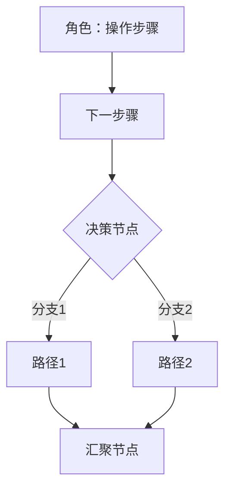

# Style DNA - 从参考文档提取的风格规范

本文件记录从参考 PRD/功能规格说明书中提取的核心风格模式，供 skill 执行时参考。

## 文档来源

### 完整规格说明书风格样本
1. `V0.1/markdown/产品需求文档.md` — 通用 PRD 模板
2. `V0.1/markdown/产品需求文档2.md` — 通用 PRD 模板（含调研结论、竞品分析引用）

### 提词模板
3. `V0.3/PRD生成提词.txt` — 模式 A 逆向推导 PRD 的提示词框架

> §11~§16「简洁产品功能说明风格」、§17~§21「枚举表格与问题分级」为本文件自带的风格规则，无独立样本文件。

## 核心风格模式

### 1. 章节编号

- 一级章节：中文数字 `一、二、三、...`
- 二级章节：`1.1`、`1.2`、`4.1.1`
- 正文编号：`1、`、`2、`、`3、`（中文顿号）
- 子项编号：`1)`、`2)`、`3)`

### 2. 页面规格表（最核心的模式）

每个功能点必须有标准规格表：

```
|**页面元素**|**功能说明**|
| :- | :- |
|页面整体描述|[描述]|
|初始化约束|[约束条件]|
|初始焦点|[默认焦点]|
|权限要求|[角色权限列表]|
|数据来源|[数据来源的业务描述或"-"]（只写业务级数据来源描述,**不含**表/字段/接口,见 `flow-steps.md`「Step 4 交互描述格式」与维度 10）|
|易用性|[要求或"无"]|
|交互方式|[交互描述]|
|组成部分描述||
|[组件名]|[详细说明]|
```

### 3. 权限描述格式

```
1、 门店管理员：查看本门店的商品，可以对已上架商品进行变更；
2、 区域运营：区域账号查看本区域全部门店数据；总部账号查看全部门店数据；
3、 供应商：查看使用本供应商货品的全部商品信息；
```

### 4. 条件逻辑表达

- `若商品加入采购单后被下架，则采购单列表页提示"商品已下架，请删除"`
- `仅"已上架"的商品才能进行变更、下架和调价操作`
- `同一个商品"变更"与"下架"只能同时发起一个；"变更/下架"与"调价"互斥`

### 5. 弹框交互描述

```
点击"删除"按钮，弹框提示"您确定要删除这条记录吗？"
- 点击"确认"：执行删除，提示"删除成功"，刷新列表
- 点击"取消"：关闭弹框，回到当前页面
```

### 6. 多行表格内容

使用 `<p>` 标签：
```
|权限要求|<p>1、 角色A：权限描述1；</p><p>2、 角色B：权限描述2；</p>|
```

### 7. 特殊场景标注

使用中文方括号：
```
【驳回后编辑申请单】
【查看详情页】
【仅可查看，不能新增、编辑删除及进行流程提交等操作】
```

### 8. 通用校验提示语

| 场景 | 提示语模板 |
|------|-----------|
| 必填为空 | "请输入[字段名]" / "请选择[字段名]" |
| 字符超限 | "最多输入xx个字符" |
| 数值越界 | "值必须小于xx" / "值必须大于xx" |
| 操作成功 | "操作成功" / "删除成功" / "提交成功" |
| 操作失败 | "删除失败，请稍后再试" |
| 确认弹框 | "确定要删除这条记录吗？" |
| 批量未选 | "请选择要删除的记录" |
| 到达边界 | "已是最顶层" / "已是最底层" |

### 9. 多步骤流程描述

```
**第一步：填写基本信息**
面包屑：返回/商品中心/商品管理/变更申请
1) [组件描述]
2) [操作说明]

**第二步：填写资源信息**
...

**第三步：上传材料**
...
```

### 10. 表格对齐规范

- 结构化数据表：居中对齐 `| :-: |`
- 描述性长文本：左对齐 `| :- |`
- 表头必须加粗：`|**列名**|`

---

## 简洁产品功能说明风格

### 11. 模块化页面说明结构

> ⚠️ 职责边界以 SKILL.md 维度 10 为准:PRD **不写**前端组件/文件名;字段表只保留 `字段 / 必填 / 说明(业务校验规则)`,**无「类型」列**,字段类型归 dev-logic-architect。

每个页面遵循统一模板：

```
### N. 页面名称

**页面定位**：一句话描述

**页面内容**：
- 区域描述列表

**交互操作**：
1. 点击"XX"按钮 → 跳转到XX页面
2. 点击"编辑" → 打开编辑页面（已上架不可编辑）

**字段列表**（不含"类型"列）：
| 字段 | 必填 | 说明 |
|------|------|------|
```

### 12. 操作约束的括号标注

```
点击"编辑"按钮（已上架产品不可编辑）
点击"删除"弹出确认框（已上架不可删除）
```

### 13. 箭头符号表示逻辑因果

```
已上架产品 → 不可编辑，仅可下架
已下架产品 → 可重新上架
仅企业管理员 → 可查看管理后台
```

### 14. 状态颜色编码

- 绿色标签 = 已上架/生效中/运行中
- 灰色标签 = 已下架/已过期/未激活
- 金色标签 = 精选/推荐
- 橙色显示 = 金额/价格重点

### 15. Mermaid 流程图规范



规范：
- 使用 `graph TD` 或 `graph LR`
- 矩形 `[]` = 操作步骤
- 菱形 `{}` = 决策分支
- 带标签边 `-->|标签|` = 条件
- 注明角色归属

### 16. PRD禁止项

**PRD文档中不得包含：**
- 技术栈（React/Vue/Spring Boot等）
- 框架选型
- 技术实现方案
- 数据库设计
- API接口设计（PRD 仅写接口业务名,**不写** HTTP Method/URL,见 SKILL.md 维度 10）

PRD聚焦于业务需求、交互逻辑、字段规格，不限定技术实现。

---

## 枚举表格与问题分级

### 17. 字典枚举表格规范

PRD 中所有状态、类型、分类等枚举值必须以独立表格形式定义，而非散落在文字描述中。

**状态类枚举表格**（带颜色、操作、触发条件）：
```
| 状态编码 | 显示文本 | 颜色 | 可执行操作 | 触发条件 |
|----------|---------|------|-----------|---------|
| active | 使用中 | 绿色 | 查看、管理 | 未到期且未临近到期 |
| expiring | 快到期 | 橙色 | 续费、查看 | 到期日 ≤ 30天 |
| expired | 已过期 | 红色 | 续费 | 超过到期日 |
```

**类型/分类枚举表格**（带编码和说明）：
```
| 编码 | 显示名称 | 说明 |
|------|---------|------|
| economy | AI+经营 | 经营管理类智能体 |
```

**角色枚举表格**（带编码和权限描述）：
```
| 角色编码 | 角色名称 | 角色描述 |
|----------|---------|---------|
| ADMIN | 企业管理员 | 可添加普通用户和管理员用户 |
```

### 18. 编码规范

- 状态编码使用大写 SNAKE_CASE：`PENDING`、`PROCESSING`、`COMPLETED`
- 角色编码使用前缀+大写：`APP_ADMIN`、`APP_USER`
- 分类编码使用小写 snake_case：`economy`、`office`、`dev`
- 字典数据通过接口动态获取，前端不硬编码

### 19. 提词模板中的PRD章节结构

PRD 提词模板定义的章节要求：
1. 产品概述（定位、用户画像、模块列表）
2. 信息架构（层级结构、导航逻辑图）
3. 功能需求（模块化：功能描述→触发条件→交互逻辑→数据字段→**状态枚举**→边界条件）
4. 数据来源（仅业务描述;ER图/实体字段清单/接口行为属详细设计,PRD 不含,见 SKILL.md 维度 10/不臆造原则）
5. 非功能需求（性能、权限、多端适配）
6. 待确认问题清单（P0/P1/P2分级）

### 20. 用户故事格式

```
As a [用户角色]，I want [功能需求]，So that [价值主张]。
```

### 21. 问题清单分级

- P0：阻塞开发，必须立即确认
- P1：当前迭代待确认
- P2：可后续迭代优化
