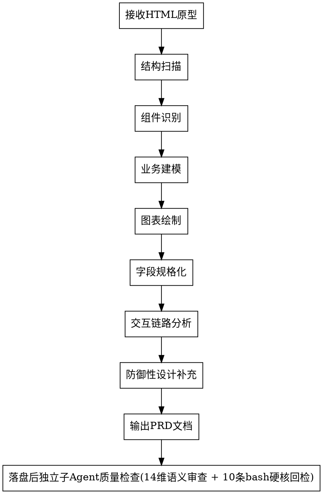
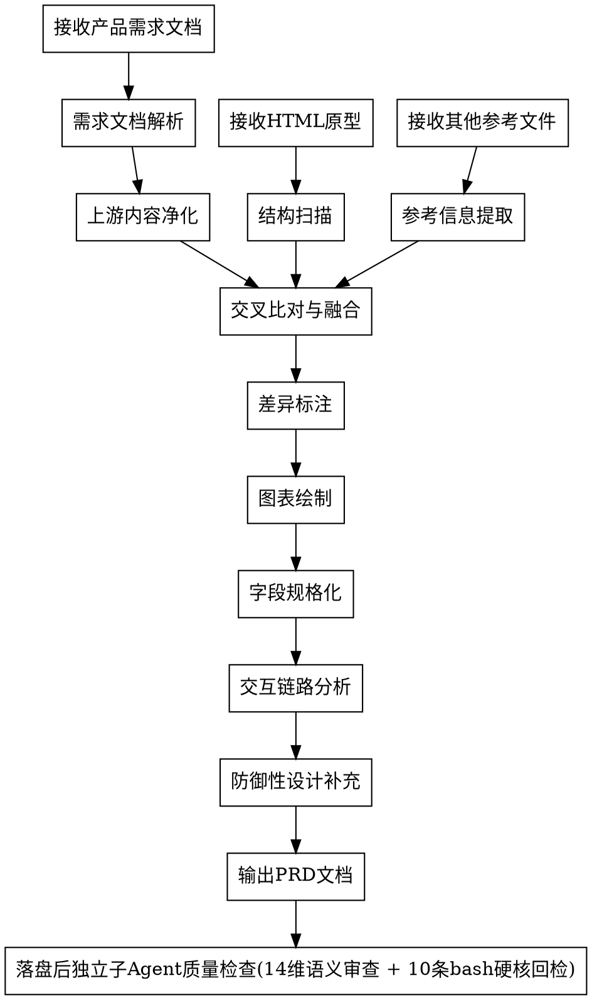

# UX Logic Extractor

从 HTML 原型和/或产品需求文档中提取交互逻辑与业务规则，生成符合企业级功能规格说明书标准的**研发用 PRD 需求文档**。

## 核心原则（结论速查 · 判据全文见 [`references/flow-principles.md`](./references/flow-principles.md)）

> 下列八条**每条都是 Critical**。此处只留强制结论；Why、正反例、逐条判据、检查清单在分片里，按需 Read。

1. **职责边界** — PRD 只描述「用户要什么 / 系统做什么」，**严禁包含技术实现细节**（表结构、API 路径、字段类型、错误码、框架名）。
2. **不臆造兜底** — 产品需求没明确说「需要兜底 / 容错 / 默认值 / 降级」的地方，**严禁自行增加**任何形式的兜底逻辑、默认数据源、缺省回退、容错降级。
3. **原型对齐三层**（AIDP 约定4）— 「对齐原型」= **视觉 + 内容 + 操作逻辑三层全部一致**，不止字段裁剪三件套；原型 `code/` 里每一层都要转写成功能点/字段/流程/交互规则，**禁止静默漏、禁止擅自简化或改流程**。
4. **不中断** — 遇信息缺失、表述不清、文档与原型冲突，**严禁中断生成**；就地按「待澄清问题清单」登记并继续。
5. **复用优先** — 必须主动追问「这块功能/数据在已有系统是否已存在，只是展示位置或统计维度不同」，**严禁默认所有需求都是全新的**。
6. **数据闭环完整性** — 每条数据都有「来源」和「去向」两端，**严禁只描述单端**。
7. **数据单位标注** — 必须区分「存储单位 vs 展示单位 vs 第三方传输单位」，**严禁默认三者一致**。
8. **语义/口径变更类需求** — 必须主动识别「同一实体的统计范围/单位/默认值/权限/状态机语义变化，代码改数值行为但页面零新增元素」这类需求，**强制产出表 E（语义变更→派生展示物影响清单）+ 表 F（历史需求作废清单）**；⛔ 禁用「版式全部保持不变/仅数值变化/UI 不变」这类笼统豁免覆盖说明性文案。
## 工作模式

本 Skill 支持两种工作模式，根据用户提供的输入自动判断：

| 模式 | 输入 | 适用场景 | 核心逻辑 |
|------|------|---------|---------|
| **模式 A：逆向提取** | 仅 HTML 原型 | 产品未提供需求文档，需从原型反推需求 | 扫描原型 → 推导业务逻辑 → 生成 PRD |
| **模式 B：融合增强** | 产品需求文档 + HTML 原型（+ 其他参考文件） | 产品已有需求文档，需转化为研发视角的 PRD | 以产品文档为主线 → 原型补充交互细节 → 融合生成研发 PRD |

**模式判断规则：**
- 用户只提供了原型 → 模式 A
- 用户提供了需求文档（无论是否有原型）→ 模式 B
- 不确定时，询问用户是否有产品提供的需求文档

## 输入要求

| 输入项 | 模式 A | 模式 B | 说明 |
|--------|--------|--------|------|
| HTML 原型 | **必需** | 推荐 | 交互原型文件或目录，**仅作为功能交互设计参考** |
| 产品需求文档 | 无 | **必需** | 产品提供的 PRD、MRD、BRD、功能说明等，**模式 B 的主线来源**；同时是「表 D：PRD 条目映射表」的**条目完整性对账基准输入**——即**产品原始 PRD 原文**（示例路径 `docs/requirements/{version}/产品提供/*.md`，自适应项目结构），逐条核验其功能条目/字段是否都被转写进研发 PRD（见「六·4 表 D」+ 维度 13 子项「产品 PRD 条目转写完整性」）；模式 A 无产品原始 PRD 时该对账标 N/A |
| 其他参考文件 | 无 | 可选 | 竞品分析、会议纪要、业务流程图、接口文档等 |
| **AIDP 原型内容基线** | 有则强制消费 | 有则强制消费 | `docs/design/{version}/原型内容基线.md`（示例路径，自适应项目结构）——逐页可见元素 + 操作逻辑 + 处置列；**上游已产出则作原型覆盖度基准，无则回退直接从原型 `code/` 现场逐页清点**（见「原型对齐三层原则」） |
| **AIDP 设计令牌 / 原型 manifest** | 有则读取 | 有则读取 | `docs/design/{version}/设计令牌.md`、原型目录内 `DESIGN-MANIFEST.json` / `DESIGN-HANDOFF.md`（`screens/appModules/requiredStates/tokens/flows`）——有则读取扩充覆盖清单，无则跳过；**不臆造、不硬依赖** |

**信息优先级原则（模式 B 必须遵守）：**

> **产品需求文档是第一信源，原型仅作为交互设计的辅助参考。**
>
> - 功能范围、业务规则、角色权限、状态流转 → **以产品需求文档为准**
> - 页面布局、交互细节、字段校验、按钮行为 → **以原型为参考补充**
> - 两者冲突时 → **以产品需求文档为准**，标注冲突并提醒用户确认
> - 原型中有但文档中没有的**功能点** → **不自动纳入**，标注为"原型补充"待用户确认
> - 文档中描述不清晰/不完整的功能点 → **结合原型补充完整**（交互流程、页面布局、操作步骤等），标注"已参考原型补充"
> - 表单字段：**以需求文档定义的字段为准**，原型中多出的字段不自动纳入

## 参考资源

本 SKILL 自带以下离线参考资源(均位于 `references/`),按需查阅,**不在每次执行时强制加载**:

| 类型 | 路径 | 用途 | 何时查阅 |
|------|------|------|---------|
| **质量检查清单** | `references/quality-review-checklist.md` | 15 维度 Quality Review 检查清单(检查目标/核验步骤/不通过标志/报告格式) | **PRD 生成后强制执行**,Quality Review Agent 必读 |
| 提词模板 | `references/V0.3/PRD生成提词.txt` | 模式 A 逆向推导 PRD 的提示词框架 | 模式 A 首次执行,**仅作章节骨架参考**;⚠️ 其中"数据需求 / ER 图 / 接口行为"等章节已下沉 dev-logic-architect 详细设计,本 SKILL 的 PRD **不生成**这些技术内容(见职责边界 / 维度 10) |
| 风格 DNA | `references/style-dna.md` | PRD 风格规则汇总(章节编号、表格格式、文风等);职责边界为 PRD 零 API/零 ER 图/零字段类型,风格规则与之冲突时以职责边界为准 | 仅查阅**版式/编号/文风**,技术内容规则以职责边界 + R0~R6 检测器为准 |
| 模式 A 样本 | `references/V0.1/markdown/*.md` | 通用产品需求文档模板样本 | 模式 A 输出格式不确定时参考 |
| 模式 B 风格 | `references/style-dna.md` §11~§16 | 简洁产品功能说明风格(模块化页面说明/括号约束/箭头因果/状态颜色/Mermaid) | 模式 B 版式与章节结构不确定时参考 |
| 第三方对接模板 | `references/third-party-integration-template.md` | 七·4 第三方系统对接说明的完整表格骨架(七·4.1~4.5 各表格 + 填写说明),SKILL.md 正文只留摘要 | PRD 含第三方对接、需生成「七·4、第三方系统对接说明」章节时照抄查阅 |
| 拆分一致性脚本 | `scripts/check_doc_split.py` | 多文件拆分检查(序号前缀/主文档/序号连续性/引用一致性/语义前缀禁"补充·追加"/碎片子文档<100行) | **PRD 多文件输出后强制执行**(QR 子 Agent 步骤 0 硬核回检命令 7),维度 9 判定 |
| 第三方对接清单脚本 | `scripts/check_3p_capability.py` | 七·4 章节编号唯一性 + 格式合规 + 七·4.4 与 七·4.2/4.3 双向追溯(⚠️ **七·4.1 对接总览 / 七·4.5 对接约束的存在性由 Agent 语义核验,脚本不覆盖**) | **PRD 落盘后强制执行**(QR 子 Agent 步骤 0 硬核回检),仅 PRD 含七·4 第三方对接章节时触发,Quality Review 维度 8 判定 |
| **职责边界硬核回检脚本** | `scripts/check_technical_content.py` | 6 类正则硬核扫描(技术栈/字段类型同行表/完整 API 路径/DDL 关键字/HTTP 错误码同行表/`T_` 前缀表名),命中即不通过 | **PRD 落盘后强制执行**,Quality Review 维度 10 必跑 |
| **多文件白名单脚本** | `scripts/check_split_blacklist.py` | 多文件拆分模式禁止"字段+字典""数据库设计""接口设计""技术架构"类独立分册;文件名英文/拼音/kebab-case 不通过 | 多文件输出后强制执行,QR 维度 9/10 联合判定 |
| **REQ 段头部溯源核验脚本** | `scripts/check_req_upstream.py` | 每个 `### REQ-NNN` 或 `#### 5.{N}` 段头部 8 行内必须含 4 类来源标注(PRD/原型/高保真/关联);H1+H2 必须 100%,H3/H4 ≥ 95% | **PRD 落盘后强制执行**,Quality Review 维度 5(数据一致性 + 上游溯源)必跑 |
| **不臆造兜底脚本** | `scripts/check_no_fabricated_fallback.py` | 兜底关键词扫描(回退/降级/兜底/默认数据),未在产品文档找到来源即不通过;Mock 兜底零容忍(与疑似兜底同为退出码 1,靠 --json 的 is_mock_fallback 区分) | **PRD 落盘后强制执行**(QR 子 Agent 步骤 0 硬核回检,始终必跑),Quality Review 维度 12 判定 |
| **需求字段清单 + 原型内容基线覆盖结构性脚本** | `scripts/check_requirement_field_inventory.py` | 存在性采集 + **表 A 字段语义名称代码级标识硬门(Critical,退出码 1)**:表 A 表头特征列 / 表 B 处置取值是否 ∈ {保留·裁剪·前端计算还原·请第三方补} / 裁剪项是否带「待产品确认」;**+ 表 C 表头特征列 / 表 C 处置取值是否 ∈ {实现·裁剪·延期·改为X} / 表 C 非实现项是否带「待产品确认」**,采集结果交 Agent 判定(漏列与基线「实现」项覆盖须 Agent 逐项比对) | **PRD 落盘后强制执行**(QR 子 Agent 步骤 0 硬核回检,仅含「需求字段清单」/表 C 章节时触发),Quality Review 维度 13 判定 |
| **PRD 条目反向覆盖率脚本(命令 9)** | `scripts/check_prd_item_coverage.py` | 判错型:解析「表 D：PRD 条目映射表」,逐行判「处置」是否 ∈ {已承接·本版不做·已存在无需重复},**未分类(空/越界)条目 > 0 即退出码 1**、列出未落点条目原文(PRD 位置 + 条目内容);内置三类高危丢失点 report-only 告警(操作类整类缺失·0 承接 / 备注·展示规则属性丢失 / 遗留问题·迭代建议未逐条进表 D);无表 D 且无产品原始 PRD 源(模式 A)退出码 0;探测到同级/父级 `产品提供/`(或 `--prd-source`)却无表 D 判退出码 1。与命令 4 正向溯源方向相反、并存不可替代 | **PRD 落盘后强制执行**(QR 子 Agent 步骤 0 硬核回检命令 9,仅含「表 D」时触发),Quality Review 维度 13 判定 |
| **语义/口径变更类需求脚本(命令 10)** | `scripts/check_semantic_change.py` | 判错型:正则识别语义变更信号词(口径/范围/单位/默认值/改为/扩展为/由…改成/不再只/全口径/含…消耗/默认开启/默认关闭/反转/由仅…改为),命中则要求存在「表 E」(6 列表头:变更项/变更前语义/变更后语义/受影响展示物/处置/新文案)否则退出码 1;另命中笼统豁免表述("版式.*保持不变"/"仅数值变化"/"UI 不变")且无表 E 亦退出码 1;「表 F」历史需求作废清单存在性 report-only 提示。既无信号又无豁免的 grandfather 退出码 0 放行 | **PRD 落盘后强制执行**(QR 子 Agent 步骤 0 硬核回检命令 10,仅命中语义变更信号词/笼统豁免时触发),Quality Review 维度 14 判定 |
| 技术栈索引 | `references/stack-index.md` | **本 SKILL 刻意不做 `stack-*.md` 拆分**的理由:技术栈词典用于「在未知技术栈的前提下做识别」,按栈拆会形成「要先探测栈才能加载词典、而词典正是用来探测栈的」循环依赖 | 有人提议按技术栈拆分本 SKILL 时**必读** |

**使用原则**:这些资源仅作为**风格与结构参考**,**不是逐字模板**。实际输出仍以本 SKILL.md 中的章节定义为准,样本只用于解决"格式不确定"时的歧义。

## When to Use

- 用户提供了 HTML 原型代码或文件路径
- 用户要求从原型生成 PRD / 需求文档 / 功能规格说明书
- 用户说"分析原型"、"提取需求"、"写PRD"、"生成需求文档"
- 用户提供截图并要求分析页面交互逻辑
- **用户提供了产品需求文档，要求转化/整理为研发用的 PRD**
- **用户同时提供了需求文档和原型，要求融合生成功能规格说明书**
- **用户说"把产品的文档整理成研发需求"、"根据这些材料出个PRD"**

## When NOT to Use

- 用户只是要求修改 HTML/CSS 样式
- 用户在讨论后端 API 设计（非从原型出发）
- 纯技术架构讨论

## Core Workflow

### 模式 A：逆向提取（仅原型）



### 模式 B：融合增强（需求文档 + 原型 + 其他文件）



**模式 B 特有步骤：**

#### 需求文档解析

从产品提供的需求文档中提取：
1. **功能清单** — 产品定义的所有功能点，保留原始编号
2. **业务规则** — 产品描述的业务逻辑、约束条件、状态流转
3. **角色权限** — 产品定义的用户角色和权限范围
4. **非功能需求** — 性能、安全、兼容性等要求
5. **术语定义** — 产品文档中的专业术语和缩略词

**严禁提取并禁止带入 PRD 的内容(产品文档仅供参考,技术方案归研发)**:

| 类别 | 举例 | 处理方式 |
|------|------|---------|
| 接口设计 | HTTP Method、URL 路径、请求/响应字段名、字段类型、JSON/SQL 示例、错误码列表、Swagger/OpenAPI 片段 | **一律丢弃**,在 PRD 中**仅**以业务语言描述"需要什么输入、得到什么信息",不提接口名/字段名/类型 |
| 数据表设计 | 表名、字段名、主外键、索引、DDL、ER 图、`T_` 前缀表名 | **一律丢弃**,数据建模归 `dev-logic-architect` |
| 技术栈选型 | 前后端框架、数据库、中间件、部署架构、类库版本 | **一律丢弃**,技术选型归 `dev-logic-architect` Phase 1 |
| 代码示例 | 伪代码、Java/TS/Python 代码片段、类名、方法签名 | **一律丢弃** |
| 研发计划 | Sprint、迭代、工时、排期、里程碑、上线日期 | **一律丢弃**,见本 SKILL 职责边界 |

**Why:** 产品需求文档中的技术设计常为历史参考或外部资料直接复制,与本项目的技术栈/约束未必匹配。研发视角 PRD 的职责是"描述要做什么业务",技术实现由 `dev-logic-architect` 基于 PRD 重新设计。

**转写原则:** 产品文档写了 `POST /api/user/create Body: {name, age}`,PRD 里只写"支持新增用户,需要录入姓名、年龄"——不保留 URL、Method、字段英文名、类型。

#### 上游内容净化 (Upstream Content Sanitization) — 模式 B 强制 Step

模式 B 在「需求文档解析」**之后**、「交叉比对与融合」**之前**,**必须**执行本 Step,主动剥离产品文档中的技术细节并转写为业务语言。**严禁**让技术内容透传到融合阶段。

**净化对象(必须剥离):**

| 编号 | 类别 | 检测正则 / 关键词 | 业务化转写示例 |
|:-:|:-|:-|:-|
| **S1** | 技术栈词典 | Vue/React/Spring Boot/MyBatis Plus/Element Plus/UnoCSS/MySQL/达梦/Redis/Nacos/Docker/k8s 等 | 整段删除;若有"性能/安全"业务指标保留为非功能业务需求(如"列表加载 < 2s") |
| **S2** | 字段类型标注 | `\|.*\b[a-z][a-zA-Z]*[A-Z][a-zA-Z]*\b.*\|.*\b(string\|number\|boolean\|integer\|varchar)\b.*\|` (变量名+类型同行) | 删去"变量名"列与"类型"列,只保留"业务字段中文名 + 业务校验规则" |
| **S3** | 完整 API 路径 | `\b(GET\|POST\|PUT\|DELETE\|PATCH)\b\s+/\S+`、时序图载荷 `FE->>BE: GET /xxx` | 整条删除;时序图改用业务动作描述(如"用户提交订单 → 系统接收订单") |
| **S4** | DDL / SQL | `CREATE TABLE`、`ALTER TABLE`、`VARCHAR(N)`、`NOT NULL`、`PRIMARY KEY` 等 | 整段删除;字段必填性改为"必填(业务约束)" |
| **S5** | HTTP 错误码 | 4xx/5xx 同行表格(`\|\s*4\d{2}\s*\|`、`\|\s*5\d{2}\s*\|`) | 改为业务错误描述(如 `404 → "找不到该资源"`、`401 → "请先登录"`),不写 HTTP 数字 |
| **S6** | `T_` 前缀表名 | `\bT_[A-Z][A-Z0-9_]{2,}\b`(与 `check_technical_content.py` R6 一致) | 替换为业务对象名(如 `T_AGENT_INFO` → "Agent 信息") |

**净化记录(必填,产物头部声明):**

PRD 头部「文档头部」紧接元信息表后,**必须**插入「⚠️ 已剥离技术细节」表,记录每条剥离动作:

```markdown
> ⚠️ **已剥离技术细节**(模式 B 上游净化阶段处理):
>
> | 编号 | 来源章节(产品文档) | 剥离原文(摘要) | 业务化转写 | 类型 |
> | :-: | :- | :- | :- | :-: |
> | C-001 | `需求说明V1.2.docx > 4.2 用户列表` | `userId: number` 字段类型表 8 行 | "用户唯一编号(业务自动生成)" 等 8 项业务字段 | S2 |
> | C-002 | `需求说明V1.2.docx > 4.3 接口契约` | `GET /api/user/list?page=1&size=10` | "用户列表支持分页查询" | S3 |
> | C-003 | `需求说明V1.2.docx > 5.1 数据表` | `CREATE TABLE T_USER_INFO(...)` 段落 | 删除(数据建模归 dev-logic-architect) | S4/S6 |
```

**质检:** 净化完成后,对 PRD 草稿运行 `python3 <SKILL_DIR>/scripts/check_technical_content.py <PRD路径>`,**必须**输出 `✅ 通过`,否则继续净化直到通过为止才能进入「交叉比对与融合」。

#### 交叉比对与融合

**核心原则：产品需求文档是第一信源,但仅限"业务需求"部分;文档中出现的技术设计(接口/数据表/技术栈/代码)、研发计划(Sprint/工时/排期)均按"参考信息"对待,严禁原样带入研发视角 PRD。原型仅作为交互设计的辅助参考。**

将产品需求文档与原型进行交叉比对：

| 比对维度 | 处理方式 | 优先级 |
|---------|---------|--------|
| 文档有、原型有 | **以文档为主**，原型仅补充交互细节（字段校验规则、按钮文案、页面跳转路径、布局结构） | 文档 > 原型 |
| 文档有但描述不完整、原型有 | **以文档为主线**，结合原型**主动补充完整**（交互流程、操作步骤、页面布局、组件选型、弹窗样式等），标注"✅ 已参考原型补充交互细节"。**判定标准**：文档只提功能名称但没有操作流程、描述业务规则但缺少交互细节、列出功能点但缺少异常场景、定义字段但缺少校验规则。**补充原则**：补充内容必须服务于文档已定义的功能点，不得借补充之名新增功能；补充的交互细节必须标注来源；表单字段严格以文档为准 | 文档为主 + 原型补充 |
| 文档有、原型无 | **完整保留文档描述**，标注"⚠️ 原型未体现"，**参考其他类似功能的原型交互设计，自行补充交互细节**（页面布局、组件选型、字段排列、按钮位置、弹窗样式等），并在补充说明中注明"参考 XXX 功能的交互设计" | 文档为准 |
| 文档无、原型有（功能点级别） | **不自动纳入 PRD**，标注"📌 原型补充功能，产品文档未提及，待确认是否纳入本期" | 待用户确认 |
| 文档无、原型有（表单字段级别） | **不自动纳入**，表单字段以需求文档定义为准，原型中多出的字段标注"📌 原型多出字段，文档未定义，待确认" | 文档为准 |
| 文档与原型冲突 | **以文档为准**，标注"❗ 文档与原型不一致（文档：xxx，原型：yyy），已采用文档定义" | 文档为准 |

**具体融合规则：**

| 信息类别 | 来源优先级 | 说明 |
|---------|-----------|------|
| 功能范围 | 产品需求文档 | 哪些功能纳入本期开发，以文档为准 |
| 业务规则 | 产品需求文档 | 状态流转、权限控制、操作约束等，以文档为准 |
| 角色权限 | 产品需求文档 | 用户角色定义和权限范围，以文档为准 |
| 字段定义 | 产品需求文档 | 字段名称、类型、必填性、业务含义，以文档为准 |
| 枚举值定义 | 产品需求文档 | 状态码、类型码、显示文本，以文档为准 |
| 页面布局 | 原型 | 组件位置、排版方式，以原型为参考 |
| 交互细节 | 原型 | 按钮文案、弹窗样式、跳转路径、加载态，以原型为参考 |
| 字段校验规则 | 原型 | 长度限制、格式校验、错误提示文案，以原型为参考 |

**冲突处理示例：**

```markdown
> ❗ **文档与原型不一致**：
> - **用户状态定义**：产品文档定义为"启用/停用"两种状态，原型展示为"启用/停用/待审核"三种状态
> - **采用方案**：以产品文档为准，用户状态为"启用/停用"两种
> - **建议**：若需支持"待审核"状态，请产品确认并更新需求文档
```

#### 差异标注

在输出的 PRD 中，对融合过程中发现的差异进行标注：

```markdown
> ⚠️ **原型未体现（已补充交互设计）**：产品文档要求支持批量导入用户，但原型中未包含导入功能。
> 已参考"用户列表页"的交互风格，补充以下交互设计：
> - 在用户列表页工具栏右侧增加"批量导入"按钮（与"新增"按钮并列）
> - 点击后弹出导入弹窗，包含：文件上传区域（支持 .xlsx/.csv）、下载模板链接、导入进度条、导入结果汇总（成功/失败/跳过条数）
> - 导入失败时展示错误明细表格（行号、字段、错误原因）
> - 交互风格参考：用户列表页的"新增用户"弹窗布局

> 📌 **原型补充**：原型中包含"高级搜索"折叠面板（按创建时间范围、状态多选筛选），产品文档未提及此功能，待确认是否纳入本期。

> ❗ **文档与原型不一致**：产品文档描述状态为"启用/停用"两种，原型中展示为"启用/停用/待审核"三种状态。已采用文档定义（启用/停用），建议产品确认。
```

## 执行步骤（骨架 · 细则见 [`references/flow-steps.md`](./references/flow-steps.md)）

| 步骤 | 干什么 | 强制结论 |
| :- | :- | :- |
| **Step 1** 结构扫描 | 通读原型/产品文档，建页面与实体清单 | 逐页扫，**不抽样** |
| **Step 2** 业务建模 | 抽出业务对象、关系、生命周期 | 用**业务语义名**，禁代码级字段名 |
| **Step 3** 图表绘制 | 业务全景流程图 / 页面跳转图 **必选**；状态迁移图（有状态流转时）、时序图（多系统多角色）**必选**；多步骤表单流程图推荐 | 图表选型判断规则见分片 |
| **Step 4** 技术规格化 | 字段清单 + 交互描述（双模式） | 字段提取规则、交互链路格式见分片 |
| **Step 5** 字典枚举提取 | 识别并提取全部字典/枚举 | **必须提取的枚举类型**清单见分片 |
| **Step 6** 防御性设计 | 权限、边界、异常 | **权限差异矩阵必须生成** |
## Output Template (输出模板)

**输出必须严格遵循以下结构，中文撰写：**

> ⚠️ **本章所有 ` ```markdown ` 围栏仅为「本文档的排版示意」,不是产物的一部分。** 写进 PRD 时**只输出围栏内的表格与正文,不输出围栏本身**。
> 原因是硬性的:PRD 内**除 ` ```mermaid ` 外出现任何代码围栏即触发 `check_technical_content.py` 的 **R0**(维度 10 Critical、始终适用)。实测把本章原样当 PRD 落盘会得到 **264 处违规、退出码 1** —— 即「照『严格遵循』照抄 → 被自家 Critical 硬门判死」。
> 换言之:**围栏是给你看结构的,不是给 PRD 用的**;唯一可以出现在 PRD 里的围栏是 Mermaid 图。

**重要：文档头部不得包含"技术栈"字段。PRD是业务需求文档，不应限定技术实现方案。**

---

### 文档头部

**模式 A（仅原型）：**

```markdown
# [页面/模块名称] — 功能规格说明书

|**文档版本**|V1.0|
| :-: | :-: |
|**编写日期**|[当前日期]|
|**文档状态**|初稿|
|**生成模式**|模式A：逆向提取|
|**原型来源**|[原型文件路径，如 `docs/ui/code/user-management/`]|
```

**模式 B（需求文档 + 原型 + 其他文件）：**

```markdown
# [页面/模块名称] — 功能规格说明书

|**文档版本**|V1.0|
| :-: | :-: |
|**编写日期**|[当前日期]|
|**文档状态**|初稿|
|**生成模式**|模式B：融合增强|
|**产品需求文档**|[产品需求文档路径，如 `docs/product/用户管理需求说明.docx`]|
|**原型来源**|[原型文件路径，如 `docs/ui/code/user-management/`]（如有）|
|**其他参考文件**|[其他文件路径列表]（如有）|
```

## 🔗 上游引用规则（Critical 强制要求 · 判据全文见 [`references/flow-upstream-refs.md`](./references/flow-upstream-refs.md)）

> 本节是本 SKILL 最长的一块判据，已整节外置。**强制结论如下，一条都不可省：**

- **每个功规点段头部 8 行内必须有 4 类来源标注**（H1 产品 PRD 来源 / H2 原型来源 / H3 参考文件 / H4 既有系统），
  由 `check_req_upstream.py` 机检：**H1 + H2 必须 100% 覆盖，H3/H4 ≥ 95%**。
- **表 A~F 是下游字段对账与跨版本清算的单一信源**：表 A 需求字段清单（**纯业务语义名，禁代码级字段名**）/
  表 B 需求字段→处置 / 表 C 原型元素·操作逻辑→处置 / 表 D PRD 条目映射 /
  表 E 语义变更→派生展示物影响 / 表 F 历史需求作废。
- **表 E 处置 = 改写的必须给出具体新文案**，⛔ 不接受「待定 / 按实际调整」。
- **五·N「复用清单」是 Critical 强制章节**——识别到「已有系统已存在、只是展示位置/统计维度不同」必须成章节登记，不能只在正文提一句。
- **🛰️ 外部系统数据强制标注（Critical）**：字段来自外部系统的必须逐个穿透标注来源，⛔ **严禁默认所有字段都来自本系统**。
- **六·3 原型版本基底对齐 /「原型超前能力清单」**：原型里超出本版范围的能力必须登记进该清单；⛔ **未登记的功能一律不进研发 PRD**，不得默认纳入。
- **引用必须是 markdown 可点击链接 + 相对路径（Critical）**，禁裸文件名、禁绝对路径。
- 表 E/F 产出后应生成机器可读副本（`check_semantic_change.py --emit-json`，见 [`flow-qr-dispatch.md`](./references/flow-qr-dispatch.md) 命令 10'），**markdown 表始终是唯一信源、JSON 是派生产物**。
## 输出规范（结论 · 细则见 [`references/flow-output-format.md`](./references/flow-output-format.md)）

- **`00_` 槽位恒给专职索引 `00_索引.md`，内容主文档一律从 `01_` 起**；即便只有一份内容文档也产出两个文件。
  `99_` 固定分配给待澄清问题清单。
- **PRD 不写研发计划**（职责边界的输出侧对应项）。
- **多文件分册白名单是 Critical 强制约束**——不在白名单内的分册名一律不许出现（机检 `check_split_blacklist.py`）。
- **拆分数量控制（Critical）**：目标 **3~5 个文件**；只有正文超 **1500 行**才允许超过 5 个。
- **字典/枚举独立成文件**有硬性规则；子文档头部规范、拆分一致性检查、何时不拆分，均见分片。
## 增量 / 补充生成约定

> 供下游命令(如 `/sprint-dev` 的"口述累进 / 代码完成回头补 PRD")以增量 / 补充方式调用本 SKILL 时遵循。本节只约定增量协作接口,不改变上文任何全量产物的命名与拆分规则。

1. **无独立 mode / 参数开关** — 本 SKILL **没有** `mode=supplement` 之类的模式参数;增量补充完全由**调用方在 prompt 中描述「本次增量范围 + 关联主文档」**驱动(prompt 驱动增量)。严禁臆造、要求或假设一个并不存在的 mode 参数。
2. **增量产物命名续编最大序号** — 增量 PRD 产物与全量产物**同目录**,统一 `NN_<业务主题>.md` 纯数字前缀(两位序号在文件名最前),序号**接已有内容文档最大序号自动累进**(不跳号、不嵌套二级序号)。**文件名一律不带「补充」/「追加」字样**(遵循 [`references/flow-output-format.md`](./references/flow-output-format.md) 的「拆分原则」命名规则);增量身份靠「产物头部回链 + `00_索引.md` 追加行(类型=补充 + 生成时间)」体现,而非文件名前缀。**`--supplement` 产出时只在 `00_索引.md` 追加一行,不改内容主文档 `01_PRD-{项目名}.md` 正文**(⛔ 本条只约束 `--supplement` 分册路径;约定 22 攒批级联 `--ledger-cascade` 反过来**就地改内容主文档正文、不新建 `NN_` 分册**,两条路径按调用方传的 flag 分流,不可混用)。
3. **增量产物头部回链(三类)** — 每个增量产物头部必须回链:① **索引 + 内容主文档**(`00_索引.md` 专职索引 / `01_PRD-{项目名}.md` 内容主文档);② **本轮输入来源**(本次增量所依据的产品需求 / 原型 / 参考文件 / 口述需求);③ **同轮其他层补充**(如有,如同一轮里其它 SKILL 产出的增量文档,便于跨层对齐)。
4. **增量仍跑 15 维度 QR** — 增量模式下**照常执行**本 SKILL 的 15 维度独立 Agent 质量检查,只是**检查范围限定在本次增量内容 + 与内容主文档的一致性**(引用 / 编号 / 术语 / 命名 / 字典枚举编码必须与内容主文档一致),不必重扫未改动的全量产物。
   ⚠️ **「不必重扫」有明确例外,别当成整份产物都不用看**:裁剪的**可执行判据**以 [`references/quality-review-checklist.md`](./references/quality-review-checklist.md) 的**「QR 变更范围裁剪协议」**为准(调用方传 `qr_delta_scope`,不传 = 全量)——**机器门一律全量跑**,标「全量」档的维度(13 需求字段去向登记 / 14 语义变更识别 / 10 职责边界 / 11 待澄清清单)**不接受裁剪**,因为**它们的失效形态正是「新增这一处与旧的那些不一致」,只看增量内部一个都发现不了**,而增量迭代恰是它们的高发期。本条与该协议冲突时**以协议为准**。
5. **增量同等触发表 D 条目化 + 命令 9 反向覆盖率** — 模式 B 融合增强与下游口述累进增量模式,只要本轮增量引入了产品需求文档条目(操作描述表 / 字段说明表 / 遗留问题·迭代建议表等),**都必须**对本轮增量条目化产出/追加「表 D：PRD 条目映射表」并跑命令 9 `check_prd_item_coverage.py` 反向覆盖率回检(检查范围限定在本轮增量条目),避免"全量守住、增量又漏"。增量表 D 与全量表 D 同域并列、条目续登,不改内容主文档已有表 D 正文。

---

## Writing Style Rules (文风规范)

| 规则 | 说明 |
|------|------|
| 语言 | 全中文撰写，技术术语可保留英文 |
| 语气 | 正式、技术性、祈使句式 |
| 动词 | 点击、输入、显示、展示、支持、跳转、提示、校验 |
| 条件句 | `若...则...`、`当...时...`、`仅...才能...` |
| UI文本 | 用中文引号标注："确认"、"取消"、"提交" |
| 编号 | 一级：`1、2、3、` 二级：`1) 2) 3)` |
| 章节引用 | PRD 内部章节用"五-1"格式(中文章节号+连字符+阿拉伯子序号),产品文档外部引用沿用其原始章节号(如 3.2) |
| 空值表示 | 无数据用`-`，无要求用`无` |
| 权限描述 | `[角色名]：[权限动作]；` 格式 |
| 多行单元格 | 使用 `<p>` 标签包裹每行 |
| 特殊场景 | 用【方括号】标注 |
| 操作约束 | 用括号标注：`（已上架不可编辑）` |
| 状态颜色 | 绿色=正常/已上架，灰色=停用/已下架，橙色=金额/警告 |
| **禁止项** | 详见 [`references/flow-principles.md`](./references/flow-principles.md) 的「职责边界」+「不臆造兜底原则」两节 |

## 📚 分片索引（细则外置，按需 Read）

> **本 SKILL.md 只保留骨架**：核心原则的**结论速查** / 工作模式与输入 / Core Workflow / 执行步骤骨架 /
> 输出模板 / 上游引用的强制结论 / 增量约定 / 文风规范。判据全文、正反例、模板、长示例一律外置。
>
> ⚠️ 分片前本文件 **2247 行 / 约 173 KiB**，是四个文档类 SKILL 里唯一没分过片的，
> 每次调用都要全量载入。本次按仓库既有 `flow-*.md` 范式**整节平移、内容一字未改**
> （行级零丢失回比：旧文件 1662 个非空行中**仅 1 行**不逐字相同——那是 `./references/x.md` 搬进
> `references/` 后必须改写成 `./x.md` 的**链接重定位**，无内容丢失），只改变加载时机。
> ⚠️ **这里刻意不写各文件的当前行数/体积**——写死必腐化，需要时 `wc -l` 现算。

| 分片 | 装什么 | 什么时候 Read |
| :- | :- | :- |
| [`flow-principles.md`](./references/flow-principles.md) | 八条 Critical 原则的判据全文、Why、正反例 | 判「这算不算越界 / 臆造 / 漏对齐原型」时 |
| [`flow-steps.md`](./references/flow-steps.md) | Step 1~6 细则：图表选型规则、字段提取规则、交互链路格式、字典枚举格式、权限矩阵 | 执行到对应步骤时 |
| [`flow-upstream-refs.md`](./references/flow-upstream-refs.md) | 上游引用规则全文（**最大一块**）：四类来源标注、三层追溯、表 A~F 契约、覆盖率阈值 | 写功规点段头部 / 产出表 A~F 时 |
| [`flow-output-format.md`](./references/flow-output-format.md) | 单文件/多文件拆分判定、分册白名单、序号分配、索引必备内容、子文档头部规范 | 决定拆不拆、怎么拆时 |
| [`flow-qr-dispatch.md`](./references/flow-qr-dispatch.md) | QR 派发流程、15 维度精简摘要、检查报告输出格式 | PRD 落盘后派 QR 子 Agent 时 |
| [`quality-review-checklist.md`](./references/quality-review-checklist.md) | **15 维度 QR 清单本身**（查什么）+ 维度成本与裁剪索引表 + Δ 协议 | QR 子 Agent 逐维核查时 |
| [`style-dna.md`](./references/style-dna.md) · [`third-party-integration-template.md`](./references/third-party-integration-template.md) · [`stack-index.md`](./references/stack-index.md) | 风格基因 / 第三方对接表格模板 / 技术栈词典（**刻意不拆**，见 `stack-index.md` 内说明） | 对应场景 |

---

## Quick Reference

**收到 HTML 后的检查清单：**

1. 识别所有 `<form>` 和表单控件 → 字段规格表
2. 识别所有 `<button>` 和点击事件 → 交互链路
3. 识别 `.modal` / `.dialog` → 弹框交互说明
4. 识别 `<table>` / 列表组件 → 列表功能说明（搜索、排序、分页、操作列）
5. 识别 `.tabs` / `.steps` → 多步骤/多标签页流程
6. 识别权限相关标记 → RBAC 矩阵
7. 识别路由/导航 → **页面跳转流程图（Mermaid graph LR）**
8. 识别状态变化 → **状态迁移图（Mermaid stateDiagram-v2）**
9. 识别多角色/多系统交互 → **时序图（Mermaid sequenceDiagram）**
10. 绘制业务全景流程图（Mermaid graph TD）
11. **提取所有状态/类型/分类/角色枚举 → 字典枚举表（编码+文本+颜色+操作+条件）**
12. 补充所有未体现的异常路径 → Error Handling
13. **识别第三方系统对接需求 → 第三方系统对接说明（七·4 章节,必须含独立汇总:本系统需提供的能力清单 + 需要第三方提供的能力清单）**
14. 编写验收测试点 → Acceptance Criteria

---

## 生成后必做：15 维度 QR（**强制阶段，不可省**）

PRD 落盘后**必须**派独立子 Agent 执行 15 维度质量检查；主流程**禁止**在当前上下文内联跑脚本或内联逐维度自查。

- **🛡️ 落盘后 bash 硬核回检 10 条命令是 Critical 强制第一步**（先于语义维度审查），命令全文见
  [`references/flow-qr-dispatch.md`](./references/flow-qr-dispatch.md) 开头。**严禁**只跑语义审查而跳过它——
  实测仅靠语义检查拦不住技术内容混入、拆分命名违规、表 A 混入代码级字段名这类结构性问题。

- **查什么** → [`references/quality-review-checklist.md`](./references/quality-review-checklist.md)（15 维度清单本身）。
- **谁来查、怎么派、报告长什么样** → [`references/flow-qr-dispatch.md`](./references/flow-qr-dispatch.md)（派发流程 + 报告格式全文）。
- **哪些维度由脚本判 / 能否按变更范围裁剪** → checklist 顶部**「维度成本与裁剪索引表」**与**「QR 变更范围裁剪协议」**。
  可选入参 **`qr_delta_scope`**，**不传 = 全量**；**机器门一律全量跑**（秒级、零上下文，裁它只制造盲区）；
  「全量」档 **10 / 11 / 13 / 14 / 15 不接受裁剪**（**完整清单以 checklist 索引表最后一列为准**）——
  13 是下游对账的单一信源、14 本身就是「语义变更强制扩散」这条安全网的判定来源（裁了等于让
  安全网自己失效）、15 的断言会被后续每一轮当既定事实引用而它上一次进 PRD 可能是好几轮之前。
- 报告**强制附「QR 执行台账」**：**15 行一行不少**（= 维度总数，改维度数时同改此处），条件维度未触发也留行写 `N/A + 原因`，
  标「前滚」的行必须写明依据的上一轮报告——否则无法区分「这项过了」与「这项没跑」。

- **循环终止**：通过终止 = 所有适用维度均 ✅（未触发的条件维度标 N/A）；**轮次上限 3 轮**，超过仍有未通过项须暂停并向用户报告，⛔ 严禁在 QR 未通过时静默结束或声称「已完成」；用户明确豁免某维度须在报告中标注。判据全文见 [`references/flow-qr-dispatch.md`](./references/flow-qr-dispatch.md)。
