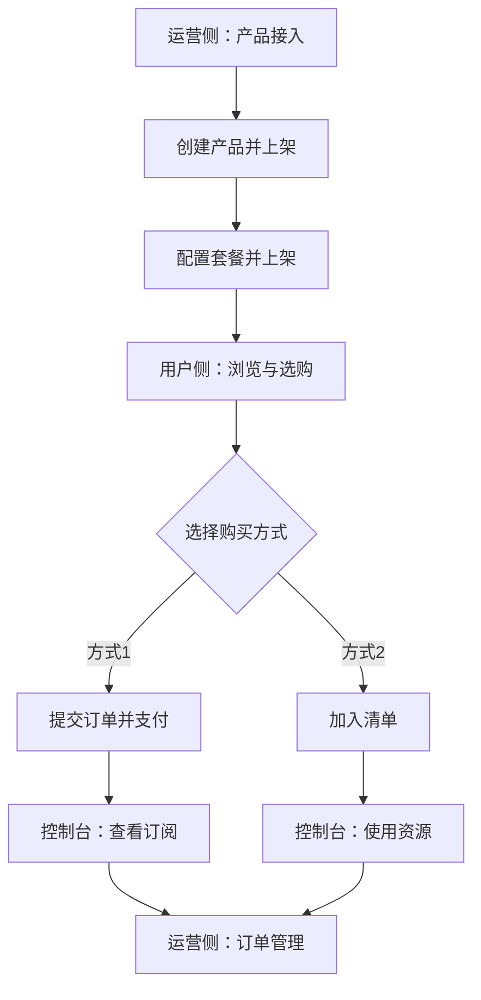
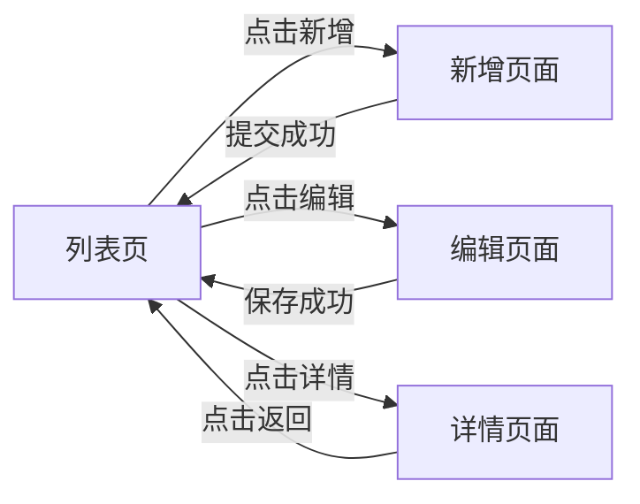
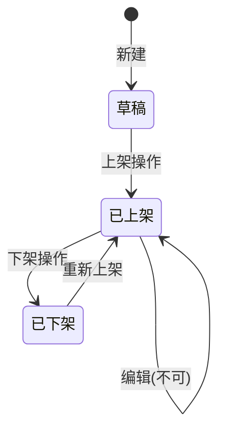
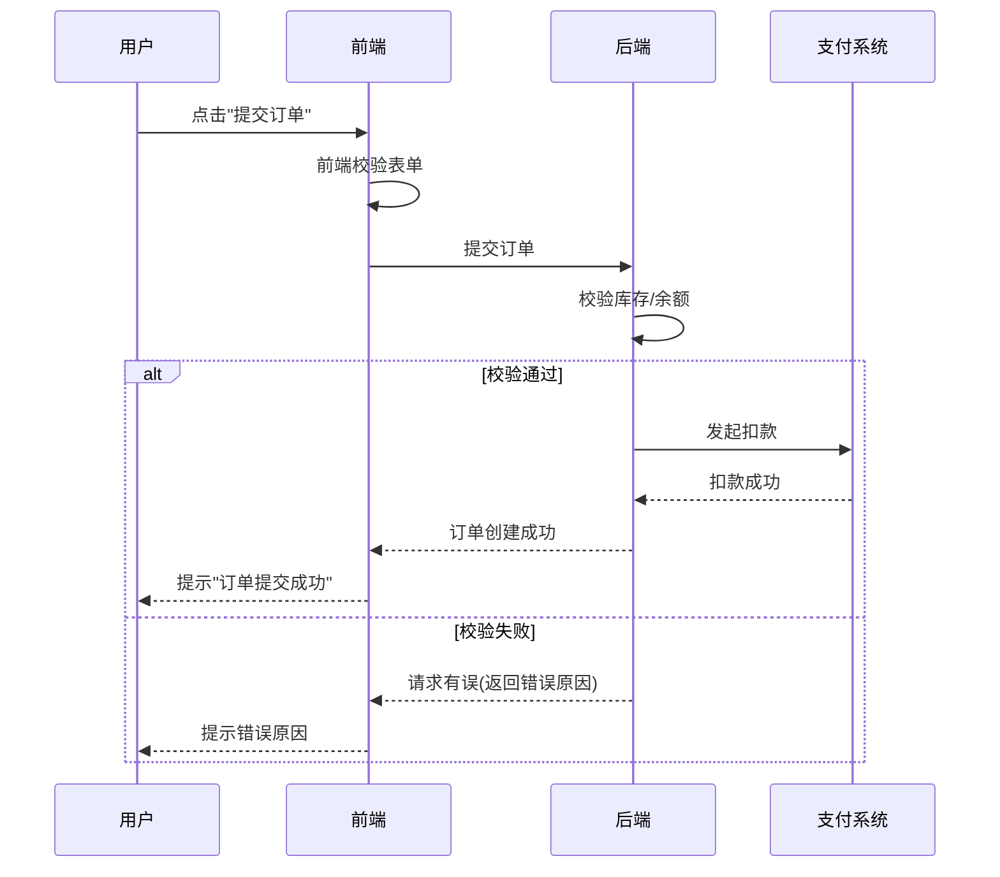
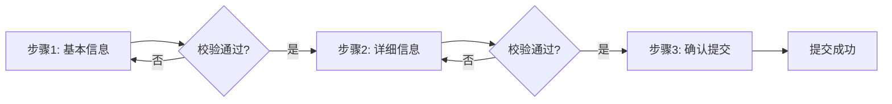

# Step 1~6 执行细则

> 本文件是 `ux-logic-extractor` SKILL 的 **六步执行细则（含图表规范、字段提取规则、字典枚举格式、权限矩阵）** 分片，由 SKILL.md 按需 Read。
> 上级文档：[`../SKILL.md`](../SKILL.md)
> ⚠️ 本文件内容为 SKILL.md 原文**整节平移**，一字未改；骨架里留的是强制结论，判据全文在这里。

---

## Step 1: Structure Scan (结构扫描)

扫描 HTML 中的所有交互元素，提取：

| 扫描目标 | HTML 特征 |
|----------|-----------|
| 表单 | `<form>`, `<input>`, `<select>`, `<textarea>`, `<checkbox>`, `<radio>` |
| 按钮/动作 | `<button>`, `<a>`, `[type="submit"]`, `@click`, `v-on:click` |
| 弹窗/抽屉 | `.modal`, `.dialog`, `.drawer`, `el-dialog`, `a-modal` |
| 标签页/步骤 | `.tabs`, `.steps`, `el-tabs`, `el-steps`, `a-tabs` |
| 表格/列表 | `<table>`, `el-table`, `a-table`, `.list` |
| 导航/面包屑 | `<nav>`, `.breadcrumb`, `el-breadcrumb` |
| 权限标记 | `v-if="hasPermission"`, `v-auth`, `disabled`, `readonly` |
| ID/Class 命名 | 提取所有有语义的 `id` 和 `class` 名称 |

**同时识别前端框架**：Vue (v-model/v-if/v-for)、React (useState/onClick)、Element UI (el-)、Ant Design (a-)、原生 HTML。

## Step 2: Business Modeling (业务建模)

基于扫描结果，推导：

1. **页面功能定位**：这个页面解决什么业务问题
2. **用户角色**：从权限标记和操作按钮推断涉及的角色
3. **业务流程**：从表单步骤、按钮动作、页面跳转推导完整流程
4. **数据流向**：表单提交去哪里、列表数据从哪来

### 客户端 MCP 业务能力声明（显式启用才产出）

只在项目明确 `client_mcp.enabled: true`（或旧 Web 项目明确 `webmcp_enabled: true`）时,以业务条目登记:客户端类型、应用自有能力的实现形态及**来源**、工具清单、每个工具的输入/输出业务语义、身份与权限来源、写操作确认与取消、注册/停用生命周期、错误契约、审计日志和调用证据要求。形式可用 `工具业务名 | 角色/数据范围 | 输入/输出业务语义 | 写入确认 | 失败表现 | 来源` 表,逐行回链产品 PRD 或原型;其余生命周期/日志/调用证据就地说明。**正式 JSON Schema 交详细设计**,此处不写协议端点、字段类型、框架 API 或凭空补非 Web 桥接地址。

四类边界:Web 已声明 WebMCP 时可登记页面对 AI 开放的业务动作,但**测试驱动 MCP** 的 Chrome 能力不算应用工具;非 Web 已证实应用自有服务/桥接时只记业务能力和来源;非 Web 未证实时写「不支持/未提供」或「实现未取到」,不编造统一入口;仅 Appium/小程序驱动可用而产品未声明时本节不产出。新旧 Web 声明矛盾进待澄清,不自行选一份覆盖另一份。

## Step 3: Diagram Generation (图表绘制)

**PRD 文档中必须包含以下类型的 Mermaid 图表（根据业务场景选择适用的）：**

### 3.1 业务全景流程图（必选）

展示整个模块/系统的端到端业务流程，包含多角色、多路径：



**规范：**
- 使用 `graph TD`（自上向下）或 `graph LR`（左到右）
- 矩形节点 `[]` 表示操作步骤
- 菱形节点 `{}` 表示决策/分支
- 带标签的边 `-->|标签|` 表示条件分支
- 注明角色归属（运营侧/用户侧/系统侧）

### 3.2 页面跳转流程图（必选）

展示页面间的导航关系和触发条件：



### 3.3 状态迁移图（涉及状态流转时必选）

展示业务对象的生命周期状态变化：



**规范：**
- 标注触发状态变更的操作
- 标注不可执行的操作约束（如"编辑(不可)"）

### 3.4 时序图（涉及多系统/多角色交互时必选）

展示角色间或系统间的交互时序：



**规范：**
- 使用 `participant` 定义参与者并用 `as` 取别名
- 实线箭头 `->>` 表示请求，虚线箭头 `-->>` 表示响应
- 使用 `alt/else/end` 表示条件分支
- 使用 `loop/end` 表示循环
- 使用 `Note over` 添加注释说明

### 3.5 多步骤表单流程图（涉及分步表单时推荐）



### 图表使用判断规则

| 场景 | 必须使用的图表类型 |
|------|-------------------|
| 任何模块 | 业务全景流程图 |
| 有多个页面 | 页面跳转流程图 |
| 对象有状态变化（上架/下架、审批流、订单状态） | 状态迁移图 |
| 涉及前后端交互、支付、第三方系统 | 时序图 |
| 分步表单 | 多步骤流程图 |
| 有角色间协作 | 时序图或泳道图 |

## Step 4: Technical Specification (技术规格化)

### 字段提取规则

对每个表单字段提取：

| 属性 | 提取来源 |
|------|----------|
| 字段名称 | `label`、`placeholder`、相邻文本 |
| 变量名 ⚠️ | `name`、`v-model`、`id` 属性(**仅供 Agent 内部定位原型字段,严禁写入 PRD 字段规格表**) |
| 字段类型 ⚠️ | `type` 属性、组件类型(**仅供内部理解,PRD 字段表不含此列,见 [`../SKILL.md`](../SKILL.md) 的 S2 净化与"职责边界"**) |
| 是否必填 | `required`、`*` 标记、`rules` |
| 校验规则 | `pattern`、`maxlength`、`min/max`、上下文推导正则 |
| 默认值 | `value`、`:value`、`placeholder` 提示 |

### 交互描述格式（双模式）

**模式A：标准规格表**（适用于完整规格说明书风格）

```markdown
|**页面元素**|**功能说明**|
| :- | :- |
|页面整体描述|[描述]|
|初始化约束|[约束]|
|初始焦点|[焦点]|
|权限要求|[权限]|
|数据来源(仅业务描述,不含表/字段/接口)|[来源]|
|交互方式|[方式]|
|组成部分描述||
|[组件名]|[说明]|
```

**模式B：模块化页面说明**（适用于简洁产品功能说明风格）

```markdown
### N. 页面名称

**页面定位**：一句话描述页面用途

**页面内容**：
- 区域1：描述
- 区域2：描述

**交互操作**：
1. 点击"XX"按钮 → 跳转到XX页面
2. 点击"编辑" → 打开编辑页面（已上架不可编辑）
3. 点击"删除" → 弹出确认框（已上架不可删除）

**字段列表**：
| 字段 | 必填 | 说明 |
|------|------|------|
```

**选择哪种模式**：默认使用模式A（完整规格表），若用户要求简洁版或产品功能说明则使用模式B。

### 交互链路描述格式

关键交互必须包含完整链路:

```
**触发动作 (Trigger)**:用户点击"提交"按钮
**前置校验 (Validation)**:校验必填字段,手机号格式 /^1[3-9]\d{9}$/
**按钮状态变化 (State)**:点击前"可点击(蓝色)"→ 表单未填完整时"置灰不可点击" → 点击中"置灰显示'提交中...'(含 Loading 图标)" → 成功后"恢复可点击"
**防重复提交 (Idempotency)**:按钮点击后立即置灰,请求响应返回前禁止再次点击
**中间态 (Loading)**:按钮置灰显示"提交中...",页面其他交互保持可用
**成功反馈 (Success)**:提示"提交成功",跳转至列表页
**失败反馈 (Fail)**:提示"提交失败,请稍后再试",按钮恢复可点击
**逆向操作 (Reverse)**:用户点击"取消"/"返回"/浏览器返回按钮时的数据处理
  - 未输入任何内容:直接关闭/返回,无需提示
  - 已输入内容但未提交:二次确认"是否放弃当前编辑?" → 确认后丢弃/自动保存草稿
  - 已上传文件:确认放弃后清理临时文件
  - 多步骤表单返回上一步:保留已填项,不清空
**数据来源 (Data Source)**:
  - 字段 A:后端接口实时获取(对应业务接口,每次进入页面重新拉取)
  - 字段 B:本地缓存读取(LocalStorage,失效时间 5 分钟)
  - 字段 C:跨模块调取(来自 xxx 模块的 Vuex/Pinia store)
  - 字段 D:前端计算(公式:字段 E * 汇率)
  - **字段 E:🛰️ 外部系统接口(ORD-API-021 订单中心「订单总览」接口,⏳ 未交付,预计 2026-XX-XX)** — 必须穿透标注外部系统标识 + 交付状态;详见「六·2、数据来源说明」
**隐藏逻辑 (Hidden Logic)**:原型未直接体现但业务必须存在的逻辑
  - 排序规则:默认按创建时间倒序,支持点击"金额/状态"列切换
  - 分页机制:每页 20 条,总条数由接口返回 total 字段
  - 自动刷新:详情页每 30 秒轮询一次状态字段
  - 默认筛选:初次进入默认筛选"状态=进行中"
  - 缓存策略:❓ 待澄清(是否缓存及 TTL 属臆造项,严禁直接写"缓存 60 秒",须登记待澄清清单交用户确认)
  - 审计日志:所有"删除/修改/导出"操作需记录操作人和时间
  - 幂等性:重复提交同一订单需去重(基于订单号)
```

**所有关键交互都必须覆盖以上 10 个维度,不得遗漏"按钮状态变化""逆向操作""数据来源""隐藏逻辑"4 项。**

## Step 5: Dictionary & Enum Extraction (字典枚举提取)

**必须从原型中识别并生成所有状态、类型、分类等枚举值的字典表。**

### 识别规则

从以下线索提取枚举值：
- 状态标签/徽章的不同颜色和文本（如绿色"运行中"、红色"已停用"）
- 下拉选择框的选项列表
- Tab/按钮组的筛选选项
- 条件渲染中的状态判断（如 `status === 'active'`）
- 卡片角标（推荐/热门/新品）
- 分类导航的类型列表

### 字典表标准格式

**状态类枚举**（带颜色和操作映射）：

```markdown
#### [业务对象]状态字典

|**状态编码**|**显示文本**|**颜色**|**可执行操作**|**触发条件**|
| :-: | :-: | :-: | :-: | :- |
|active|使用中|绿色|查看、管理|未到期且未临近到期|
|expiring|快到期|橙色|续费、查看|到期日 ≤ 30天|
|expired|已过期|红色|续费|超过到期日|
```

**类型/分类枚举**（带编码和说明）：

```markdown
#### [分类名称]字典

|**编码**|**显示名称**|**说明**|
| :-: | :-: | :- |
|economy|AI+经营|经营管理类智能体|
|office|AI+办公|办公协同类智能体|
|dev|AI+研发|研发效能类智能体|
```

**角色枚举**（带编码和权限概述）：

```markdown
#### 角色字典

|**角色编码**|**角色名称**|**角色描述**|
| :-: | :-: | :- |
|ADMIN|企业管理员|企业创建用户，可添加普通用户和管理员用户|
|USER|企业员工|企业中的普通员工|
```

### 必须提取的枚举类型

| 枚举类别 | 识别线索 | 输出要求 |
|----------|---------|----------|
| 业务状态 | 彩色标签、徽章、进度条 | 编码+文本+颜色+操作+触发条件 |
| 分类/类型 | Tab筛选、下拉框、按钮组 | 编码+显示名+说明 |
| 角色 | 权限控制、菜单可见性 | 编码+名称+描述 |
| 紧急程度/优先级 | 标签颜色区分 | 编码+文本+颜色 |
| 角标/标记 | 卡片右上角标签 | 值+颜色+含义 |

---

## Step 6: Defensive Design (防御性设计)

**必须自动补充原型未体现的边缘场景:**

| 场景类别 | 必须覆盖的 Edge Cases |
|----------|----------------------|
| 接口异常 | 参数错误提示、登录过期跳转登录页、越权操作拦截、服务异常错误提示(用业务语言,不写 HTTP 状态码数字) |
| 网络异常 | 断网提示、请求超时(超过 N 秒)重试机制、弱网加载态 |
| 加载失败 | 数据获取异常的兜底展示(空态插图 + "加载失败,点击重试"按钮) |
| 搜索无结果 | 空态文案"未找到匹配的数据,请调整筛选条件" + 引导操作(清空筛选/新建) |
| 并发冲突 | 重复提交防护、数据乐观锁冲突提示"数据已被他人修改,请刷新后重试" |
| 数据边界 | 空列表展示、分页边界、超长文本截断 (`...` + Tooltip 展示全文)、特殊字符转义 |
| 数值极值 | 金额超 1 亿的显示格式(千分位/万/亿)、库存为 0 的展示、负数的颜色(红色)、百分比超过 100% 的处理 |
| 时间极值 | 远期日期(如 2099-12-31)、空时间显示为 `-`、秒级 vs 毫秒级统一 |
| 列表极值 | 无数据(空态)、仅 1 条、超过 1 万条的性能降级(虚拟滚动/提示"仅展示前 10000 条") |
| 权限边界 | 按钮级权限控制、URL 直接访问拦截、角色切换后页面刷新、未登录跳转登录页 |
| 操作约束 | 已上架不可编辑/删除、已生效订单不可取消 |

### 权限差异矩阵(必须生成)

**对每个页面,必须生成不同角色的可见性和可操作性差异矩阵:**

```markdown
#### [页面名称]权限差异矩阵

|**元素**|**企业管理员**|**企业员工**|**未登录用户**|
| :-: | :-: | :-: | :-: |
|页面访问|✅ 可访问|✅ 可访问|❌ 跳转登录页|
|新增用户按钮|✅ 可见可点|❌ 不可见|❌ 不可见|
|编辑按钮|✅ 可见可点|⚠️ 仅编辑自己的|❌ 不可见|
|删除按钮|✅ 可见可点|❌ 不可见|❌ 不可见|
|列表字段-手机号|✅ 完整展示|⚠️ 脱敏展示(138****1234)|—|
|列表字段-薪资|✅ 完整展示|❌ 不可见|—|
|数据范围|全部数据|仅本部门数据|—|
```
